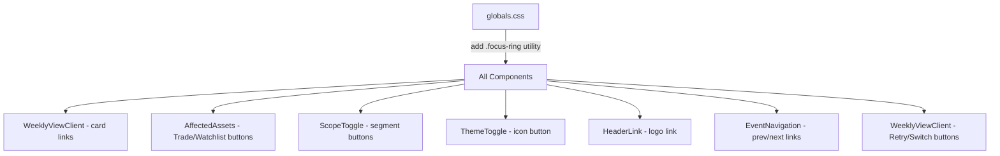

## Problem Statement

The constraints explicitly require: "All interactive elements must have visible focus states (green outline)." Currently, no interactive element in the app — cards, buttons, links, scope toggle, theme toggle — has any custom `focus-visible` styling. Keyboard users see the browser default focus ring or nothing at all, which breaks the eToro design system spec.

## User Story

As a keyboard user or accessibility-conscious user, I want to see a clear green focus ring on buttons, links, and cards when I tab through the interface, so that I know which element is active.

## How It Was Found

Code review of all interactive components (`WeeklyViewClient`, `AffectedAssets`, `ScopeToggle`, `ThemeToggle`, `HeaderLink`, `EventNavigation`) against the constraints spec. None have `focus-visible` or `focus` ring styles defined.

## Proposed UX

- All focusable elements get a `focus-visible:ring-2 focus-visible:ring-[var(--etoro-green)] focus-visible:outline-none` treatment
- Event cards: green ring with rounded corners matching the card radius
- Buttons (Trade, Watchlist, Switch to Global): green ring with pill radius
- Scope toggle buttons: green ring with rounded-full
- Theme toggle: green ring with rounded-full
- Back link and navigation links: green ring with slight rounded corners
- Add a global CSS utility for the focus ring so it's consistent

## Acceptance Criteria

- [ ] All buttons have `focus-visible:ring-2 focus-visible:ring-[var(--etoro-green)]` or equivalent
- [ ] Event card links have visible green focus ring when focused via keyboard
- [ ] Scope toggle buttons have visible green focus ring
- [ ] Theme toggle has visible green focus ring
- [ ] Header logo link has visible green focus ring
- [ ] Event navigation prev/next links have visible green focus ring
- [ ] Trade and Watchlist CTA buttons have visible green focus ring
- [ ] Focus ring uses CSS variable `--etoro-green` (#0EB12E)
- [ ] No visual change on mouse click (use `focus-visible`, not `focus`)

## Verification

- Tab through the entire app and verify every interactive element shows a green outline
- Run all tests and verify they pass

## Research Notes

- Tailwind CSS v4 supports `focus-visible:` prefix natively
- The eToro variable font is already loaded; only CSS class changes needed
- Using `focus-visible` (not `focus`) ensures mouse clicks don't show the ring
- A global CSS approach with `@layer` would be cleanest for consistency

## Architecture

## One-Week Decision

**YES** — This is purely additive CSS class changes across ~7 components. No logic changes, no new dependencies. Estimated: 1-2 hours.

## Implementation Plan

1. Add a global CSS utility class in `globals.css` for the focus ring
2. Apply `focus-visible:ring-2 focus-visible:ring-[var(--etoro-green)] focus-visible:outline-none` classes to all interactive elements
3. Components to update: WeeklyViewClient, AffectedAssets, ScopeToggle, ThemeToggle, HeaderLink, EventNavigation
4. Run tests and verify

## Out of Scope

- Skip/bypass link for screen readers
- ARIA attribute changes
- Tab order changes
