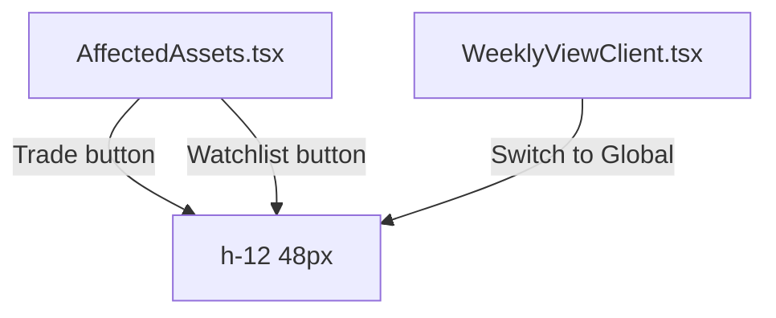

## Problem Statement

The constraints specify button heights of 56px (large) and 48px (medium). Currently, the Trade and Watchlist buttons in `AffectedAssets.tsx` use `py-3 px-4` which yields a height of approximately 44px. The "Switch to Global" button in `WeeklyViewClient.tsx` uses `px-5 py-3` which also yields ~44px. These are 4-12px shorter than spec.

## User Story

As a user, I want the CTA buttons to have the correct eToro design system dimensions so they feel substantial, professional, and match the eToro product styling.

## How It Was Found

Code review comparing button padding/height values against the constraint spec's "Buttons" section: "Primary: green (#0EB12E) fill, white text, pill radius (48px), 56px height (large), 48px (medium)."

## Proposed UX

- Trade and Watchlist buttons on asset cards: 48px height (medium) — these are side-by-side so medium is appropriate
- "Switch to Global" button on empty state: 48px height (medium)
- Use explicit `h-12` (48px) for medium buttons instead of relying on padding
- Keep `py-3` padding but ensure total height hits 48px with `min-h-[48px]` or explicit height

## Acceptance Criteria

- [ ] Trade button height is 48px
- [ ] Watchlist button height is 48px
- [ ] "Switch to Global" button height is 48px
- [ ] Button text remains vertically centered
- [ ] No layout shift or overflow on mobile
- [ ] All tests pass

## Verification

- Inspect button elements and verify computed height matches spec
- Run all tests

## Research Notes

- Current button height from `py-3` (12px top + 12px bottom) + 16px font ≈ 44px
- Need 48px: use `h-12` or `min-h-[48px]` with flex centering
- Only 2 components affected: AffectedAssets.tsx and WeeklyViewClient.tsx

## Architecture

## One-Week Decision

**YES** — Trivial CSS height change in 2 files. Estimated: 30 minutes.

## Implementation Plan

1. Update Trade button in AffectedAssets: add `h-12` and use `flex items-center justify-center`
2. Update Watchlist button in AffectedAssets: same treatment
3. Update "Switch to Global" button in WeeklyViewClient: same treatment
4. Run tests and verify

## Out of Scope

- Changing button border-radius (already correct at 48px/pill)
- Changing button font size or weight (already correct)
