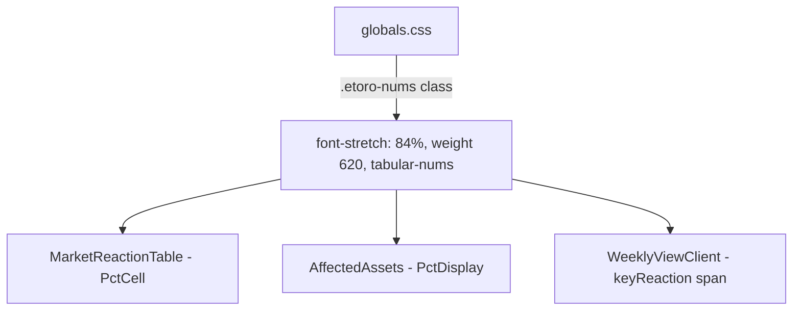

## Problem Statement

The constraints specify: "Numbers right-aligned, use eToro Numbers font (font-stretch: 84%, weight 620)" for market reaction table data. Currently, `MarketReactionTable.tsx` and `AffectedAssets.tsx` use `tabular-nums` for numeric alignment but do not apply the eToro-specific font-stretch (84%) and font-weight (620). This makes the numbers look generic rather than matching eToro's distinctive condensed number style.

## User Story

As a trader viewing market reaction data, I want the percentage numbers to use eToro's condensed number styling so the data feels professional and visually consistent with the eToro platform.

## How It Was Found

Code review of `MarketReactionTable.tsx` PctCell component and `AffectedAssets.tsx` PctDisplay component against the constraints spec's "Tables (Market Reaction)" section.

## Proposed UX

- Add a CSS utility class `.etoro-numbers` with `font-stretch: 84%; font-weight: 620; font-variant-numeric: tabular-nums;`
- Apply this class to all percentage values in `MarketReactionTable` (Day 1, Week 1 columns)
- Apply this class to all percentage values in `AffectedAssets` (Day 1, Week 1 values)
- Apply this class to the key reaction percentage in the weekly view event cards

## Acceptance Criteria

- [ ] CSS class `.etoro-numbers` exists with font-stretch: 84%, font-weight: 620, tabular-nums
- [ ] MarketReactionTable percentage cells use `.etoro-numbers`
- [ ] AffectedAssets PctDisplay component uses `.etoro-numbers`
- [ ] Weekly view card key reaction percentage uses `.etoro-numbers`
- [ ] Numbers still display correctly (no clipping or overflow)
- [ ] All tests pass

## Verification

- Inspect percentage elements and verify computed font-stretch and font-weight match spec
- Run all tests

## Research Notes

- The eToro variable font supports font-stretch via `font-stretch: 0% 100%` in the @font-face declaration
- font-stretch: 84% creates the condensed number look used in eToro's platform
- font-weight: 620 is between semi-bold (600) and bold (700) — the variable font supports it
- 3 components affected: MarketReactionTable, AffectedAssets, WeeklyViewClient

## Architecture

## One-Week Decision

**YES** — One CSS class definition + applying it in 3 components. Estimated: 30 minutes.

## Implementation Plan

1. Add `.etoro-nums` utility class in globals.css
2. Apply to PctCell in MarketReactionTable
3. Apply to PctDisplay in AffectedAssets
4. Apply to keyReaction percentage in WeeklyViewClient
5. Run tests and verify

## Out of Scope

- Changing font-family (already using eToro variable font)
- Changing number alignment (already right-aligned where appropriate)
