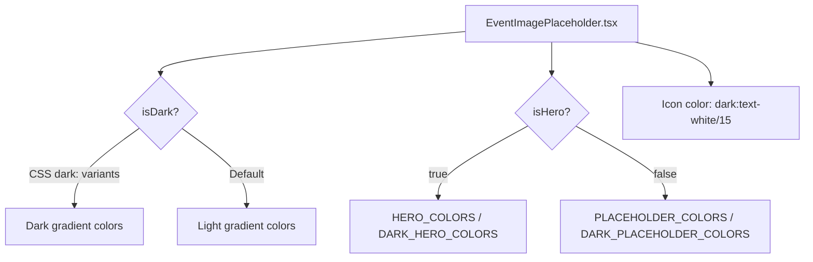

## Problem statement

The `EventImagePlaceholder` component uses hardcoded light pastel gradients (e.g., `from-[#E8F5E9] to-[#F1F8F2]` for earnings) that don't adapt to dark mode. In dark mode, every event card thumbnail and the detail page hero display bright, light-colored rectangles against dark navy card backgrounds, creating a jarring visual mismatch. This is the most visible dark-mode visual inconsistency in the entire app.

## User story

As a user browsing in dark mode, I want image placeholders to blend naturally with the dark theme so that the weekly view and event detail pages look polished and consistent.

## How it was found

Observed during visual-polish review in browser. Dark mode landing page (screenshot 141) shows light pastel placeholder squares on dark cards. Dark mode event detail (screenshot 146) shows a light gradient hero placeholder on a dark page. Both look out of place compared to the rest of the dark UI.

## Proposed UX

- Card thumbnails: Use darker, desaturated gradient variants in dark mode (e.g., deep greens, deep blues) that complement the navy card background
- Hero placeholders: Same treatment, scaled to the larger hero dimensions
- Icon color should shift from `text-black/15` / `text-black/20` to `text-white/15` / `text-white/20` in dark mode
- Gradients should feel subtle and atmospheric, not washed out

## Acceptance criteria

- [ ] `EventImagePlaceholder` detects dark mode (via `.dark` class on `<html>` or CSS custom properties)
- [ ] Dark mode gradients use deep, desaturated colors that complement `#000021` card background
- [ ] Placeholder icon color inverts to white at low opacity in dark mode
- [ ] Card thumbnails (16x16 in weekly view) look natural on dark cards
- [ ] Hero placeholder (full-width on detail page) looks natural on dark page background
- [ ] Light mode gradients remain unchanged
- [ ] No visual regression in light mode

## Verification

- Run all tests to confirm no regressions
- Open the app in dark mode, navigate the weekly view and event detail page
- Screenshot both views and confirm placeholders blend with the dark theme
- Toggle between light and dark to verify both modes look correct

## Out of scope

- Changing the actual gradient design or icon set
- Adding real images or external image sources
- Modifying the placeholder component API

## Planning

### Overview

The `EventImagePlaceholder` component in `src/components/EventImagePlaceholder.tsx` has two sets of hardcoded light gradient colors (`PLACEHOLDER_COLORS` and `HERO_COLORS`) plus hardcoded dark icon colors (`text-black/15`, `text-black/20`). These need dark-mode variants that use deep, desaturated colors matching the navy theme.

### Research notes

- The project uses Tailwind v4 with class-based dark mode (`.dark` on `<html>`)
- Tailwind `dark:` variants are available for conditional styling
- The component is a server component (no `"use client"` directive), so it cannot use `useTheme()` or client-side state
- Approach: Use Tailwind's `dark:` prefix on gradient classes, or use CSS custom properties for gradient colors
- Since the gradient colors are applied via Tailwind arbitrary value classes (`from-[#hex]`), the simplest approach is to add dark mode color maps and apply them via CSS custom properties defined in `globals.css`

### Assumptions

- The `dark:` variant works with the `.dark` class approach used by this project
- No need to change the component from server to client component

### Architecture diagram

### One-week decision

**YES** — This is a straightforward CSS/className change to one component. ~30 minutes of work.

### Implementation plan

1. Add dark mode gradient color maps (e.g., `DARK_PLACEHOLDER_COLORS`, `DARK_HERO_COLORS`) using deep, desaturated variants
2. Apply both light and dark gradient classes to the component using Tailwind's `dark:` prefix
3. Change icon colors to use `dark:text-white/15` and `dark:text-white/20`
4. Test in both light and dark modes
