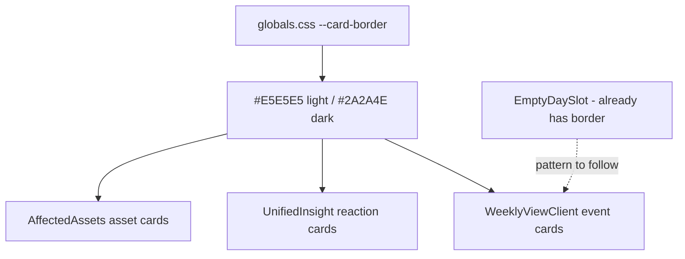

## Problem statement

Multiple card components (event cards in weekly view, consolidated market reaction table, affected asset cards) rely solely on `shadow-[var(--card-shadow)]` for visual boundary definition. In dark mode, the shadow value `0 0 13px rgba(0,0,0,0.3)` is nearly invisible against the dark `#0A0A2E` page background. While the background color difference between cards (`#000021`) and page (`#0A0A2E`) provides some contrast, the cards lack the crisp definition of a professional dark mode interface. The empty day slot component already has `border border-[var(--gray-border)]` in both modes, creating an inconsistency with the other cards.

## User story

As a user viewing the app in dark mode, I want card boundaries to be clearly defined so that the layout feels clean and professional rather than murky.

## How it was found

Observed during visual-polish review. Comparing card styles across components: `EmptyDaySlot` has explicit borders while `EventCard`, `ConsolidatedReactionTable`, `PerMatchReactionTables`, and `AssetCard` rely on shadow only. In dark mode screenshots, card edges appear softer than expected for a professional financial app.

## Proposed UX

- Add `border border-[var(--card-border)]` to all card-level elements that currently use shadow-only boundaries
- In dark mode, `--card-border` resolves to `#2A2A4E` which provides subtle but clear definition
- In light mode, `--card-border` resolves to `#E5E5E5` — a soft gray that complements the existing shadow
- This matches the existing pattern used by `EmptyDaySlot` and creates visual consistency

## Acceptance criteria

- [ ] Event cards in `WeeklyViewClient` have `border border-[var(--card-border)]`
- [ ] Consolidated market reaction card in `UnifiedInsight` has card border
- [ ] Per-match reaction cards in `UnifiedInsight` have card borders
- [ ] Affected asset cards in `AffectedAssets` have card borders
- [ ] Light mode appearance is not significantly changed (border + shadow together)
- [ ] Dark mode cards have clear, professional boundary definition
- [ ] No visual regression in light mode

## Verification

- Run all tests to confirm no regressions
- Check weekly view and event detail in both light and dark mode
- Confirm card edges are cleanly defined in dark mode
- Confirm light mode still looks clean (shadow + border shouldn't be too heavy)

## Out of scope

- Changing card shadow values
- Adding hover border effects
- Modifying card padding or radius

## Planning

### Overview

Several card components use `shadow-[var(--card-shadow)]` for visual separation but lack explicit borders. In dark mode, the shadow (`0 0 13px rgba(0,0,0,0.3)`) is nearly invisible. Adding `border border-[var(--card-border)]` to these cards makes them crisp in dark mode while remaining subtle in light mode.

### Research notes

- Affected components: `WeeklyViewClient.tsx` (event cards), `UnifiedInsight.tsx` (reaction table cards), `AffectedAssets.tsx` (asset cards)
- `EmptyDaySlot` already has `border border-[var(--gray-border)]` — this is the pattern to follow
- `--card-border` resolves to `#E5E5E5` (light) / `#2A2A4E` (dark), defined in `globals.css`
- Tailwind v4 supports `border-[var(--card-border)]` syntax
- The border + shadow combination in light mode is standard practice and won't look heavy

### Assumptions

- Adding a 1px border alongside existing shadow will look clean in both modes
- No need to remove shadows — border is additive

### Architecture diagram

### One-week decision

**YES** — Adding a border class to 4-5 elements across 3 files. ~15 minutes of work.

### Implementation plan

1. Add `border border-[var(--card-border)]` to event card Link elements in `WeeklyViewClient.tsx`
2. Add same border to consolidated/per-match reaction table wrappers in `UnifiedInsight.tsx`
3. Add same border to `AssetCard` wrapper in `AffectedAssets.tsx`
4. Verify in both light and dark modes
