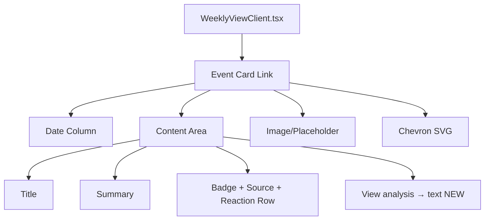

## Problem Statement

Event cards on the weekly view are the primary interactive element but lack a clear visual cue that they are clickable. The only indicator is a tiny 16px chevron SVG on the far right side, which is easy to miss — especially on mobile/touch devices where there is no hover effect. A first-time user might think the weekly view IS the content and never discover the detail pages with historical analysis, market reaction data, and trade CTAs.

## User Story

As a first-time visitor, I want to immediately understand that each event card leads to a detailed analysis page, so that I explore the full value of the app rather than bouncing after seeing only headlines.

## How It Was Found

Fresh-eyes review of the landing page. On desktop, hover effects (translateY, shadow change) provide some affordance, but on mobile/touch there is zero indication beyond a tiny chevron. The cards look like static content blocks.

## Proposed UX

Add a subtle "View analysis" or "See history" text link at the bottom-right of each event card, styled as a small muted-text call-to-action. This complements the existing chevron and makes the interactive nature explicit. On hover/touch, both the text and chevron should animate together.

- Add a small `text-xs text-muted` label like "View analysis →" aligned to the bottom-right of the card content area
- On hover/focus, the text should transition to the foreground color
- Keep the existing chevron but make the tap target the entire card (already a `<Link>`)
- The text should not compete with the event title or badge — keep it subtle but visible

## Acceptance Criteria

- [ ] Each event card displays a "View analysis" text near the bottom of the card content
- [ ] The text is styled as `text-xs text-muted` and transitions on hover/focus
- [ ] The text is visible on both light and dark mode
- [ ] Mobile users can see the affordance without hover
- [ ] The existing card layout, spacing, and animation are preserved
- [ ] No layout shift or overflow caused by the new element

## Verification

Run `npm run build` to verify no build errors. Visually verify in browser that the affordance text appears on cards in both light and dark mode.

## Out of Scope

- Changing the card structure or layout significantly
- Adding tooltips or popovers
- Modifying the event detail page

---

## Planning

### Overview

Add a small "View analysis" text affordance to each event card in `WeeklyViewClient.tsx`. This is a minor UI addition — one line of JSX per card.

### Research Notes

- Cards are already wrapped in `<Link>` elements making the entire card clickable
- The chevron SVG at the right side is the only visual affordance currently
- Mobile users have no hover state, so the affordance must be visible by default
- The card layout uses flexbox with a date column, content area, image, and chevron

### Assumptions

- The text "View analysis" is the right wording — matches the app's editorial tone
- It should appear at the end of the metadata row (below badge + source) to avoid adding a new row

### Architecture Diagram

### One-Week Decision

**YES** — This is a single-component change adding one line of JSX and a few Tailwind classes. Estimated: 15 minutes.

### Implementation Plan

1. In `WeeklyViewClient.tsx`, inside the event card's content area, add a `` below the badge/source/reaction row
2. Style it as `text-xs text-muted group-hover:text-foreground transition-colors mt-1`
3. Include a right arrow character or the → entity
4. Verify layout on both light and dark mode
