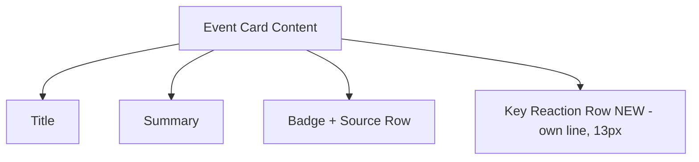

## Problem Statement

Each event card shows a key market reaction preview (e.g., "▲ S&P 500 +1.1%") at 11px font size, pushed to the right side of the badge/source row at the bottom of the card. For a trader — the target user — this is the most compelling piece of data on the card: it shows the real-world market impact. Yet it's rendered at the smallest font size on the card and is easy to miss at a glance. A first-time user's eye is drawn to the title and badge but may never notice the reaction data.

## User Story

As a trader scanning this week's events, I want to immediately see the market impact of each event so that I can prioritize which events to explore based on their significance.

## How It Was Found

Fresh-eyes review. The key reaction indicator at 11px (`text-[11px] etoro-nums ml-auto`) is visually subordinate to the badge (also 11px but colored and pill-shaped) and the source text. The data deserves more visual weight since it's the strongest hook for the target audience.

## Proposed UX

Move the key reaction data to its own row or give it more visual prominence:

- Increase the font size from 11px to 13px
- Move it to its own line below the badge+source row, or visually separate it with slightly more spacing
- Keep the green/red coloring and up/down arrow
- Optionally, add a subtle background pill (like badges) to make it stand out more
- The reaction data should be the second-most-visible element on the card after the title

## Acceptance Criteria

- [ ] Key reaction text is rendered at 13px or larger (up from 11px)
- [ ] The reaction data is visually distinct from the badge and source text
- [ ] Green/red coloring and directional arrows are preserved
- [ ] The eToro number font styling (font-stretch: 84%, weight 620) is preserved
- [ ] Layout works on both mobile and desktop without overflow
- [ ] Dark mode rendering is correct

## Verification

Run `npm run build` to verify no build errors. Visually verify the reaction data is more prominent on cards.

## Out of Scope

- Changing the reaction data content or logic
- Adding new data fields to the card
- Modifying the event detail page

---

## Planning

### Overview

Increase the visual prominence of the `keyReaction` data on event cards in `WeeklyViewClient.tsx`. Currently at 11px, it should be larger and visually separated from the badge/source metadata.

### Research Notes

- The reaction text is in a `` with classes `text-[11px] etoro-nums ml-auto` inside the badge/source flex row
- It already uses green/red coloring and directional arrows
- The `etoro-nums` class applies font-stretch: 84% and weight 620
- Moving it to its own row below the badge/source row would give it more visual weight

### Assumptions

- 13px font size is sufficient — larger would compete with the title
- Moving to its own row is better than staying inline at a larger size, since the badge/source row is already dense

### Architecture Diagram

### One-Week Decision

**YES** — Minor styling change in one component. Estimated: 10 minutes.

### Implementation Plan

1. In `WeeklyViewClient.tsx`, extract the `keyReaction` span out of the badge/source row
2. Place it as a new `
` below the badge/source row
3. Increase font size to `text-[13px]`
4. Keep `etoro-nums` class and green/red coloring
5. Verify layout doesn't overflow or shift
