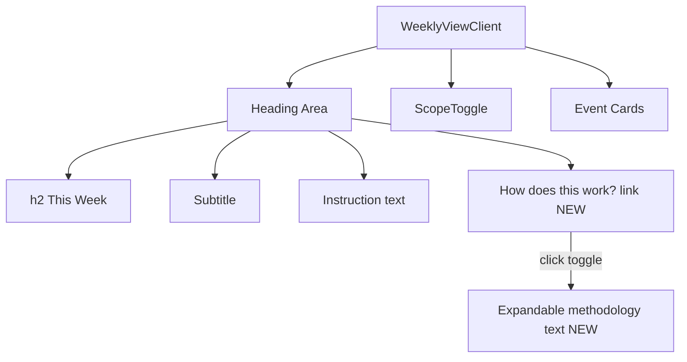

## Problem Statement

The app's methodology ("How it works") is only explained in the footer — below all 7 event cards. A first-time user never scrolls that far before forming their opinion of the app. They see headlines, dates, and market data but have no immediate understanding of HOW the historical matching works or WHY they should trust it. This reduces the app's credibility for new visitors who wonder: "Is this AI-generated? How are historical events selected? Is the data real?"

## User Story

As a first-time visitor, I want to quickly understand how the historical analysis is generated so that I can trust the insights and take action on them.

## How It Was Found

Fresh-eyes review. The footer contains a clear "How it works" section but it's invisible above the fold. A new user landing on the page sees the subtitle ("One market-moving event per day, paired with history") which explains the WHAT but not the HOW. Building trust requires a brief methodology disclosure within the main content area.

## Proposed UX

Add a small, collapsible "How it works" disclosure near the subtitle/heading area:

- Below the existing subtitle text "Select an event to see how markets reacted to similar moments in the past."
- A small clickable text link: "How does this work?" styled as `text-xs text-muted underline`
- On click, expands a brief 1-2 sentence methodology explanation (from the existing footer text): "We aggregate headlines from major financial outlets, identify the most market-moving event each day, and use historical pattern matching to find similar past events."
- Collapse by default — does not clutter the page for returning users
- Uses a simple CSS/React state toggle, no complex animation
- The footer "How it works" section remains unchanged

## Acceptance Criteria

- [ ] A "How does this work?" link appears below the existing subtitle text
- [ ] Clicking it toggles a brief methodology explanation
- [ ] The disclosure is collapsed by default
- [ ] Styling matches eToro design system (text-xs, muted color, clean spacing)
- [ ] Works in both light and dark mode
- [ ] Does not shift the layout of event cards below when expanded
- [ ] Does not duplicate or remove the footer section

## Verification

Run `npm run build` to verify no build errors. Visually verify the disclosure appears and toggles correctly.

## Out of Scope

- Rewriting or removing the footer content
- Adding a full onboarding flow or modal
- Adding tooltips to other sections

---

## Planning

### Overview

Add a collapsible "How does this work?" link in `WeeklyViewClient.tsx` (client component) below the existing subtitle. Uses React `useState` to toggle a brief methodology paragraph.

### Research Notes

- `WeeklyViewClient.tsx` is already a client component (`"use client"`)
- The heading area has: h2 "This Week", subtitle text, instruction text, and the scope toggle
- The footer in `layout.tsx` has the methodology text — we can reuse the same wording
- A simple `useState(false)` toggle is the lightest approach — no external dependencies

### Assumptions

- The methodology text from the footer is the right content to surface
- Collapsed by default is correct — returning users don't need to see it every time
- Smooth expand/collapse with CSS `max-height` transition provides good UX without a library

### Architecture Diagram

### One-Week Decision

**YES** — Small client-side addition: one `useState`, one click handler, a conditional render block. Estimated: 20 minutes.

### Implementation Plan

1. Add `const [showHowItWorks, setShowHowItWorks] = useState(false)` to `WeeklyViewClient`
2. Below the instruction text `
`, add a `<button>` styled as `text-xs text-muted underline cursor-pointer`
3. Below the button, render a conditional `
` with the methodology text and a smooth transition
4. Use the same text from the footer: "Trade the Past aggregates headlines from major news sources..."
5. Style the expanded block with a subtle background or border-left to visually separate it
6. Verify both light and dark mode appearance
