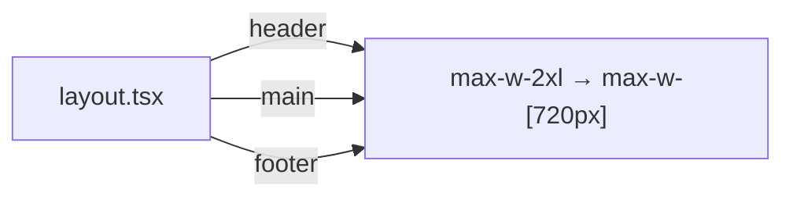

## Problem Statement

The constraint spec explicitly states "Max content width: 720px, centered (editorial feel)" for desktop. The current implementation uses `max-w-2xl` (Tailwind = 42rem = 672px) in all three content containers — header, main, and footer. This 48px shortfall slightly narrows the editorial reading column and deviates from the eToro design spec.

## User Story

As a desktop user, I want the content area to fill 720px so the reading experience has the editorial breathing room the design intended.

## How It Was Found

Visual polish review comparing the rendered layout against the constraint spec. The `max-w-2xl` class resolves to 672px, not the specified 720px. Observed in `src/app/layout.tsx` in three places.

## Proposed UX

Replace `max-w-2xl` with `max-w-[720px]` in the header, main, and footer containers in `layout.tsx`. No other visual changes.

## Acceptance Criteria

- [ ] Header content container uses `max-w-[720px]` instead of `max-w-2xl`
- [ ] Main content container uses `max-w-[720px]` instead of `max-w-2xl`
- [ ] Footer content container uses `max-w-[720px]` instead of `max-w-2xl`
- [ ] All three containers remain horizontally centered with `mx-auto`
- [ ] No horizontal overflow on any viewport
- [ ] Build passes with no errors

## Verification

- Run `npm run build` — no errors
- Open app in browser and verify content area is slightly wider than before
- Check responsive behavior: at <720px, content still fills available width

## Out of Scope

- Changing padding values
- Any other layout modifications
- Mobile breakpoint changes

## Planning

### Overview

Trivial string replacement in one file. Replace three instances of `max-w-2xl` with `max-w-[720px]` in `src/app/layout.tsx`.

### Research Notes

- Tailwind v4 `max-w-2xl` = 42rem = 672px
- Constraint spec requires 720px max content width
- `max-w-[720px]` is the Tailwind arbitrary value syntax for exactly 720px

### Architecture

### One-Week Decision

**YES** — This is a 3-line change in a single file. Takes minutes.

### Implementation Plan

1. Open `src/app/layout.tsx`
2. Replace all 3 instances of `max-w-2xl` with `max-w-[720px]`
3. Build and verify
