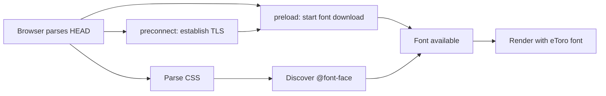

## Problem statement

The eToro variable font (eToro-VF-v0.7.ttf) is loaded via a CSS `@font-face` declaration with a `preconnect` hint, but there is no `<link rel="preload">` for the font file itself. This means the browser must: (1) download HTML, (2) discover and parse the CSS, (3) find the `@font-face` rule, and only then (4) start downloading the font. On first visit (uncached), the font takes ~500ms to load, during which users see either invisible text (FOIT) or a flash of unstyled fallback text (FOUT). Adding a `preload` hint would let the browser start downloading the font as soon as it parses the `<head>`, saving one full round-trip of latency (~200-300ms).

## User story

As a first-time visitor, I want the eToro-branded typography to appear as quickly as possible, so that I don't see a jarring font swap or invisible text during the initial page load.

## How it was found

Performance profiling via `performance.getEntriesByType("resource")` showed the eToro font at 499ms duration. Inspecting `<link>` elements confirmed only 1 preconnect (to etorostatic.com) and 0 font preloads. The font download is delayed until CSS parsing completes, which is suboptimal.

## Proposed UX

No visual change — the page looks exactly the same, but the eToro font appears ~200-300ms sooner on first visit. The FOUT/FOIT period is shortened.

## Acceptance criteria

- [ ] `<link rel="preload" href="https://marketing.etorostatic.com/cache1/fonts/etoro/eToro-VF-v0.7.ttf" as="font" type="font/ttf" crossOrigin="anonymous">` is present in `<head>` of `layout.tsx`
- [ ] The preload link appears before any `<script>` tags in the `<head>`
- [ ] Build passes without warnings
- [ ] Font appears in the browser's preload resource list (`performance.getEntriesByType("resource")` shows the font with `initiatorType: "link"` instead of only `"css"`)

## Verification

Run `npm run build` and verify no errors. Open the app in a browser, check DevTools Network tab to confirm the font request starts in parallel with CSS rather than after it.

## Out of scope

- Changing the font-face declaration itself
- Self-hosting the font
- Adding any other preload hints

---

## Planning

### Overview

Add a `<link rel="preload">` tag for the eToro variable font in `layout.tsx` so the browser starts downloading it immediately when parsing `<head>`, rather than waiting until CSS is parsed and the `@font-face` rule is discovered.

### Research notes

- The font URL is `https://marketing.etorostatic.com/cache1/fonts/etoro/eToro-VF-v0.7.ttf`
- A `preconnect` hint already exists in `layout.tsx` line 24
- The font uses `font-display: swap` in `globals.css`, which shows fallback text while loading (FOUT)
- Preload + preconnect together will: establish connection early (preconnect) AND start download early (preload)
- The `crossOrigin="anonymous"` attribute is required for font preloads per the spec

### Assumptions

- The font URL is stable and won't change frequently
- The font file size is acceptable for preloading (~300-500KB)

### Architecture diagram

### One-week decision

**YES** — This is a single-line addition to `layout.tsx`. Takes ~5 minutes to implement and verify.

### Implementation plan

1. Add `<link rel="preload" href="..." as="font" type="font/ttf" crossOrigin="anonymous">` in `layout.tsx` `<head>`, before the existing `<script>` tag
2. Run `npm run build` to verify no warnings
3. Verify in browser DevTools that the font appears as a preloaded resource
