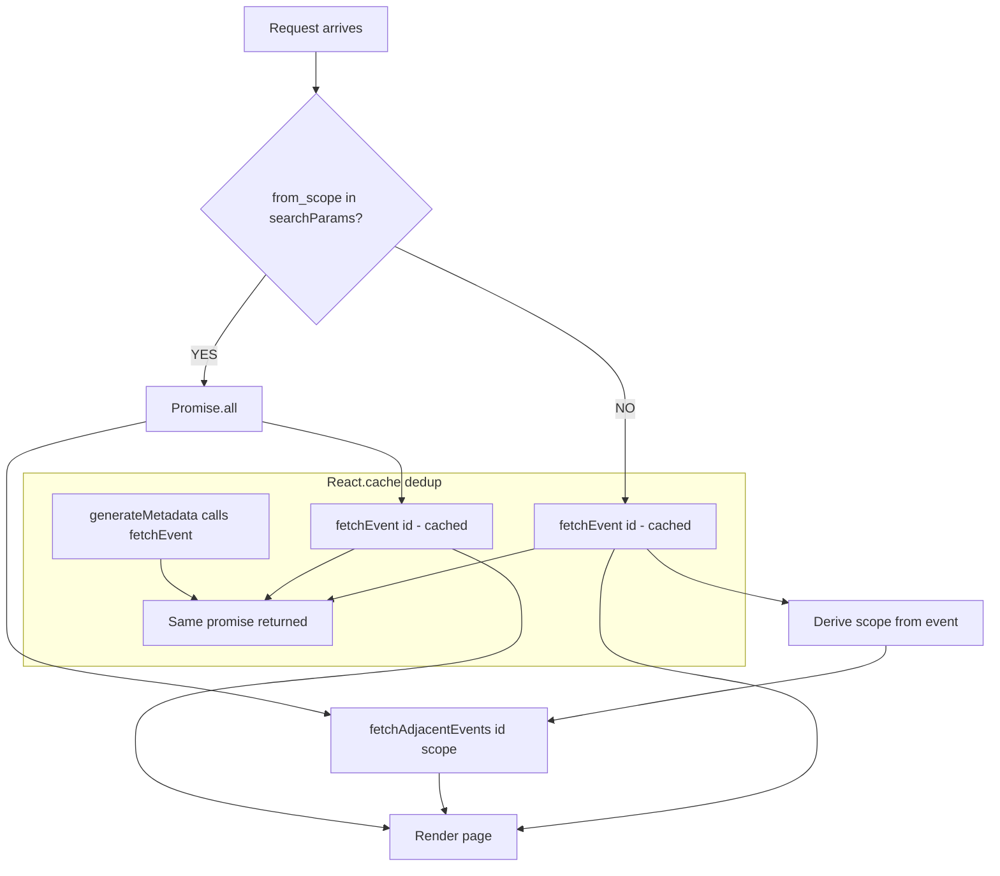

## Problem statement

On the event detail page (`/event/[id]/page.tsx`), data fetching has two inefficiencies:

1. **Duplicate fetching**: `generateMetadata` calls `fetchEvent(id)` and then the page component calls `fetchEvent(id)` again with the same ID. Without `React.cache()`, these are two separate invocations. For mock events this hits the in-memory cache quickly, but for live events (`id.startsWith("live-")`), the first uncached call triggers an OpenAI API request that takes 1-3 seconds. The second call would then hit the in-memory cache, but `generateMetadata` runs the full expensive path unnecessarily if the page component will run the same fetch.

2. **Sequential waterfall**: `fetchEvent(id)` must complete before `fetchAdjacentEvents(id, scope)` begins, because the scope is derived from the event data. However, when `from_scope` is present in `searchParams` (the common case — all weekly view links include it), the scope is known upfront. In this case, both fetches could run in parallel with `Promise.all()`.

Combined, these issues can add 1-3 seconds of unnecessary latency on cold cache for live events.

## User story

As a trader clicking through events, I want the event detail page to load as fast as possible, so that I can quickly assess the historical analysis and take action.

## How it was found

Code review of `src/app/event/[id]/page.tsx` revealed that `fetchEvent` is called in both `generateMetadata` and the default export without `React.cache()` deduplication. The `fetchAdjacentEvents` call is sequential even when `from_scope` is available from searchParams.

## Proposed UX

No visual change — the page renders the same content, but loads faster due to deduplication and parallelization.

## Acceptance criteria

- [ ] `fetchEvent` is wrapped with `React.cache()` (from `"react"`) so that multiple calls with the same `id` within a single request are deduplicated
- [ ] When `from_scope` is present in searchParams, `fetchEvent(id)` and `fetchAdjacentEvents(id, scope)` run in parallel via `Promise.all()`
- [ ] When `from_scope` is NOT present, the waterfall is preserved (since scope depends on event data)
- [ ] Build passes without errors
- [ ] Event detail pages render correctly with all sections (hero, insight, assets, navigation)

## Verification

Run `npm run build` and verify no errors. Navigate to an event detail page from the weekly view and confirm all sections render correctly.

## Out of scope

- Changing the caching strategy in event-service.ts
- Adding client-side caching or SWR
- Modifying the API routes

---

## Planning

### Overview

Wrap the `fetchEvent` and `fetchAdjacentEvents` helper functions in `src/app/event/[id]/page.tsx` with `React.cache()` to deduplicate calls within a single request, and parallelize them with `Promise.all()` when the scope is known from `searchParams`.

### Research notes

- `React.cache()` (from `"react"`) memoizes a function for the duration of a single server request, deduplicating identical calls
- Next.js 14+ Server Components support `React.cache()` natively
- Currently `generateMetadata` and the page component both call `fetchEvent(id)` — two separate invocations
- For live events, `getEventById` calls OpenAI API which can take 1-3 seconds
- `from_scope` is present in most navigations (set by weekly view links), so scope is usually known upfront
- When scope is known, `fetchEvent` and `fetchAdjacentEvents` can run in parallel

### Assumptions

- `React.cache()` is available in the project's React version (React 18+, confirmed by Next.js 16.2.3)
- The dynamic import pattern (`await import()`) can be kept or replaced with static imports — both work with `React.cache()`

### Architecture diagram

### One-week decision

**YES** — This involves wrapping two functions with `React.cache()` and restructuring one `Promise.all` call. ~30 minutes of work.

### Implementation plan

1. Import `cache` from `"react"` at the top of `src/app/event/[id]/page.tsx`
2. Change dynamic imports to static imports for `getEventById` and `getEvents` from `@/lib/event-service`
3. Wrap `fetchEvent` with `cache()`: `const fetchEvent = cache(async (id: string) => getEventById(id))`
4. Wrap `fetchAdjacentEvents` with `cache()` similarly
5. In the page component, when `from_scope` is present, use `Promise.all([fetchEvent(id), fetchAdjacentEvents(id, scope)])` to parallelize
6. When `from_scope` is absent, keep the sequential flow (scope depends on event data)
7. Build and verify the event detail page renders correctly
