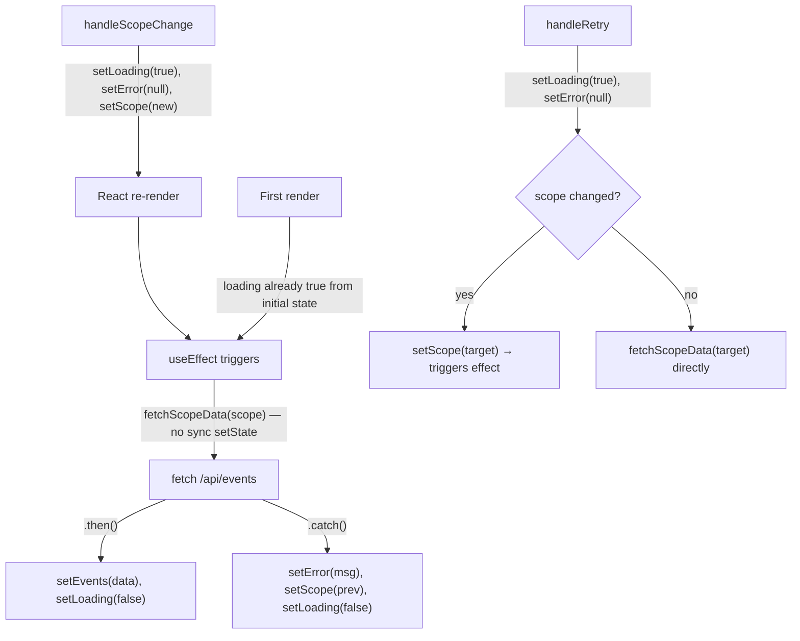

## Problem statement

Running `npm run lint` fails with 1 error and 2 warnings:

1. **Error** — `react-hooks/set-state-in-effect` in `src/components/WeeklyViewClient.tsx:192`. The `fetchScope()` function (which internally calls `setEvents`, `setLoading`, `setError`) is called directly within a `useEffect` body. The ESLint rule flags this because calling setState synchronously within an effect causes cascading renders.

2. **Warning** — `@typescript-eslint/no-unused-vars` for `vi` (line 1) and `userEvent` (line 3) in `src/components/__tests__/AffectedAssets.test.tsx`.

This causes `npm run lint` to fail, which would block any CI pipeline.

## User story

As a developer working on this codebase, I want the linter to pass cleanly so that CI pipelines are unblocked and code quality checks succeed.

## How it was found

During the surface-sweep product review, `npm run lint` was run and returned exit code 1.

## Proposed UX

No user-facing changes. This is a code quality fix.

## Overview

The root cause is that `fetchScope()` (lines 131-162 of `WeeklyViewClient.tsx`) bundles synchronous setState calls (`setLoading(true)`, `setError(null)`) together with the async fetch. When `fetchScope` is called inside a `useEffect` (line 192, 197), the synchronous setState calls happen directly in the effect body, triggering the `react-hooks/set-state-in-effect` ESLint rule.

## Research notes

- The `react-hooks/set-state-in-effect` rule flags synchronous setState calls within effect bodies, but allows setState in async callbacks (`.then()`, `.catch()`, `.finally()`) since those don't cause cascading renders.
- The current `loading` state is already initialized correctly: `useState(urlScope !== "global")` (line 125), so the first-render case doesn't need `setLoading(true)` called from the effect.
- For subsequent scope changes, `setLoading(true)` should be called in the event handler (`handleScopeChange`) before `setScope(newScope)` triggers the effect.
- `handleRetry` also calls `fetchScope` directly — event handlers can call setState synchronously without ESLint issues.

## Assumptions

- The ESLint rule only flags synchronous setState calls in effect bodies, not async callbacks.
- Moving `setLoading(true)` and `setError(null)` into event handlers (before state transitions) maintains the same UX (loading skeletons appear immediately on interaction).

## Architecture diagram

## One-week decision

**YES** — This is a targeted refactor of a single component and removal of 2 unused imports. Completable in under an hour.

## Implementation plan

### Phase 1: Refactor `fetchScope` in `WeeklyViewClient.tsx`

1. **Rename `fetchScope` → `fetchScopeData`** and remove synchronous setState calls from it:
   - Remove `setLoading(true)` (line 133)
   - Remove `setError(null)` (line 134)
   - Keep `failedScope.current = null` (ref mutation, not setState)
   - Keep the async fetch + callbacks unchanged (`.then`, `.catch`, `.finally`)
   - Keep the cleanup function return

2. **Move `setLoading(true)` and `setError(null)` into callers:**
   - `handleScopeChange`: Add `setLoading(true); setError(null);` before `setScope(newScope)` call
   - `handleRetry`: Add `setLoading(true); setError(null);` at the start

3. **Update the `useEffect`** to call `fetchScopeData` instead of `fetchScope`:
   - First render with `urlScope !== "global"`: loading is already `true` from `useState(urlScope !== "global")`, so just call `fetchScopeData(urlScope)` — no sync setState needed
   - Subsequent scope changes: loading was already set by `handleScopeChange`, just call `fetchScopeData(scope)`

4. **Update dependency arrays** if the function name changed.

### Phase 2: Remove unused imports in `AffectedAssets.test.tsx`

1. Remove `vi` from the `vitest` import on line 1
2. Remove the `userEvent` import on line 3

### Phase 3: Verify

1. `npm run lint` — must exit 0
2. `npx vitest run` — all 85 tests must pass
3. `npm run build` — must succeed
4. Manual browser test: scope toggle, initial local scope load, retry after error

## Acceptance criteria

- [ ] `npm run lint` exits with code 0 (no errors, no warnings)
- [ ] The `useEffect` in `WeeklyViewClient.tsx` no longer triggers the `react-hooks/set-state-in-effect` rule
- [ ] Unused imports in `AffectedAssets.test.tsx` are removed
- [ ] Scope toggling and initial scope loading from URL still work correctly (no regressions)
- [ ] All existing tests continue to pass (`npx vitest run`)

## Verification

1. Run `npm run lint` — must exit 0
2. Run `npx vitest run` — all tests must pass
3. Run `npm run build` — must succeed
4. Test in browser: switch scopes, navigate to detail, navigate back — scope persists correctly

## Out of scope

- Refactoring other components
- Adding new tests
- Changing the ESLint configuration to suppress the rule
