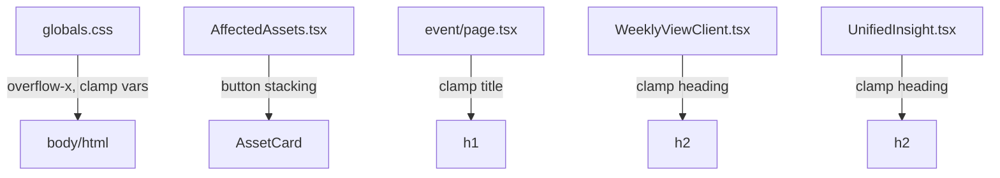

## Problem Statement

The responsive layout is broken at multiple breakpoints. The product owner reported specific issues at 375px (mobile) and 1280px (desktop). Key problems:

1. **No overflow-x: hidden** on body/html — risk of horizontal scroll on narrow viewports
2. **Mobile (<768px):** Trade and Watchlist buttons appear side-by-side instead of full-width stacked; asset cards don't stack cleanly enough
3. **Font sizes are fixed** — no `clamp()` for smooth scaling between breakpoints
4. **Market reaction table** needs guaranteed horizontal scroll wrapper on narrow screens
5. **Touch targets** need verification (44px minimum)
6. **Footer** needs clean stacking on mobile

## User Story

As a mobile user, I want the layout to be fully responsive at all breakpoints (320px–1280px) so that content is readable and usable without horizontal scrolling or visual breakage.

## How it was found

Direct user/product owner feedback reporting broken layout at 375px and 1280px. Code review confirmed: no `overflow-x: hidden`, no `clamp()` usage, buttons are side-by-side on mobile via `flex gap-2`, and font sizes are hardcoded.

## Proposed UX

### Mobile (<768px):
- Single column layout, all cards full width
- Trade/Watchlist buttons stack vertically, full width
- Market reaction table has `overflow-x: auto` wrapper (already present, verify)
- Header: logo left, dark mode toggle right, compact (already correct)
- No horizontal scroll on the page body
- Touch targets minimum 44px
- Footer sections stack vertically

### Desktop (>1024px):
- Content centered, max-width 720px (already implemented)
- Affected asset cards 2-3 per row via CSS grid (already implemented via `sm:grid-cols-2 lg:grid-cols-3`)
- CTA buttons inline (not full width)
- Generous whitespace

### Both:
- Images: max-width 100%, height auto
- Font sizes: use `clamp()` for page titles, section headers
- Scope toggle and header must not break at any width
- `overflow-x: hidden` on html/body
- Test at 320px, 375px, 768px, 1024px, 1280px — no breakage

## Acceptance Criteria

- [ ] `overflow-x: hidden` set on html and body elements
- [ ] Page title ("This Week") uses `clamp()` font sizing
- [ ] Event detail page title uses `clamp()` font sizing
- [ ] Section headers ("What History Tells Us", "Affected Assets") use `clamp()` font sizing
- [ ] On mobile (<768px): Trade and Watchlist buttons are full width, stacked vertically
- [ ] On desktop: Trade and Watchlist buttons remain inline
- [ ] Market reaction table has horizontal scroll wrapper (already has `overflow-x-auto`)
- [ ] No horizontal scroll on the page body at 320px, 375px, 768px
- [ ] Touch targets are minimum 44px on interactive elements
- [ ] Footer stacks cleanly on mobile
- [ ] All 85 tests continue to pass
- [ ] Build succeeds

## Verification

- Run all tests with `npx vitest run`
- Run build with `npx next build`
- Test with agent-browser at 1280px viewport

## Overview

CSS-only responsive fix across 5 files. No structural changes — just adding `overflow-x: hidden`, `clamp()` font sizes, and responsive button stacking.

## Research Notes

- Tailwind CSS v4 is used (via `@import "tailwindcss"`). Responsive utilities (`sm:`, `md:`, `lg:`) work as expected.
- `sm:` = 640px, `md:` = 768px, `lg:` = 1024px in Tailwind defaults.
- The asset card grid already uses `grid-cols-1 sm:grid-cols-2 lg:grid-cols-3` — correct for the spec.
- MarketReactionTable already has `overflow-x-auto` — sufficient for horizontal scroll.
- All font sizes are hardcoded (e.g., `text-[24px]`, `text-[18px]`). Need `clamp()` for smooth scaling.

## Architecture Diagram

## One-Week Decision

**YES** — This is a focused CSS refactor touching 5 files. No new components, no API changes, no data model changes. Estimated effort: 1–2 hours.

## Implementation Plan

### Phase 1: Global CSS fixes (globals.css)
1. Add `overflow-x: hidden` to html and body
2. Add CSS custom properties for clamp() font sizes

### Phase 2: Component responsive fixes
1. `AffectedAssets.tsx` — Stack Trade/Watchlist buttons vertically on mobile (<768px), inline on desktop
2. `event/[id]/page.tsx` — Apply clamp() to h1 title
3. `WeeklyViewClient.tsx` — Apply clamp() to "This Week" heading
4. `UnifiedInsight.tsx` — Apply clamp() to section heading
5. `layout.tsx` — Verify footer stacking (already uses `space-y-5` which stacks vertically)

### Phase 3: Verify
1. Run tests
2. Run build
3. Browser check

## Out of Scope

- Adding new features or content
- Changing the design system colors or tokens
- Redesigning the layout structure
