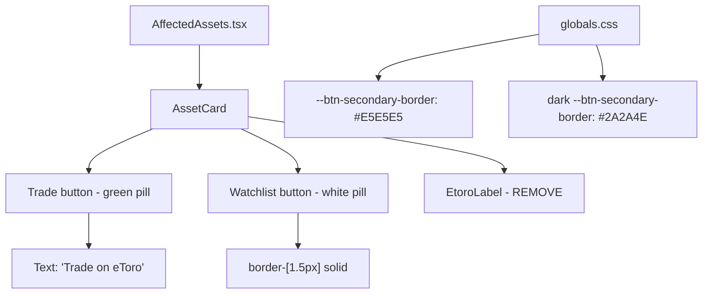

## Problem statement

The Trade and Watchlist buttons on Affected Assets cards look unfinished. The "Trade" button is a green pill but the "Watchlist" button looks like a ghost button with barely visible border — especially in dark mode where it nearly disappears into the background. The "on eToro" label below the buttons clutters the card layout. Button sizing is inconsistent.

## User story

As a trader viewing an event's affected assets, I want the Trade and Watchlist buttons to look solid, professional, and tappable so I feel confident clicking them to take action.

## How it was found

Direct product owner feedback (URGENT priority). Confirmed via browser screenshots in both light and dark mode — the Watchlist button border is barely visible in light mode and nearly invisible in dark mode.

## Proposed UX

### Button Styling
- **Trade button**: Green (#0EB12E via var(--etoro-green)) filled pill, white text, 48px height, full pill radius (48px), font weight 600, text says "Trade on eToro" (with small eToro wordmark text inside instead of separate "on eToro" label below)
- **Watchlist button**: White filled pill with solid #E5E5E5 border (1.5px), dark text (#1A1A1A), 48px height, same pill radius
- Both buttons: SAME height and width, equal sizing side by side, visible padding (16px 24px minimum)
- Hover: Trade darkens to #0C9A27, Watchlist gets subtle gray background (#F5F5F5)
- Dark mode Watchlist: #2A2A4E border, white text, transparent background

### Card Layout
- Remove the "on eToro" text below the buttons
- Cleaner layout: asset name, badge, data row, then buttons with equal spacing

## Acceptance criteria

- [ ] Trade button text reads "Trade on eToro" instead of just "Trade"
- [ ] No separate "on eToro" label below the buttons
- [ ] Trade button: green filled pill, white text, 48px height, rounded-[48px], font-semibold
- [ ] Watchlist button: white filled with 1.5px solid #E5E5E5 border, dark text, 48px height, same radius
- [ ] Both buttons are equal width side by side (flex-1)
- [ ] Padding is 16px 24px minimum on both buttons
- [ ] Hover: Trade → #0C9A27, Watchlist → #F5F5F5 background
- [ ] Dark mode: Watchlist has #2A2A4E border, white text, transparent bg
- [ ] All 85 tests pass
- [ ] Build succeeds

## Verification

1. Run `npx vitest run` — all tests pass
2. Run `npx next build` — build succeeds
3. Visual check in browser: light mode + dark mode, verify buttons look solid and equal

## Overview

Focused styling fix in `src/components/AffectedAssets.tsx`. The `AssetCard` component has two CTA buttons (Trade, Watchlist) and an `EtoroLabel` component that need restyling. The CSS variables for secondary button styling already exist in `globals.css` (light: `--btn-secondary-bg: var(--white)`, dark: `--btn-secondary-bg: transparent`). The dark mode transparent background plus thin border makes the Watchlist button nearly invisible.

## Research notes

- The `AffectedAssets.tsx` file is self-contained — all button styling is inline via Tailwind classes
- CSS custom properties for secondary buttons exist: `--btn-secondary-bg`, `--btn-secondary-text`, `--btn-secondary-border`, `--btn-secondary-hover`
- Light mode: border is `var(--gray-border)` = `#E5E5E5` — correct color but needs thicker width (1.5px)
- Dark mode: border is `#2A2A4E` — correct per spec, but `bg: transparent` makes it hard to see
- Current padding is `px-4` (16px) — needs to be `px-6` (24px) for the spec's `16px 24px`
- The `EtoroLabel` component renders "on eToro" text and should be removed
- Trade button text should change from "Trade" to "Trade on eToro"
- Both buttons use `min-h-[48px]` — correct height, but should be explicit `h-[48px]` for equal sizing

## Assumptions

- No changes needed to the `getEtoroTradeUrl` or `getEtoroWatchlistUrl` functions
- The test file `AffectedAssets.test.tsx` may need button text updates if it matches "Trade" text exactly

## Architecture diagram

## One-week decision

**YES** — This is a single-file styling change to one component. Estimated effort: 30 minutes.

## Implementation plan

### Phase 1: Update AssetCard button styling

1. Change Trade button text from "Trade" to "Trade on eToro"
2. Update Trade button: ensure `h-[48px]` (not just min-h), `px-6` padding
3. Update Watchlist button: `border-[1.5px]` (from default 1px), `h-[48px]`, `px-6` padding
4. Ensure both buttons have `flex-1` for equal width

### Phase 2: Remove EtoroLabel

1. Delete the `EtoroLabel` component
2. Remove the `
<EtoroLabel />
` wrapper from AssetCard

### Phase 3: Update tests

1. Check if `AffectedAssets.test.tsx` matches on "Trade" text — update to "Trade on eToro" if so

### Phase 4: Verify

1. `npx vitest run` — all tests pass
2. `npx next build` — build succeeds
3. Browser check in light + dark mode

## Out of scope

- Changing the card grid layout or responsive breakpoints
- Changing the consolidation logic or data display
- Adding new features to the cards
