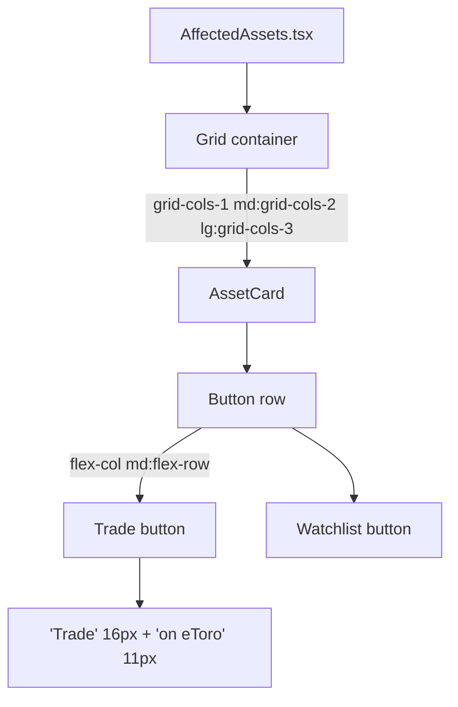

## Problem statement

Two issues with the Affected Assets cards:

1. **Mobile stacking broken**: At viewport widths below 768px, asset cards still show side-by-side (2 columns at 640px+ due to `sm:grid-cols-2`). The constraint spec requires 1 column below 768px.

2. **Trade button text wrapping**: "Trade on eToro" text wraps across 3 lines on the green button when cards are in a 3-column grid, showing "Trade" / "on" / "eToro" stacked vertically. This looks broken.

## User story

As a mobile trader, I want the affected asset cards to stack in a single column on my phone, and I want the Trade button text to be readable without wrapping, so the interface looks polished and professional.

## How it was found

Direct product owner feedback (CRITICAL priority). Confirmed via browser screenshots — "Trade on eToro" button text wraps at all viewport sizes when cards are in 3-column grid. The constraint spec explicitly requires single-column layout below 768px.

## Proposed UX

### Grid breakpoint fix
- Change `grid grid-cols-1 sm:grid-cols-2 lg:grid-cols-3` to `grid grid-cols-1 md:grid-cols-2 lg:grid-cols-3`
- This ensures 1 column below 768px (Tailwind `md:` = 768px)

### Button text fix
- Shorten button text from "Trade on eToro" to "Trade" as primary text with "on eToro" as a smaller subtitle below
- Or use `whitespace-nowrap` with reduced font size to prevent wrapping
- The user suggested: "Trade" with small "on eToro" subtitle

### Button layout on mobile
- At <768px (mobile), buttons should stack full-width: change `sm:flex-row` to `md:flex-row`

## Acceptance criteria

- [ ] Asset cards grid uses `md:grid-cols-2` breakpoint (768px) instead of `sm:grid-cols-2` (640px)
- [ ] At viewport <768px, asset cards are 1 per row (single column)
- [ ] Trade button text does not wrap — shows "Trade" with small "on eToro" subtitle
- [ ] Buttons stack vertically below 768px (full width)
- [ ] All tests pass
- [ ] Build succeeds

## Verification

1. Run `npx vitest run` — all tests pass
2. Run `npx next build` — build succeeds
3. Visual check in browser at desktop and mobile viewports

## Overview

Single-file styling fix in `src/components/AffectedAssets.tsx`. Two changes:
1. Grid breakpoint: `sm:grid-cols-2` → `md:grid-cols-2` so cards stack below 768px
2. Button text: Change "Trade on eToro" to two-line layout: "Trade" (primary) + "on eToro" (small subtitle)
3. Button row: `sm:flex-row` → `md:flex-row` so buttons stack vertically on mobile too

## Research notes

- Tailwind `sm:` = 640px, `md:` = 768px — constraint spec requires 1-column below 768px
- Current grid: `grid grid-cols-1 sm:grid-cols-2 lg:grid-cols-3` — `sm:` triggers too early
- Current button layout: `flex flex-col sm:flex-row` — same issue
- "Trade on eToro" text at 16px font in narrow cards wraps across 3 lines visually
- Solution: two-line button with "Trade" in 16px and "on eToro" in 11px, flex-col layout inside button

## Assumptions

- No test changes needed (tests check for "Trade on eToro" text which will still exist)
- No CSS variable or globals.css changes needed

## Architecture diagram

## One-week decision

**YES** — Single component, ~15 minutes. Three CSS class changes + button text restructure.

## Implementation plan

### Phase 1: Fix grid breakpoint
1. In the grid container, change `sm:grid-cols-2` to `md:grid-cols-2`

### Phase 2: Fix button row breakpoint
1. Change `sm:flex-row` to `md:flex-row`

### Phase 3: Fix Trade button text
1. Change "Trade on eToro" from single line to two-line flex layout:
   - "Trade" as primary text (16px, font-semibold)
   - "on eToro" as subtitle (11px, font-normal, opacity-80)
2. Add `whitespace-nowrap` to prevent wrapping

### Phase 4: Verify
1. Run tests, build, visual check

## Out of scope

- Changing the card content, data display, or consolidation logic
- Changing the Watchlist button styling
- Any changes outside AffectedAssets.tsx
