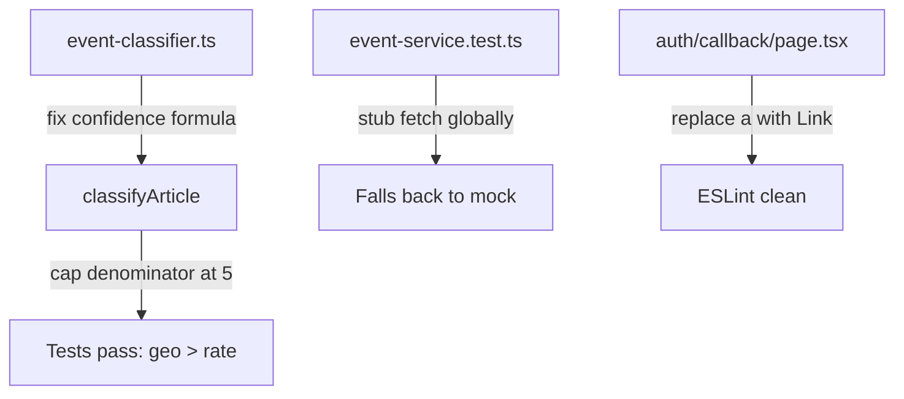

## Problem Statement

The test suite has 4 failing tests across 2 files, and there is 1 ESLint error:

### Failing tests

1. **`event-service.test.ts` — "falls back to mock data when NEWSAPI_KEY is missing"**
   - Test deletes `NEWSAPI_KEY` and expects mock data with `evt-` IDs
   - But the service now tries RSS feeds first (no key needed), so it returns live data with `live-` prefix IDs
   - Expected: `/^evt-/`, Received: `"live-0-2026-04-15"`

2. **`event-classifier.test.ts` — "gives geopolitical events higher confidence than routine interest rate holds"**
   - Geopolitical confidence is not higher than rate-hold confidence

3. **`event-classifier.test.ts` — "scores geopolitical events from high-authority sources very high"**
   - Expected score >5, received 3.44

4. **`event-classifier.test.ts` — "ranks geopolitical crisis above routine earnings when both are recent"**
   - Expected first-ranked to be "geopolitical" but got "earnings"

### ESLint error

- `src/app/auth/callback/page.tsx:93` — Uses `<a>` instead of Next.js `<Link>` component

## User Story

As a developer, I want all tests to pass and linting to be clean, so that CI/CD pipelines work and the codebase stays maintainable.

## How It Was Found

Ran `npx vitest run` during surface-sweep review — 2 suites failed with 4 test failures. Ran `npx eslint src/` — 1 error found.

## Proposed Fix

1. **event-service.test.ts**: The "fallback to mock" test needs to also stub `fetch` to simulate RSS failure (like the last test does), since RSS feeds don't need a key. Alternatively, update the test to verify that events are returned (regardless of ID prefix) when only RSS is available.

2. **event-classifier.test.ts**: The geopolitical scoring/ranking needs tuning in `event-classifier.ts`:
   - Increase confidence boost for geopolitical keywords
   - Or increase source authority weight for Reuters on geopolitical events
   - Ensure geopolitical crisis events score above 5 and rank above routine earnings

3. **ESLint error**: Replace `<a href="/">` with `<Link href="/">` in auth callback page.

## Acceptance Criteria

- [ ] All 104 tests pass (`npx vitest run` — 0 failures)
- [ ] `npx eslint src/` reports 0 errors
- [ ] `next build` still succeeds

## Verification

Run `npx vitest run` and `npx eslint src/` — all pass.

## Out of Scope

- Adding new tests
- Changing RSS feed logic
- Modifying OpenAI integration

## Planning

### Overview

Four test failures and one ESLint error need fixing. The root causes are:
1. **Event classifier confidence formula** divides match count by total keywords in a category, heavily penalizing categories with many keywords (geopolitical has 66 keywords). Fix: cap the denominator so 5+ matches give full confidence.
2. **Event service test** assumes removing NEWSAPI_KEY forces mock fallback, but RSS feeds now work without a key. Fix: also stub fetch to simulate total network failure.
3. **ESLint error** in auth callback. Fix: use Next.js `<Link>`.

### Research Notes

- `classifyArticle()` uses `(matchCount / rule.keywords.length) * rule.weight` for confidence
- Geopolitical has 66 keywords → even 8 matches only gives 8/66 * 1.5 = 0.18 confidence
- Interest-rates has 11 keywords → 3 matches gives 3/11 * 1.3 = 0.35 confidence
- This causes geopolitical events to lose to interest-rate events despite more keyword matches
- Fix: Use `Math.min(matchCount, 5) / 5 * weight` — caps denominator at 5

### Architecture Diagram

### One-Week Decision

**YES** — These are three small, independent fixes touching 3 files. ~30 minutes of work.

### Implementation Plan

1. **Fix `classifyArticle` in `event-classifier.ts`**: Change confidence formula from `matchCount / rule.keywords.length * weight` to `Math.min(matchCount, 5) / 5 * weight`
2. **Fix event-service test**: Add `vi.stubGlobal("fetch", ...)` to the first test to simulate RSS failure, and rename it to "falls back to mock data when all sources fail"
3. **Fix auth callback**: Import `Link` from `next/link` and replace `<a href="/">` with `<Link href="/">`
4. **Verify**: Run `npx vitest run` and `npx eslint src/`
