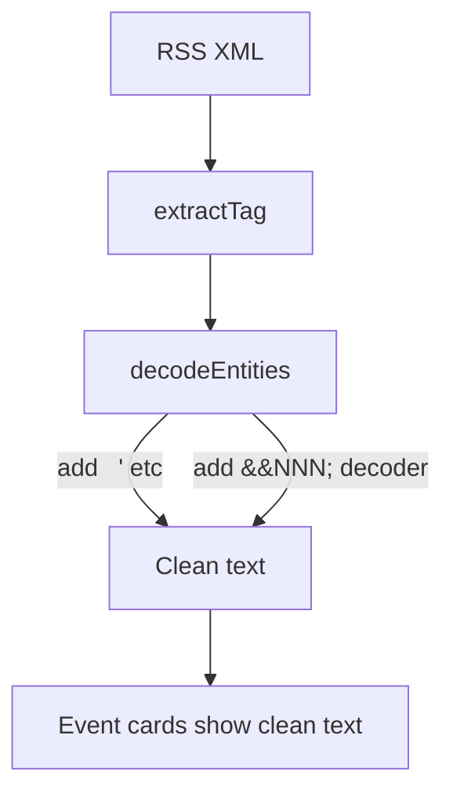

## Problem Statement

Event card descriptions show raw HTML entities like `&nbsp;` and `&apos;` as literal text instead of proper characters. This is visible on:

- **Citigroup event card** (Tue Apr 14): Description shows "income&nbsp;&nbsp;CNBCEarnings" instead of properly separated text
- **Anthropic event card** (Mon Apr 13): Title shows "Anthropic&apos;s" instead of "Anthropic's"
- **Local scope events**: Same issue with `&nbsp;` in descriptions

The root cause is the `decodeEntities()` function in `src/lib/rss-client.ts` which only decodes `&amp;`, `&lt;`, `&gt;`, `&quot;`, `&#39;`, and `&#x27;` — but misses `&nbsp;` and `&apos;` (and potentially other named HTML entities).

## User Story

As a trader reading event summaries, I want clean readable text without HTML artifacts, so that I can quickly understand each event.

## How It Was Found

Observed during browser review — visible on the weekly view event cards. Confirmed in accessibility tree snapshot showing literal `&nbsp;` and `&apos;` in link text.

## Proposed Fix

Update the `decodeEntities()` function in `src/lib/rss-client.ts` to also decode:
- `&nbsp;` → space (` `)
- `&apos;` → apostrophe (`'`)
- `&#160;` → space
- Any other common HTML named entities that might appear in RSS feeds

## Acceptance Criteria

- [ ] `&nbsp;` is rendered as a space in event descriptions
- [ ] `&apos;` is rendered as an apostrophe in event titles
- [ ] No other HTML entities appear as literal text in event cards
- [ ] Existing tests still pass
- [ ] Visual verification in browser confirms clean text

## Verification

Browse the weekly view in agent-browser, check that event descriptions show clean text without HTML entity artifacts.

## Out of Scope

- Changing RSS feed sources
- Modifying event card layout
- Full HTML parser implementation

## Planning

### Overview

The `decodeEntities()` function in `src/lib/rss-client.ts` only handles 6 HTML entities. RSS feeds commonly include `&nbsp;`, `&apos;`, and numeric entities like `&#160;`. These appear as literal text in the UI.

### Research Notes

- Current handled entities: `&amp;`, `&lt;`, `&gt;`, `&quot;`, `&#39;`, `&#x27;`
- Missing: `&nbsp;` (non-breaking space), `&apos;` (apostrophe), `&#160;`, `&mdash;`, `&ndash;`, `&hellip;`, `&lsquo;`, `&rsquo;`, `&ldquo;`, `&rdquo;`
- Best approach: add the most common named entities + a generic numeric entity decoder (`&#NNN;` and `&#xHHH;`)

### Architecture Diagram

### One-Week Decision

**YES** — Single function change in one file. ~15 minutes.

### Implementation Plan

1. Add `&nbsp;` → space, `&apos;` → apostrophe to the replacement chain
2. Add common typographic entities (`&mdash;`, `&ndash;`, `&hellip;`, smart quotes)
3. Add generic numeric entity handler: `&#(\d+);` → `String.fromCharCode(n)` and `&#x([0-9a-f]+);` → `String.fromCharCode(parseInt(hex, 16))`
4. Verify with `npx vitest run` and visual browser check
