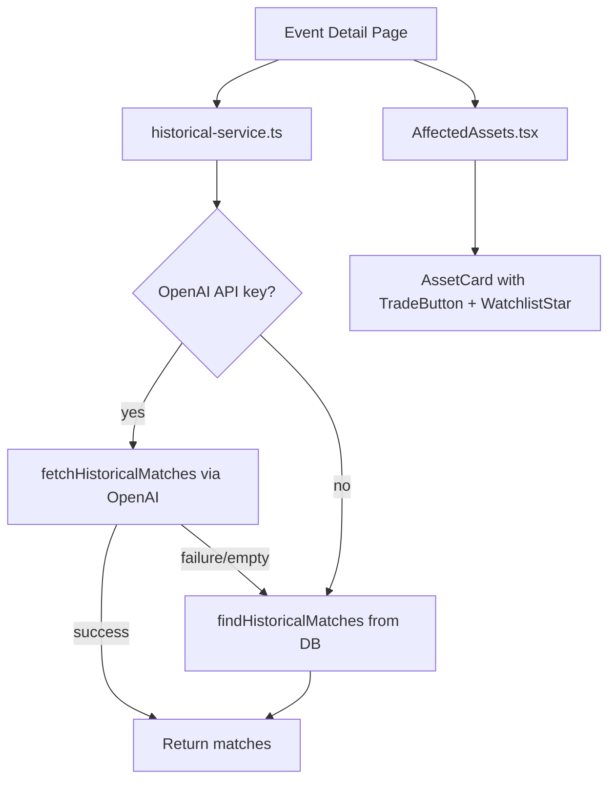

## Problem statement

There are uncommitted changes from a previous failed iteration that provide a significant product improvement: a built-in historical events database (`src/lib/historical-db.ts`) that acts as a fallback when the OpenAI API is unavailable (quota exceeded, timeout, no API key). Without these changes committed, they could be lost on a `git checkout` or reset.

Additionally, `AffectedAssets.tsx` was simplified to remove an unnecessary `useAuth` dependency (both the logged-in and logged-out code paths rendered identical buttons), and there are 2 ESLint warnings for unused `beforeEach` imports in test files.

## User story

As a user, I want historical matches to always be available even when the OpenAI API is down, so that I always get meaningful historical analysis for every event.

## How it was found

During the iteration #19 surface-sweep review:
- `git status` showed uncommitted changes to `src/lib/historical-service.ts`, `src/components/AffectedAssets.tsx`, and an untracked `src/lib/historical-db.ts`
- All 104 tests pass with these changes in place
- Build succeeds
- The UI renders correctly with these changes active
- ESLint shows 2 warnings: unused `beforeEach` in `auth.test.ts` and `pkce.test.ts`

## Proposed UX

No UX change — the historical fallback DB is already functional in the working tree. Historical matches will always be available regardless of OpenAI API status.

## Acceptance criteria

- [ ] `src/lib/historical-db.ts` is committed with entries for all 7 event types
- [ ] `src/lib/historical-service.ts` tries OpenAI first, falls back to built-in DB
- [ ] `src/components/AffectedAssets.tsx` no longer imports `useAuth`
- [ ] ESLint warnings for unused `beforeEach` in `auth.test.ts` and `pkce.test.ts` are fixed
- [ ] All tests pass (`npx vitest run`)
- [ ] Build succeeds (`npm run build`)
- [ ] ESLint has 0 errors and 0 warnings

## Verification

- Run `npx vitest run` — all tests pass
- Run `npm run build` — succeeds
- Run `npx eslint src/` — 0 errors, 0 warnings
- Browse event detail at http://localhost:3050 — historical matches render

## Out of scope

- Adding new historical entries to the database
- Changing the matching algorithm
- UI redesign of asset cards

---

## Planning

### Overview

Straightforward commit task. Three files already modified/created in the working tree need to be committed, plus two minor ESLint fixes (remove unused `beforeEach` imports).

### Research notes

- `src/lib/historical-db.ts` is a new file with ~540 lines containing a built-in database of historical events for all 7 event types (layoffs, earnings, geopolitical, interest-rates, regulation, lawsuits, commodity-shocks) with tag-based matching
- `src/lib/historical-service.ts` modified to try OpenAI first, then fall back to built-in DB (was: return empty array on failure)
- `src/components/AffectedAssets.tsx` simplified: removed `useAuth` import, replaced full-width Trade+Watchlist buttons with compact Trade button + star icon for Watchlist
- `src/lib/__tests__/auth.test.ts` line 1: imports `beforeEach` but never uses it
- `src/lib/__tests__/pkce.test.ts` line 1: imports `beforeEach` but never uses it
- All 104 tests pass with current working tree
- Build succeeds

### Architecture diagram

### One-week decision

**YES** — This is a sub-hour task. The changes are already in place and tested. Only needs lint fixes and a commit.

### Implementation plan

1. Remove unused `beforeEach` from `auth.test.ts` and `pkce.test.ts` imports
2. Verify tests still pass
3. Verify ESLint has 0 errors and 0 warnings
4. `git add -A && git commit`
