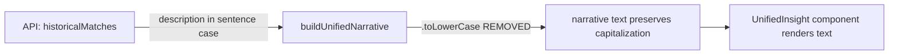

## Problem Statement

The "What History Tells Us" section on event detail pages displays historical event descriptions with all text lowercased, including proper nouns. For example, "Iran seizes oil tankers in the Strait of Hormuz" becomes "iran seizes oil tankers in the strait of hormuz". This makes the text look unprofessional and is incorrect from a grammar/capitalization standpoint.

The root cause is in `src/components/UnifiedInsight.tsx` — the `buildUnifiedNarrative` function calls `.toLowerCase()` on `m.description` at lines 85 and 89. The API already returns properly capitalized text (sentence case with proper nouns capitalized), so the `.toLowerCase()` call is unnecessary and harmful.

## User Story

As a trader reading the historical analysis, I want proper nouns like country names, geographic features, and event names to be properly capitalized, so that the analysis reads professionally and is easy to scan.

## How It Was Found

During a surface-sweep review of the live app at `http://localhost:3050/event/live-0-2026-04-15`, the "What History Tells Us" paragraph reads: "In similar past events — the 2023 iran seizes oil tankers in the strait of hormuz and the 2023 israel-hamas war begins after october 7 attack and the 2024 houthi rebels attack red sea shipping..."

The API response at `/api/events/live-0-2026-04-15` returns properly capitalized descriptions: "Iran seizes oil tankers in the Strait of Hormuz", "Israel-Hamas war begins after October 7 attack", "Houthi rebels attack Red Sea shipping, disrupting global trade".

## Proposed UX

The narrative should preserve the original capitalization from the API. For example: "In similar past events — the 2023 Iran seizes oil tankers in the Strait of Hormuz and the 2023 Israel-Hamas war begins after October 7 attack..."

## Acceptance Criteria

- [ ] Historical event descriptions in the narrative text retain their original capitalization
- [ ] Proper nouns (country names, geographic features, organizations) are correctly capitalized
- [ ] The narrative still flows naturally as a sentence
- [ ] Existing tests pass
- [ ] No visual regression on event detail pages

## Verification

- Run all tests: `npx vitest run`
- Open event detail page and verify the "What History Tells Us" text has proper capitalization
- Take a screenshot as evidence

## Out of Scope

- Changing the Key Takeaway text format
- Modifying the consolidated market reaction table
- Changing how the historical fallback database stores descriptions

## Planning

### Overview

The `buildUnifiedNarrative` function in `src/components/UnifiedInsight.tsx` calls `.toLowerCase()` on historical match descriptions when constructing the narrative paragraph. The API returns properly capitalized text (sentence case with proper nouns), so this transform is both unnecessary and harmful.

### Research Notes

- `m.description` values from the API are already in sentence case: "Iran seizes oil tankers in the Strait of Hormuz"
- The `.toLowerCase()` was likely added to make descriptions flow as subordinate clauses, but since they're already sentence case (not Title Case), removing it produces natural text
- Two call sites: line 85 (single match) and line 89 (multiple matches)
- The existing test file `src/components/__tests__/UnifiedInsight.test.tsx` has tests for the narrative builder

### Architecture Diagram

### One-Week Decision

**YES** — This is a two-line change: remove `.toLowerCase()` from lines 85 and 89 of `UnifiedInsight.tsx`. Update affected tests if any assert on the lowercased text.

### Implementation Plan

1. Remove `.toLowerCase()` from `m.description.toLowerCase()` on line 85 (single match case)
2. Remove `.toLowerCase()` from `m.description.toLowerCase()` on line 89 (multiple match case)
3. Update tests in `UnifiedInsight.test.tsx` if they assert on lowercased descriptions
4. Verify all tests pass
5. Visual verification in browser
