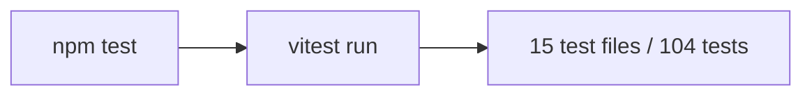

## Problem Statement

The project has 15 test files with 104 passing tests using vitest, but `package.json` has no `test` script. Running `npm test` fails with an error. The `scripts` section only defines `dev`, `build`, `start`, and `lint` — the standard `test` command is missing.

## User Story

As a developer working on this project, I want `npm test` to run the test suite, so that I can follow standard Node.js conventions and integrate with CI/CD pipelines.

## How It Was Found

During the surface-sweep review, running `npx jest` (the default when no test script exists) failed because the project uses vitest, not jest. Running `npx vitest run` succeeds with all 104 tests passing. The missing script was discovered by inspecting `package.json`.

## Proposed UX

Add `"test": "vitest run"` to the scripts section of `package.json`. This is the standard vitest command for CI/single-run mode.

## Acceptance Criteria

- [ ] `npm test` runs the vitest test suite and passes
- [ ] All 104 existing tests still pass
- [ ] No other scripts are modified

## Verification

- Run `npm test` and confirm all tests pass
- Run `npm run build` to confirm no regressions

## Out of Scope

- Adding test:watch or test:coverage scripts
- Modifying vitest configuration
- Adding new tests

## Planning

### Overview

The project uses vitest for testing (configured in `vitest.config.mts`) with 15 test files and 104 tests, but `package.json` is missing a `test` script. Standard tooling and CI/CD pipelines expect `npm test` to work.

### Research Notes

- `vitest` is a devDependency in `package.json`
- `vitest.config.mts` exists at the project root
- `npx vitest run` passes all 104 tests
- Standard convention: `"test": "vitest run"` for CI/single-run mode

### Architecture Diagram

### One-Week Decision

**YES** — Single line addition to `package.json` scripts.

### Implementation Plan

1. Add `"test": "vitest run"` to the `scripts` section of `package.json`
2. Run `npm test` to verify it works
3. Confirm build still passes
