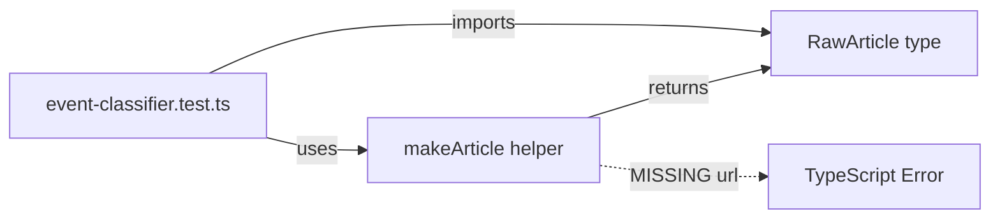

## Problem statement

Running `tsc --noEmit` fails with a type error in `src/lib/__tests__/event-classifier.test.ts`. The `makeArticle` helper function creates a `RawArticle` object but does not include the required `url` property. The `Partial<RawArticle>` spread overrides don't guarantee `url` is present, so TypeScript correctly flags the return type mismatch.

```
src/lib/__tests__/event-classifier.test.ts(10,3): error TS2322:
Type '{ title: string; description: string | null; url?: string | undefined; ... }' is not assignable to type 'RawArticle'.
  Types of property 'url' are incompatible.
    Type 'string | undefined' is not assignable to type 'string'.
```

## User story

As a developer, I want `tsc --noEmit` to pass cleanly so that CI type checking works and I can catch real type errors early.

## How it was found

Running `npx tsc --noEmit` during a surface-sweep review of the project. The Next.js build passes because it only type-checks files in the app build graph, not standalone test files. But `tsc --noEmit` covers all `**/*.ts` files per `tsconfig.json`.

## Proposed fix

Add a default `url` property to the `makeArticle` helper function:

```typescript
function makeArticle(overrides: Partial<RawArticle> = {}): RawArticle {
  return {
    title: "Test headline",
    description: "Test description",
    url: "https://example.com/test-article",
    source: { id: "reuters", name: "Reuters" },
    publishedAt: new Date().toISOString(),
    urlToImage: null,
    ...overrides,
  };
}
```

## Acceptance criteria

- [ ] `npx tsc --noEmit` passes with zero errors
- [ ] All 106 existing tests still pass
- [ ] `npm run build` still succeeds

## Verification

1. Run `npx tsc --noEmit` — should exit 0
2. Run `npm test` — all tests pass
3. Run `npm run build` — build succeeds

## Planning

### Overview

Trivial one-line fix: add the missing `url` default property to the `makeArticle` test helper function.

### Research notes

- `RawArticle` (defined in `src/lib/news-client.ts`) requires `url: string`
- The `makeArticle` helper in `event-classifier.test.ts` omits `url` from its defaults
- `Partial<RawArticle>` spread means `url` becomes `string | undefined` unless explicitly provided
- Next.js build succeeds because it only type-checks files in the app graph, not test files
- `tsc --noEmit` checks all `**/*.ts` per `tsconfig.json`, including test files

### Architecture diagram



### One-week decision

**YES** — This is a single-line change in one test file. Estimated time: 5 minutes.

### Implementation plan

1. Add `url: "https://example.com/test-article"` to the default object in `makeArticle()`
2. Run `tsc --noEmit` to verify
3. Run `npm test` to confirm all tests still pass
4. Run `npm run build` to confirm build succeeds

## Out of scope

- Adding a `typecheck` script to package.json (separate concern)
- Modifying the `RawArticle` interface
- Changes to any other test files
