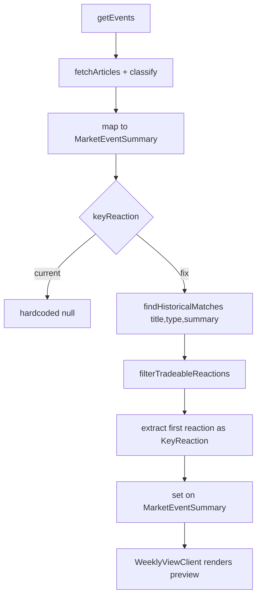

## Problem Statement

The weekly view cards have UI code to display a key market reaction preview (e.g. "▲ Oil +3.9%") but this feature NEVER shows for live events. In `src/lib/event-service.ts` line 94, the `getEvents()` function hardcodes `keyReaction: null` for all live events. The UI in `WeeklyViewClient.tsx` checks `event.keyReaction &&` to conditionally render it, so it's simply invisible.

The built-in historical database (`src/lib/historical-db.ts`) can be queried cheaply (no API calls, no OpenAI) to find a matching historical entry and extract the first reaction for the weekly card preview.

## User Story

As a trader browsing the weekly view, I want to see a quick market reaction indicator on each event card (e.g. "▲ Oil +3.9%") so I can immediately gauge the likely impact without clicking into the detail page.

## How It Was Found

Surface sweep of the live app. All 4 event cards on the weekly view show no keyReaction data. Inspected the API response at `/api/events?scope=global` — every event returns `keyReaction: null`. Traced to `event-service.ts` line 94 where it's hardcoded.

## Proposed UX

Each weekly card should show a small market reaction indicator below the source name, matching the existing UI pattern:
- Green up arrow + asset name + percentage for bullish reactions
- Red down arrow + asset name + percentage for bearish reactions
- Only the most impactful reaction from the first historical match

The UI code already exists in `WeeklyViewClient.tsx` — only the data flow needs fixing.

## Acceptance Criteria

- [ ] `getEvents()` in `event-service.ts` populates `keyReaction` using the built-in historical DB (`findHistoricalMatches`) for live events
- [ ] The historical DB lookup is synchronous and adds no external API calls
- [ ] The first reaction from the best-matching historical entry is used as the keyReaction
- [ ] Weekly view cards show the market reaction preview (visible in browser)
- [ ] Existing tests pass; add a test verifying keyReaction is populated for live events
- [ ] Mock data path continues to work as before

## Verification

- Run full test suite (`npm test`) — all pass
- Open http://localhost:3050 in browser, verify keyReaction previews appear on event cards
- Check both Global and Local scope

## Out of Scope

- Changing the event detail page behavior
- Calling OpenAI or any external API for the weekly view
- Changing the historical DB content
- Modifying the keyReaction UI rendering (already built)

---

## Planning

### Overview

Small data-flow fix in `event-service.ts`. The weekly view card UI already renders `keyReaction` when present. The built-in historical DB (`findHistoricalMatches`) is synchronous, free, and always returns results for any event type. We just need to call it for each live event and extract the first tradeable reaction.

### Research Notes

- `findHistoricalMatches(title, type, summary)` is synchronous, returns `HistoricalMatch[]` with reactions arrays
- `filterTradeableReactions()` filters to eToro-tradeable assets only
- `KeyReaction` type: `{ asset: string, direction: "up" | "down", day1Pct: number }`
- The DB has entries for all event types (layoffs, geopolitical, earnings, regulation, interest-rates, commodity-shocks, lawsuits)
- Even with zero tag matches, `findHistoricalMatches` falls back to the top 2 entries for the type, so it always returns something

### Assumptions

- The built-in DB reactions are acceptable for preview purposes (they won't be exact matches but give directional signal)
- No performance concern: the DB is small (<50 entries total) and lookups are fast

### Architecture Diagram

### One-Week Decision

**YES** — This is a ~30-minute code change. Only `event-service.ts` needs modification plus one new test.

### Implementation Plan

1. Import `findHistoricalMatches` from `historical-db` and `filterTradeableReactions` from `etoro-slugs` in `event-service.ts`
2. Create a helper function `getKeyReaction(title, type, summary)` that:
   - Calls `findHistoricalMatches(title, type, summary)`
   - Filters reactions through `filterTradeableReactions`
   - Returns the first reaction as `KeyReaction` or null
3. Replace `keyReaction: null` on line 94 with `keyReaction: getKeyReaction(e.title, e.type, e.summary || e.title)`
4. Add a unit test in `event-service.test.ts` or a new test file verifying live events have keyReaction populated
5. Run full test suite, verify in browser
