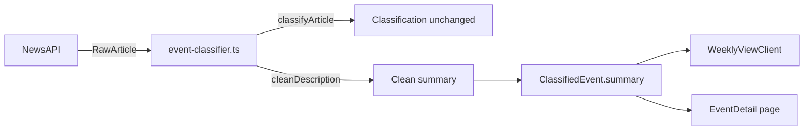

## Problem Statement

When NewsAPI returns articles sourced from Google News, the `description` field contains concatenated sub-article headlines from multiple outlets jammed together without separators. For example, a Citigroup earnings story shows:

> "Citigroup beats estimates, boosted by gains in fixed income CNBCEarnings live updates: Citi and BlackRock stocks rise on strong results, Johnson & Johnson profit beats estimates Yahoo FinanceCitigroup Profit Jumps 42%, Beats Expectations Barron'sCitigroup Reports First Quarter 2026 Results Business WireCiti Logs Best Returns in Five Years as Revamp Takes Hold Bloomberg.com"

This unreadable wall of text appears on the event detail page (full text) and weekly cards (truncated but still garbled). It undermines the app's editorial, high-quality feel.

## User Story

As a trader viewing an event, I want to see a clean, readable summary of the event, so that I can quickly understand what happened without parsing garbled concatenated headlines.

## How It Was Found

During browser review of the live app at http://localhost:3050. Clicking on the Tuesday Apr 14 "Citigroup beats estimates" event (sourced from Google News Business) revealed the concatenated description on the event detail page. The same garbled text appears on the weekly card (truncated to 2 lines via `line-clamp-2` but still visually confusing). The local scope (UK/DE/FR) events showed the same pattern with Google News UK articles.

Screenshots: 294-citigroup-detail.png, 296-local-scope.png

## Proposed UX

- On event detail, the summary should read as a single clean sentence or short paragraph — not multiple headlines mashed together.
- On weekly cards, the 2-line truncated preview should read coherently.
- If the description is from Google News (source name contains "Google News"), extract only the first meaningful headline/sentence before the source attribution starts.
- Alternatively, if the description is garbled, fall back to the article title as the summary.

## Acceptance Criteria

- [ ] Google News articles no longer show concatenated multi-source descriptions
- [ ] Event detail summary text is a clean, readable sentence for Google News articles
- [ ] Weekly card description preview (line-clamp-2) reads coherently
- [ ] Non-Google-News articles are unaffected
- [ ] All existing tests pass
- [ ] New test covers the Google News description cleanup function

## Verification

- Run `npm test` — all tests pass
- Open http://localhost:3050 in browser, navigate to events sourced from Google News, verify descriptions are clean and readable on both the weekly card and event detail page

## Out of Scope

- Changing the NewsAPI data source or switching providers
- Modifying the event classification logic
- Any changes to the historical matching or market reaction data

---

## Planning

### Overview

Google News articles from NewsAPI have concatenated sub-article descriptions where multiple headlines from different sources are jammed together without separators. This makes the summary text unreadable on both the weekly card and event detail page. The fix is a single utility function in `event-classifier.ts` that cleans descriptions from Google News sources.

### Research Notes

- NewsAPI returns Google News articles with source.name like "Google News", "Google News UK", "Google News Business", etc.
- The description field contains a pattern: `Title1 Source1Title2 Source2Title3 Source3...` where source names (CNBC, Yahoo Finance, Bloomberg, etc.) run directly into the next headline with no delimiter.
- The article **title** is always clean — it's just the primary headline.
- The fix point is `src/lib/event-classifier.ts` line 243: `summary: article.description || article.title`
- Classification in `classifyArticle()` already uses `title + description` for keyword matching (line 186), so cleaning the summary won't affect classification.

### Assumptions

- All Google News sources have "Google News" somewhere in `source.name`
- The title is always clean and usable as a fallback summary
- Non-Google-News articles have clean descriptions

### Architecture Diagram

### One-Week Decision

**YES** — This is a small, focused change: one utility function + one test file. Well under one day of work.

### Implementation Plan

1. **Add `cleanDescription()` function** to `src/lib/event-classifier.ts`
   - Detect Google News source: `source.name.toLowerCase().includes("google news")`
   - For Google News articles: use the article title as the summary (the title is always the clean primary headline)
   - For non-Google-News articles: return the description as-is
2. **Apply at the summary assignment** (line 243): replace `article.description || article.title` with `cleanDescription(article.description, article.source.name, article.title)`
3. **Add tests** in `src/lib/__tests__/event-classifier.test.ts`:
   - Google News article → summary equals the title
   - Non-Google-News article → summary equals the description
   - Null description → summary equals the title
4. **Verify** all 107 existing tests still pass
