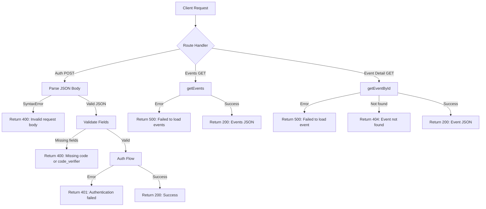

## Problem statement

The `/api/auth/etoro` POST endpoint leaks raw JavaScript error messages to clients when it receives a malformed or empty request body. Sending a POST with no body returns `{"error":"Unexpected end of JSON input"}` with a 401 status code. This exposes implementation details (the fact that `request.json()` is being called and failing) which is a security concern and poor UX.

The issue is on line 13 of `src/app/api/auth/etoro/route.ts`: `await request.json()` throws when the body is missing or not valid JSON, and the catch block on line 52 passes the raw error message through to the response.

Additionally, the `/api/events` and `/api/events/[id]` routes lack any try-catch wrapper. While their underlying service functions have error handling, unexpected errors at the route level would result in unstructured 500 errors.

## User story

As a developer integrating with the API (or a potential attacker probing endpoints), I should receive clean, non-revealing error messages that don't expose internal implementation details.

## How it was found

During error-handling review (iteration #31), sending `curl -X POST http://localhost:3050/api/auth/etoro` with no body returned `{"error":"Unexpected end of JSON input"}` instead of a clean "Invalid request body" message.

## Proposed UX

- `/api/auth/etoro` with empty/malformed body: `{"error":"Invalid request body"}` with 400 status
- `/api/auth/etoro` with valid JSON but missing fields: `{"error":"Missing code or code_verifier"}` with 400 status (already works)
- `/api/events` on unexpected error: `{"error":"Failed to load events"}` with 500 status
- `/api/events/[id]` on unexpected error: `{"error":"Failed to load event"}` with 500 status

## Acceptance criteria

- [ ] POST to `/api/auth/etoro` with no body returns `{"error":"Invalid request body"}` with status 400
- [ ] POST to `/api/auth/etoro` with malformed JSON returns `{"error":"Invalid request body"}` with status 400
- [ ] No raw JavaScript error messages (like "Unexpected end of JSON input") are ever returned to clients
- [ ] `/api/events` route has a try-catch wrapper returning structured JSON on error
- [ ] `/api/events/[id]` route has a try-catch wrapper returning structured JSON on error
- [ ] All existing tests still pass

## Verification

- Run `curl -X POST http://localhost:3050/api/auth/etoro` and verify clean error message
- Run `curl -X POST http://localhost:3050/api/auth/etoro -d "not json"` and verify clean error message
- Run all tests: `npm test`

## Out of scope

- Changing auth flow logic
- Adding rate limiting
- Modifying error boundary components (those are for UI errors, not API)

---

## Planning

### Overview

Three API route files need defensive error handling: the auth endpoint needs to catch malformed JSON bodies before they reach `request.json()`, and both events routes need try-catch wrappers to return structured JSON errors on unexpected failures.

### Research notes

- Next.js `request.json()` throws a SyntaxError when the body is empty or invalid JSON
- The catch block in the auth route passes `error.message` directly to the client, leaking internal details
- Both event routes rely entirely on service-level error handling; route-level errors (middleware issues, etc.) would produce raw 500s

### Assumptions

- No changes to business logic or auth flow
- Error messages should be generic and non-revealing

### Architecture diagram

### One-week decision

**YES** — This is a 30-minute task touching 3 files with simple try-catch additions. No new dependencies or complex logic.

### Implementation plan

1. **Auth route** (`src/app/api/auth/etoro/route.ts`): Wrap `request.json()` in its own try-catch that returns `{"error":"Invalid request body"}` with 400 status. Keep the outer catch for auth errors but sanitize the message to never leak raw error strings.
2. **Events route** (`src/app/api/events/route.ts`): Add try-catch around the `getEvents` call, return `{"error":"Failed to load events"}` with 500 on failure.
3. **Event detail route** (`src/app/api/events/[id]/route.ts`): Add try-catch around the `getEventById` call, return `{"error":"Failed to load event"}` with 500 on failure.
4. Run tests to verify.
