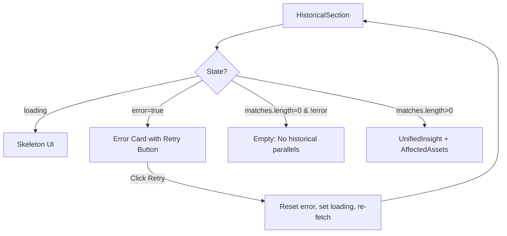

## Problem statement

The `HistoricalSection` component (`src/components/HistoricalSection.tsx`) conflates two very different states: "no historical data exists" and "the API call failed." Both show the same message: "No historical parallels found for this event."

When the historical matches API fails (network error, OpenAI timeout, etc.), users see "No historical parallels found" and have no way to know that data might actually exist but just failed to load. They have no retry option and are misled into thinking there is genuinely nothing to show.

The relevant code (lines 83-91):
```tsx
if (error || matches.length === 0) {
  return (
    <section className="...">
      <p className="text-sm text-muted">
        No historical parallels found for this event.
      </p>
    </section>
  );
}
```

## User story

As a trader viewing an event detail page, when the historical data fails to load I want to see a clear error message with a retry button so I can try again rather than being told no data exists.

## How it was found

During error-handling code review (iteration #31), the HistoricalSection code was inspected and found to use `if (error || matches.length === 0)` to display a single "no data" message for both error and empty states.

## Proposed UX

**Error state** (API failure):
- Show a card with "Could not load historical data" message
- Include a "Try again" button that re-fetches the data
- Use the same error styling as the weekly view error banner (red-tinted background)

**Empty state** (no matches genuinely exist):
- Keep the existing "No historical parallels found for this event." message

## Acceptance criteria

- [ ] When the historical matches API fails, the HistoricalSection shows "Could not load historical data" with a "Try again" button
- [ ] Clicking "Try again" re-fetches the historical matches
- [ ] When no matches genuinely exist (not an error), the existing "No historical parallels found" message is shown
- [ ] The error state uses appropriate styling (error background color, consistent with app design)
- [ ] The retry button follows eToro design system (pill shape, proper colors)
- [ ] All existing tests still pass

## Verification

- Temporarily break the API response (e.g., return 500 from `/api/events/[id]`) and verify the error state with retry appears
- Verify the "No historical parallels found" message still appears when data is genuinely empty
- Run all tests: `npm test`

## Out of scope

- Adding retry logic to the event service or historical service (that's backend resilience)
- Adding toast notifications
- Automatic retry/polling

---

## Planning

### Overview

The `HistoricalSection` component needs to separate its error state from its empty state. When `error` is true, show a retry-enabled error message. When `matches.length === 0` and no error, show the existing "no parallels" message.

### Research notes

- The component already tracks `error` and `matches` as separate state variables — the fix is purely in the render logic
- The weekly view (`WeeklyViewClient`) already implements a similar error+retry pattern that can be referenced for consistency
- The retry function needs to reset error state and re-trigger the fetch

### Assumptions

- The existing `fetchMatches` function in the useEffect can be extracted for retry use
- Styling should match the existing error banner in WeeklyViewClient for consistency

### Architecture diagram



### One-week decision

**YES** — This is a 30-minute task touching a single component. Just splitting the existing conditional and adding a retry callback.

### Implementation plan

1. Extract the `fetchMatches` function so it can be called from both the useEffect and a retry handler.
2. Split the `if (error || matches.length === 0)` conditional into two separate branches:
   - `if (error)` → render error card with "Could not load historical data" and a "Try again" button
   - `if (matches.length === 0)` → render existing empty state message
3. Wire the retry button to reset `error` to false, `loading` to true, and call `fetchMatches` again.
4. Style the error card consistently with the weekly view error banner (red-tinted `var(--error-bg)` background, eToro green retry button).
5. Run tests to verify.
