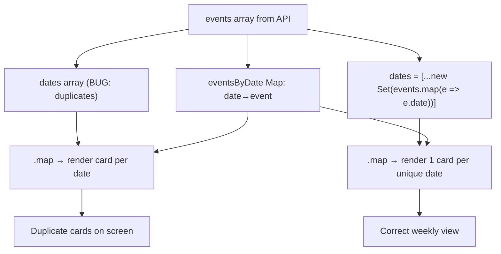

## Overview

Single-line fix in `WeeklyViewClient.tsx` to deduplicate the `dates` array for global scope, preventing N identical cards from rendering when the API returns multiple events with the same date.

## Research Notes

- The bug is purely in the rendering layer — the data source (event-service) intentionally returns up to 10 diverse events which may share a date.
- The `eventsByDate` Map already deduplicates by date (Map overwrites duplicate keys, keeping the last event per date). Only the iteration array needs fixing.
- Local scope already uses `getWeekDates()` which returns 7 unique dates — not affected.
- No library or API changes needed.

## Architecture Diagram



## One-Week Decision

**YES** — This is a single-line change in one file. No new dependencies, no API changes, no schema changes. Implementable in minutes.

## Implementation Plan

1. In `src/components/WeeklyViewClient.tsx`, change the `dates` array construction for global scope from `events.map(e => e.date)` to `[...new Set(events.map(e => e.date))]`
2. Run existing tests to confirm no regressions
3. Verify visually in browser

## Problem Statement

The weekly view renders duplicate event cards when the event API returns multiple events for the same date. In `WeeklyViewClient.tsx`, for global scope, the `dates` array is built with `events.map(e => e.date)`, which produces duplicate date strings when multiple events share the same day. The `eventsByDate` Map keeps only the last event per date (Map overwrites duplicate keys), but the iteration still produces one card per entry in `dates`, resulting in N identical cards for the same event on the same day.

For example, when the API returns 9 events for April 15 and 1 for April 14, the weekly view shows 9 identical cards for "Trump's Hormuz blockade…" (the last April 15 event) plus 1 for April 14, instead of 1 card per unique day.

## User Story

As a trader visiting the weekly view, I want to see one event per day so that the page fulfills its promise of "one market-moving event per day, paired with history" and doesn't show confusing duplicate cards.

## How It Was Found

Browsing the app with agent-browser at http://localhost:3050, scrolling through the weekly view. Multiple identical cards for WED 15 APR were observed, all showing the same headline. Verified by curling `/api/events` which returned 10 events (9 for April 15, 1 for April 14), confirming the data source returns multiple events per day. Screenshots 350 and 351 show the duplicates.

## Root Cause

In `src/components/WeeklyViewClient.tsx` (around line 244–245):

```typescript
const eventsByDate = new Map(events.map((e) => [e.date, e]));
const dates = scope === "local" ? getWeekDates() : events.map((e) => e.date);
```

For global scope, `dates` is `events.map(e => e.date)` — no deduplication. The Map correctly deduplicates by date, but the iteration array does not.

## Proposed Fix

Deduplicate the dates array for global scope:

```typescript
const dates = scope === "local"
  ? getWeekDates()
  : [...new Set(events.map((e) => e.date))];
```

This ensures each date appears only once in the iteration, so only one card per day is rendered. The `eventsByDate` Map already picks one event per date.

## Acceptance Criteria

- [ ] When the API returns multiple events for the same day, the weekly view shows exactly 1 card per unique date
- [ ] No duplicate cards appear on the weekly view for any scope (global or local)
- [ ] All existing tests continue to pass
- [ ] Visual verification: weekly view shows distinct days, not repeated identical cards

## Verification

1. Run `npm test` — all tests pass
2. Browse to http://localhost:3050 with agent-browser and verify no duplicate day cards appear
3. Screenshot as evidence

## Out of Scope

- Changing which event is selected per day (Map last-write-wins is acceptable)
- Changing the event service to return fewer events per day
- Adding per-day deduplication logic to the API layer
