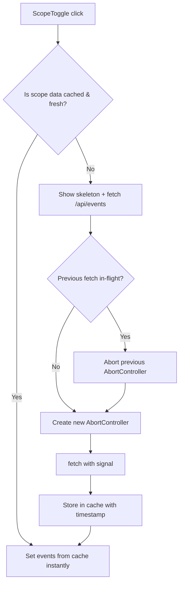

## Problem statement

When the user toggles between Global and Local scope on the weekly view, the `WeeklyViewClient` component discards all previously fetched data and re-fetches from `/api/events?scope=...` every time. This results in:

1. **Skeleton loader shown on every toggle** — even when switching back to a scope whose data was loaded seconds ago, the user sees 5 skeleton cards for ~1 second while the API responds.
2. **Redundant API calls** — toggling Global → Local → Global fires 2 separate API requests for "global" data that hasn't changed.
3. **No request cancellation** — the current boolean-flag cancellation (`let cancelled = false`) prevents stale state updates but does not abort the in-flight HTTP request. This wastes bandwidth and server resources when the user toggles rapidly.

Observed: switching to "local" then back to "global" fired a `/api/events?scope=global` request that took 1,140ms. The user saw the skeleton loader for the full duration even though the global data had been loaded on initial page render.

## User story

As a trader toggling between Global and Local scope, I want the scope switch to feel instant when I return to a previously-loaded scope, so that I can quickly compare global and local events without waiting.

## How it was found

Browser performance profiling during scope toggle:
- Cleared `performance.getEntriesByType('resource')`, toggled to Local, waited for data, toggled back to Global.
- Observed 2 new `/api/events?scope=global` requests (1,140ms each) even though global data was loaded on page load.
- Screenshot evidence in `review-screenshots/362-local-loading.png`.

## Proposed UX

- When switching to a scope that was already fetched, show the cached data immediately (no skeleton, no spinner).
- When switching to a scope for the first time, show skeleton + fetch as today.
- Cache is per-session (in-memory) — no localStorage needed.
- Cache TTL: 2 minutes — after that, refetch on next toggle.
- Rapid toggles should abort the previous in-flight request via AbortController.

## Acceptance criteria

- [ ] Toggling from Global to Local and back to Global shows cached global data instantly (no skeleton, no API call if data is < 2 min old).
- [ ] First load of each scope still fetches from API and shows skeleton.
- [ ] Rapid scope toggles cancel the previous in-flight fetch (AbortController).
- [ ] Cache is invalidated after 2 minutes (configurable constant).
- [ ] All existing tests pass.
- [ ] Verified in browser with agent-browser — toggle back and forth, no skeleton on cached scope.

## Verification

- Run all tests: `npm test`
- Open app in browser, toggle Global → Local → Global, confirm no skeleton on second global load.
- Screenshot the instant toggle for evidence.

## Out of scope

- Server-side cache changes (already exists with 5-min TTL).
- HTTP cache headers (API already sets `s-maxage`).
- Persisting cache across page reloads.

---

## Planning

### Overview

The `WeeklyViewClient` component currently holds a single `events` state and re-fetches from the API on every scope toggle. The fix adds an in-memory cache (`useRef<Map>`) keyed by scope ("global" | "local") with a TTL, and uses `AbortController` to properly cancel in-flight requests.

### Research notes

- The component is `src/components/WeeklyViewClient.tsx` (~437 lines).
- Current flow: `handleScopeChange` sets `scope` → `useEffect` calls `fetchScopeData(scope)` → fetch → `setEvents(data.events)`.
- `initialEvents` prop provides server-rendered global data on first load.
- The server-side event cache has a 5-min TTL; a 2-min client TTL is appropriate.
- `AbortController` is fully supported in all modern browsers and can be passed to `fetch()` to actually cancel network requests.
- React 18 Strict Mode runs effects twice in dev — AbortController properly handles this by aborting the first request.

### Assumptions

- "Instant" means showing cached data without any skeleton/loading state.
- Cache does not survive page navigation (component unmount clears it).
- Initial server-rendered data counts as cached "global" data.

### Architecture diagram

### One-week decision

**YES** — This is a ~30 line change in a single component. No new files, no API changes, no dependencies. Well under one day.

### Implementation plan

1. Add a `useRef` for a `Map<string, { data: MarketEventSummary[]; fetchedAt: number }>` cache.
2. Seed the cache with `initialEvents` under the "global" key on mount.
3. In `fetchScopeData`, check cache first — if data exists and `Date.now() - fetchedAt < CACHE_TTL`, use it directly without fetching.
4. Replace the boolean `cancelled` pattern with `AbortController` — store the controller in a ref, abort on cleanup or new fetch.
5. On successful fetch, write the result to the cache map.
6. Update `handleScopeChange` to skip `setLoading(true)` when cached data is available.
7. Update existing tests to verify the caching behavior (no additional test file needed).
