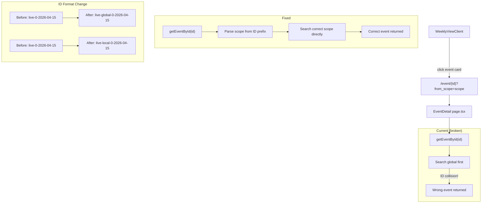

## Problem Statement

Event IDs are positional (`live-${index}-${date}`) and identical IDs map to **different events** in global vs local scope. For example, `live-4-2026-04-15` is "Snap's stock jumps 11%..." in global but "U.S. says Hormuz blockade..." in local. When a user clicks an event card from local scope, the event detail page calls `getEventById(id)` which searches the global scope first and returns the **wrong event**.

The user sees a completely different article than the one they clicked on.

## User Story

As a user browsing local (UK/DE/FR) events, I want clicking an event card to show that exact event's detail page, so that I'm not confused by seeing a different article than the one I selected.

## How It Was Found

1. Navigated to the weekly view and switched to Local scope (UK / DE / FR).
2. Clicked on the first event card: "U.S. says Hormuz blockade 'fully implemented'..."
3. Event detail page showed "Snap's stock jumps 11% on plans to axe 16% of its workforce..." — a completely different event from the global scope.
4. Root cause confirmed: `curl` shows global `live-4-2026-04-15` = "Snap's stock" while local `live-4-2026-04-15` = "U.S. says Hormuz blockade". The `getEventById` function in `event-service.ts` searches `["global", "local"]` in order, finding the global event first.

## Research Notes

- Event ID generation is in `event-service.ts` line 91: `id: \`live-${i}-${e.date}\``
- `getEventById` in `event-service.ts` line 116-142 searches `["global", "local"]` sequentially
- Tests in `event-service.test.ts` check `startsWith("live-")` — need to update to new prefix
- The `from_scope` search param on event detail page is only used for adjacent nav, not event lookup
- Only 2 files reference the `live-` prefix: `event-service.ts` and its test file
- Mock event IDs use `evt-` prefix — unaffected by this change

## Assumptions

- Changing the ID format from `live-X-date` to `live-global-X-date` / `live-local-X-date` is safe since IDs are ephemeral (regenerated on each cache miss)
- No external systems depend on the event ID format

## Architecture Diagram

## One-Week Decision

**YES** — This is a small, focused change touching only `event-service.ts` and its test file. The ID generation and parsing changes are straightforward string operations. Estimated effort: ~1 hour.

## Implementation Plan

### Phase 1: Update ID generation
- In `getEvents()`, change ID format from `live-${i}-${date}` to `live-${scope}-${i}-${date}`
- This makes global and local IDs naturally unique

### Phase 2: Update ID parsing in `getEventById`
- Parse scope from the ID prefix: `live-global-...` → search global, `live-local-...` → search local
- Keep fallback to searching both scopes for any IDs that don't match the new format

### Phase 3: Update tests
- Update `event-service.test.ts` to expect the new ID format (e.g. `startsWith("live-global-")` or `startsWith("live-local-")`)

## Acceptance Criteria

- [ ] Event IDs include scope so global and local IDs never collide
- [ ] Clicking a local event card always shows the correct local event detail
- [ ] Clicking a global event card always shows the correct global event detail
- [ ] Existing global-only links (without `from_scope`) still work
- [ ] All tests pass
- [ ] No console errors

## Verification

- Run all tests: `npm test`
- Browse the app with agent-browser:
  1. Switch to Local scope
  2. Click each visible local event card
  3. Verify the detail page shows the same event title as the card
  4. Switch to Global scope and verify the same
- Take screenshots as evidence

## Out of Scope

- Changing the URL slug format beyond scope prefixing
- Adding permanent/deterministic IDs based on content hashing
- Modifying the event detail page layout or design
