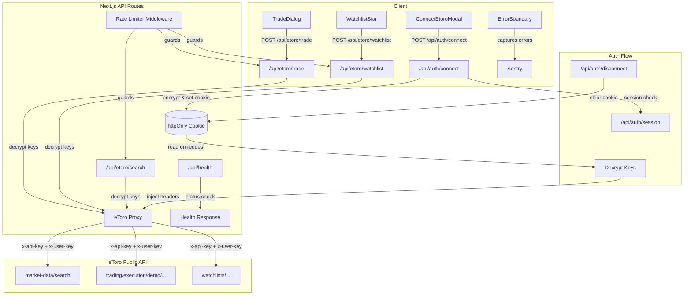

# Initiative 0002 — Production Ready

## Goal
Close all production gaps so the app is a fully functional trading tool — not just a demo. Users should be able to connect their eToro account and execute real trades and watchlist actions directly from the app.

## Scope

### 1. eToro API Key Connection Flow
- Add "Connect eToro" button in the header (replaces the current SSO login scaffold)
- On click: open a modal where the user enters their **Public API Key** and **User Key**
- Include a step-by-step guide inside the modal: "Go to eToro > Settings > Trading > Create New Key"
- Store keys in an httpOnly encrypted cookie (server-side only, never in localStorage)
- Show "Connected to eToro" indicator when keys are stored
- Add a "Disconnect" option to clear stored keys

### 2. Real Trading via eToro API
- When user clicks "Trade" on an asset card:
  - If NOT connected: show "Connect eToro" modal
  - If connected: open a trade confirmation dialog showing asset name, current price direction from historical data
  - On confirm: resolve the instrument ID via eToro search API, then execute a **demo market order** (by amount) via eToro Public API
  - Show success/failure feedback
- Default to **demo/virtual** trading for safety — add a toggle for real trading with a warning

### 3. Real Watchlist via eToro API
- When user clicks the watchlist star on an asset card:
  - If NOT connected: show "Connect eToro" modal
  - If connected: resolve instrument ID, add to user's default eToro watchlist via API
  - Toggle star state on success
  - Show toast notification on success/failure

### 4. Error Tracking & Monitoring
- Add basic error tracking (Sentry or Vercel Analytics)
- Log API failures server-side
- Add health check endpoint (/api/health)

### 5. Rate Limiting
- Add basic rate limiting to API routes (prevent abuse)
- Limit eToro API proxy calls per user session

### 6. Production Hardening
- Validate all environment variables on startup
- Add proper error boundaries in React
- Ensure no secrets leak in error messages or client-side code

## Out of Scope
- OAuth SSO (deferred until eToro approves the app)
- Database persistence (in-memory sessions acceptable for now)
- User profiles or account management
- Real money trading by default (demo first, opt-in to real)

## Success Criteria
- User can connect their eToro account via API keys
- Clicking "Trade" executes a demo trade on eToro
- Clicking the watchlist star adds the asset to the user's eToro watchlist
- Errors are tracked and reported
- API routes are rate-limited
- No secrets exposed client-side

---

## Planning

### Overview
This initiative replaces the current SSO-based auth scaffold with a simpler API key connection flow, adds real eToro API integration for trading and watchlists via backend proxy routes, and hardens the app for production with error tracking, rate limiting, and security improvements.

### Research Notes
- **eToro Public API** uses `x-api-key` + `x-user-key` headers (no OAuth needed for API key auth)
- Demo trading endpoint: `POST /trading/execution/demo/market-open-orders/by-amount` with PascalCase body
- Instrument resolution: `GET /market-data/search?internalSymbolFull=<SYMBOL>&fields=instrumentId,internalSymbolFull,displayname`
- Watchlist add: `POST /watchlists/{watchlistId}/items` with `[{ItemId, ItemType: "Instrument"}]`
- Default watchlist: `POST /watchlists/default-watchlist/selected-items`
- Encryption: Node.js `crypto.createCipheriv` with AES-256-GCM using a server-side `ENCRYPTION_KEY` env var
- Rate limiting: In-memory sliding window or token bucket (no external deps needed for MVP)

### Assumptions
- Users already have eToro accounts and can generate API keys
- In-memory session store is acceptable (no DB required yet)
- AES-256-GCM encryption is sufficient for key storage in cookies
- Demo trading is the default; real trading requires explicit opt-in

### Architecture Diagram

### One-Week Decision
**NO** — This initiative spans 6 distinct feature areas (auth, trading, watchlists, monitoring, rate limiting, hardening), each requiring backend routes, frontend components, tests, and security considerations. Estimated 12-15 working days.

### Split Rationale
Split into 5 vertical slices, ordered by dependency:
1. **API Key Connection** — foundation for all eToro integrations
2. **Trade Execution** — depends on connection flow
3. **Watchlist** — depends on connection flow
4. **Error Tracking & Monitoring** — independent infrastructure
5. **Rate Limiting & Production Hardening** — capstone hardening
