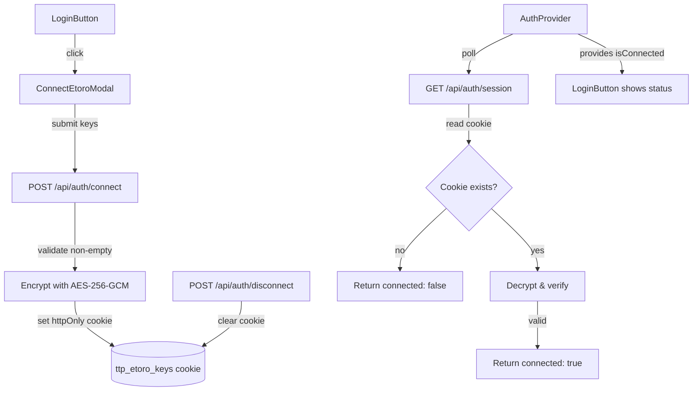

## Overview
Replace the current SSO/OAuth login flow with a simple API key connection modal. Users enter their eToro Public API Key and User Key, which are encrypted and stored in an httpOnly cookie. The header shows connection status with a disconnect option.

## Acceptance Criteria
- [ ] "Connect eToro" button in header replaces SSO login button
- [ ] Modal with API key + User key input fields and step-by-step guide
- [ ] Keys encrypted with AES-256-GCM using server-side ENCRYPTION_KEY
- [ ] Encrypted keys stored in httpOnly, secure, sameSite cookie
- [ ] Keys NEVER stored in localStorage or accessible to client JS
- [ ] "Connected to eToro" indicator shown when keys are stored
- [ ] "Disconnect" option clears stored keys
- [ ] `/api/auth/session` returns connection status (not SSO session)
- [ ] `/api/auth/connect` validates and stores encrypted keys
- [ ] `/api/auth/disconnect` clears cookie
- [ ] AuthProvider updated to use new connection flow
- [ ] Tests for encryption, connect/disconnect routes, and UI states

## Research Notes
- Node.js `crypto` module provides AES-256-GCM natively — no external deps needed
- `ENCRYPTION_KEY` env var should be 32 bytes (64 hex chars) for AES-256
- Cookie size limit ~4KB — encrypted API key + user key + IV + auth tag fits well within this
- Existing `auth.ts` has SSO-specific code (JWKS, token exchange) — can be replaced entirely
- Existing `AuthProvider` checks `/api/auth/session` — keep this pattern, just change what session means
- Existing `LoginButton` uses PKCE redirect — replace with modal trigger

## Architecture Diagram

## One-Week Decision
**YES** — Focused scope: 2 API routes, 1 modal component, 1 encryption utility, refactor of existing auth files. ~2-3 days.

## Implementation Plan

### Phase 1: Encryption utility
- Create `src/lib/encryption.ts` with `encrypt(plaintext)` and `decrypt(ciphertext)` using AES-256-GCM
- Use `ENCRYPTION_KEY` env var (generate default for dev)
- Include IV and auth tag in the encrypted payload

### Phase 2: API routes
- Replace `src/app/api/auth/etoro/route.ts` with connect endpoint (POST: receive apiKey + userKey, encrypt, set cookie)
- Update `src/app/api/auth/session/route.ts` to check for encrypted keys cookie instead of session store
- Update `src/app/api/auth/logout/route.ts` → rename to disconnect, clear keys cookie
- Remove SSO-specific code from `src/lib/auth.ts` (JWKS, token exchange, etc.)

### Phase 3: Frontend
- Create `src/components/ConnectEtoroModal.tsx` — modal with key inputs and guide
- Refactor `src/components/LoginButton.tsx` to trigger modal instead of SSO redirect
- Update `src/components/AuthProvider.tsx` — add `isConnected`, `showConnectModal`, remove SSO-specific state
- Remove PKCE dependencies (`src/lib/pkce.ts` usage in LoginButton)

### Phase 4: Tests
- Unit tests for encryption utility
- API route tests for connect/session/disconnect
- Component tests for modal and login button states
