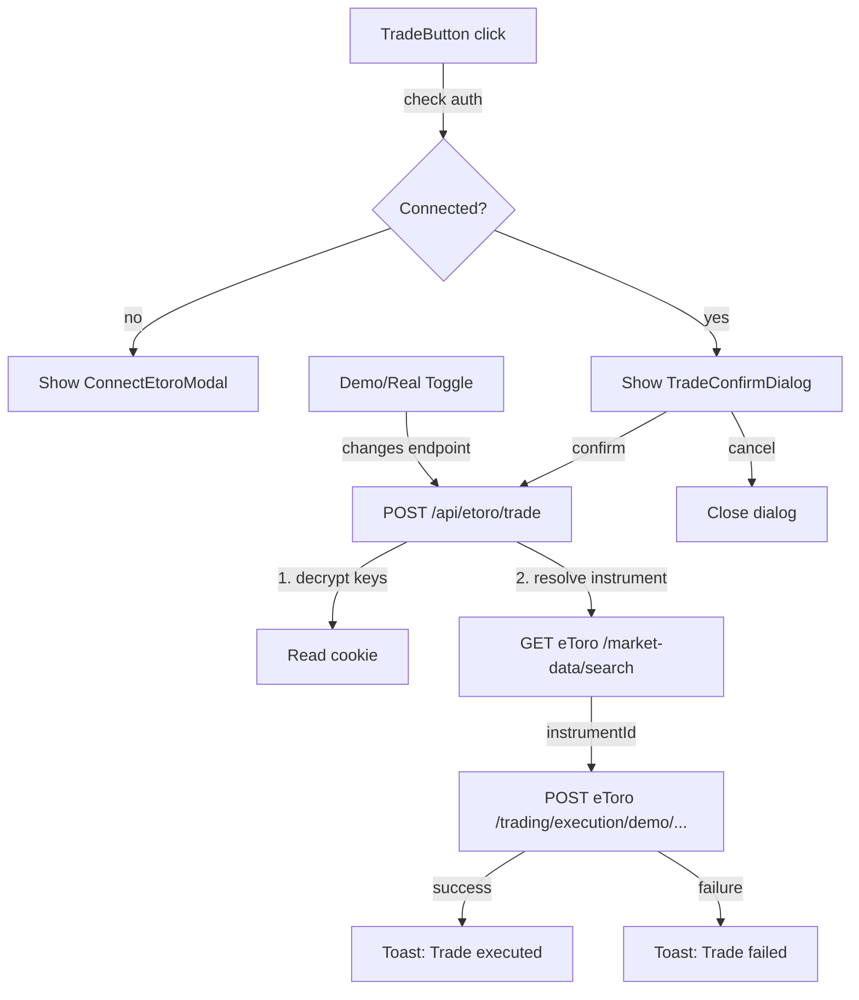

## Overview
When a connected user clicks "Trade" on an asset card, show a trade confirmation dialog with asset name and historical direction. On confirm, resolve the instrument ID via eToro search API and execute a demo market order. Default to demo/virtual trading with an opt-in toggle for real trading.

## Acceptance Criteria
- [ ] Trade button checks connection status; if not connected, shows connect modal
- [ ] Trade confirmation dialog shows asset name, direction, and amount input
- [ ] `/api/etoro/search` proxy route resolves asset name to instrumentId
- [ ] `/api/etoro/trade` proxy route executes demo market order by amount
- [ ] Demo mode is default; real trading requires explicit toggle with warning
- [ ] Success/failure toast notifications after trade
- [ ] Loading states during trade execution
- [ ] All eToro API calls go through backend proxy with encrypted key decryption
- [ ] Required headers: x-request-id (UUID), x-api-key, x-user-key
- [ ] PascalCase body fields: InstrumentID, IsBuy, Leverage, Amount
- [ ] Tests for proxy routes and trade dialog

## Research Notes
- eToro search: `GET /market-data/search?internalSymbolFull=<SYM>&fields=instrumentId,internalSymbolFull,displayname`
- Demo trade: `POST /trading/execution/demo/market-open-orders/by-amount`
- Real trade: `POST /trading/execution/market-open-orders/by-amount`
- Body: `{ InstrumentID, IsBuy: true/false, Leverage: 1, Amount: number }`
- `x-request-id` must be unique UUID per request
- Existing `etoro-slugs.ts` maps asset names to eToro symbols — can reuse for search

## Architecture Diagram

## One-Week Decision
**YES** — Well-scoped: 2 proxy API routes, 1 dialog component, 1 toast system, asset symbol mapping. ~3-4 days.

## Implementation Plan

### Phase 1: eToro proxy infrastructure
- Create `src/lib/etoro-proxy.ts` — shared helper to decrypt keys from cookie and build eToro request headers
- Create `src/app/api/etoro/search/route.ts` — proxy for instrument search
- Create `src/app/api/etoro/trade/route.ts` — proxy for trade execution (demo by default)

### Phase 2: Toast notification system
- Create `src/components/ToastProvider.tsx` — context + UI for toast notifications
- Add to layout.tsx

### Phase 3: Trade UI
- Create `src/components/TradeDialog.tsx` — confirmation dialog with amount input, demo/real toggle
- Refactor `TradeButton` in `AffectedAssets.tsx` to check connection and open dialog
- Wire up trade execution flow with loading/success/error states

### Phase 4: Tests
- API route tests for search and trade proxy
- Component tests for trade dialog states
