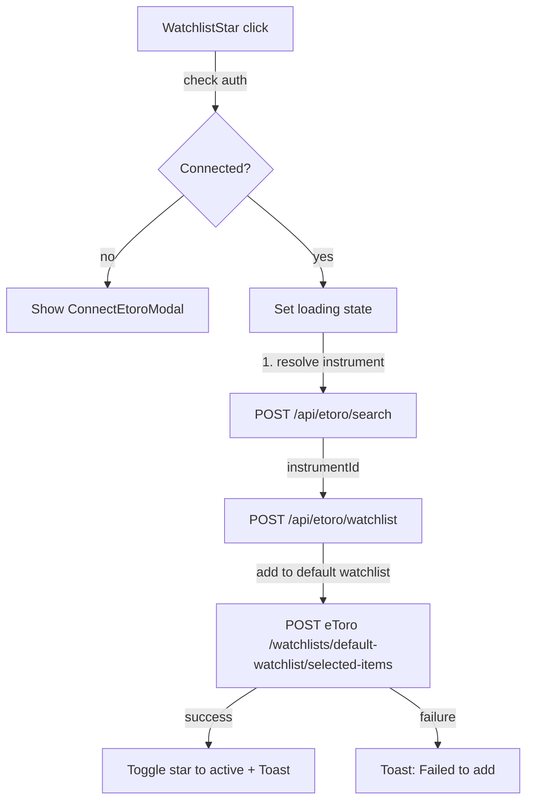

## Overview
When a connected user clicks the watchlist star on an asset card, resolve the instrument ID and add it to their default eToro watchlist via the API. Toggle star state on success and show toast notifications.

## Acceptance Criteria
- [ ] Watchlist star checks connection status; if not connected, shows connect modal
- [ ] `/api/etoro/watchlist` proxy route adds item to user's default watchlist
- [ ] Instrument ID resolved via shared `/api/etoro/search` route
- [ ] Star toggles to filled/active state on success
- [ ] Toast notification on success/failure
- [ ] Loading state on star during API call
- [ ] All API calls go through backend proxy
- [ ] Tests for watchlist route and star component behavior

## Research Notes
- Get user watchlists: `GET /watchlists`
- Add to default watchlist: `POST /watchlists/default-watchlist/selected-items` with body `[{ItemId, ItemType: "Instrument"}]`
- Or add to specific watchlist: `POST /watchlists/{watchlistId}/items`
- Need to first resolve instrument name → instrumentId via search
- Can reuse `/api/etoro/search` from trade execution task

## Architecture Diagram

## One-Week Decision
**YES** — Narrow scope: 1 proxy route, 1 component refactor, reuses existing search proxy. ~2 days.

## Implementation Plan

### Phase 1: Watchlist API route
- Create `src/app/api/etoro/watchlist/route.ts` — accepts asset name, resolves instrument ID, adds to default watchlist

### Phase 2: WatchlistStar refactor
- Refactor `WatchlistStar` in `AffectedAssets.tsx` from external link to interactive button
- Check connection status via AuthProvider
- Call watchlist API with loading/success/error states
- Use toast system from trade execution task

### Phase 3: Tests
- API route tests for watchlist proxy
- Component tests for star states
