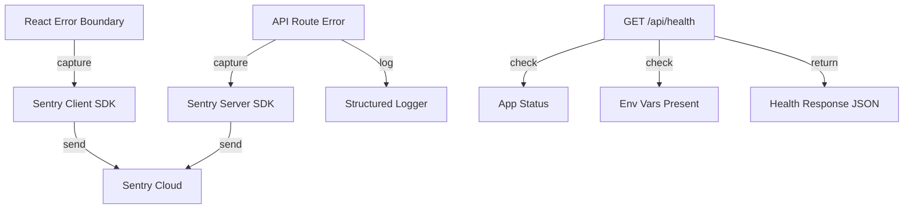

## Overview
Add basic error tracking and monitoring infrastructure. Integrate Sentry for client-side error capture, add server-side API failure logging, and create a health check endpoint.

## Acceptance Criteria
- [ ] Sentry SDK integrated for client-side error tracking
- [ ] Server-side API failures logged with structured format
- [ ] `/api/health` endpoint returns app status, uptime, and dependency checks
- [ ] Error boundaries capture and report errors to Sentry
- [ ] No secrets or PII leaked in error reports
- [ ] Tests for health check endpoint

## Research Notes
- `@sentry/nextjs` is the official Sentry SDK for Next.js — handles both client and server
- Requires `SENTRY_DSN` env var (or `NEXT_PUBLIC_SENTRY_DSN` for client)
- Sentry auto-instruments Next.js API routes and React error boundaries
- Health check should verify: app is running, key env vars present (not their values), basic connectivity
- Structured logging: JSON format with timestamp, level, message, context

## Architecture Diagram

## One-Week Decision
**YES** — Standard integration: 1 SDK setup, 1 health endpoint, logging utility. ~1-2 days.

## Implementation Plan

### Phase 1: Sentry integration
- Install `@sentry/nextjs`
- Create `sentry.client.config.ts` and `sentry.server.config.ts`
- Configure with `NEXT_PUBLIC_SENTRY_DSN` env var
- Update `next.config.ts` with Sentry webpack plugin (if needed)

### Phase 2: Health check
- Create `src/app/api/health/route.ts` — returns status, uptime, env var presence checks
- No auth required on health endpoint

### Phase 3: Structured logging
- Create `src/lib/logger.ts` — structured JSON logger for server-side
- Add logging to existing API routes for failures
- Ensure no secrets in log output

### Phase 4: Tests
- Health endpoint returns expected shape
- Logger produces valid JSON output
