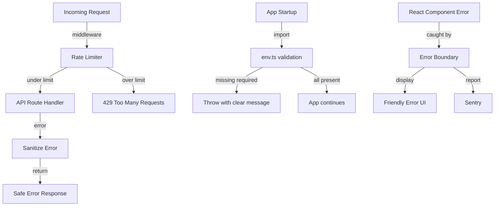

## Overview
Add rate limiting to all API routes (especially eToro proxy routes), validate environment variables on startup, improve React error boundaries, and audit for secret leaks.

## Acceptance Criteria
- [ ] In-memory rate limiter applied to all API routes
- [ ] eToro proxy routes have stricter per-session rate limits
- [ ] Rate limit exceeded returns 429 with Retry-After header
- [ ] All required environment variables validated on startup
- [ ] React error boundaries catch and display friendly error messages
- [ ] No secrets or raw error messages exposed to client
- [ ] Sanitized error responses on all API routes
- [ ] Tests for rate limiting behavior and env validation

## Research Notes
- In-memory sliding window rate limiter: track requests per IP in a Map with TTL
- Next.js middleware can intercept all API routes for rate limiting
- Env validation: check at module load time in a shared `src/lib/env.ts`
- Existing `error.tsx` has basic error boundary — enhance with Sentry reporting
- Secret audit: grep for env var usage in client components, ensure no `process.env.SECRET_*` on client

## Architecture Diagram

## One-Week Decision
**YES** — Cross-cutting concerns but straightforward: rate limiter utility, env validation module, error boundary enhancements. ~2-3 days.

## Implementation Plan

### Phase 1: Rate limiting
- Create `src/lib/rate-limit.ts` — in-memory sliding window rate limiter
- Create or update Next.js middleware (`src/middleware.ts`) to apply rate limiting to `/api/` routes
- Stricter limits for `/api/etoro/*` routes (e.g., 30 req/min vs 100 req/min for general)

### Phase 2: Env validation
- Create `src/lib/env.ts` — validate required env vars at import time
- Import in `layout.tsx` or `instrumentation.ts` to fail fast
- Required: `ENCRYPTION_KEY`; Optional but warned: `NEWSAPI_KEY`, `OPENAI_API_KEY`, `NEXT_PUBLIC_SENTRY_DSN`

### Phase 3: Error boundary & sanitization
- Enhance `src/app/error.tsx` to report to Sentry
- Add `src/app/event/[id]/error.tsx` improvements
- Audit all API routes for raw error message leaks
- Add sanitization helper in `src/lib/errors.ts`

### Phase 4: Tests
- Rate limiter unit tests (under limit, over limit, sliding window behavior)
- Env validation tests (missing vars, all present)
- Error sanitization tests
