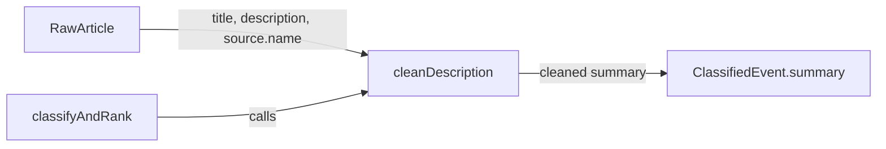

# Fix 5 failing tests: implement and export missing cleanDescription function

## Problem Statement

The test suite has 5 failing tests in `src/lib/__tests__/event-classifier.test.ts`. All 5 are in the `cleanDescription` describe block and fail with `TypeError: cleanDescription is not a function`.

The tests import `cleanDescription` from `../event-classifier`, but the function does not exist in `src/lib/event-classifier.ts` — it was never implemented or exported despite tests being written for it in a previous task (`trade-the-past-clean-google-news-descriptions`).

**Failing tests:**
1. `returns title for Google News articles instead of concatenated description`
2. `returns title for Google News regional variants`
3. `returns description as-is for non-Google-News articles`
4. `returns title when description is null`
5. `returns title when description is empty string`

## User Story

As a developer, I want the test suite to pass completely so that CI/CD is green and regressions are caught immediately.

## How It Was Found

Running `npx vitest run` shows 5 failed / 144 passed. All failures are `TypeError: cleanDescription is not a function` in the cleanDescription test block.

## Proposed Fix

Implement and export a `cleanDescription(description, sourceName, title)` function in `src/lib/event-classifier.ts` that:
- Returns `title` if the source name starts with "Google News" (since Google News descriptions are garbled concatenations of multiple headlines)
- Returns `title` if `description` is null, undefined, or whitespace-only
- Returns `description` as-is for all other sources

Also use `cleanDescription` in `classifyAndRank()` where it currently does `article.description || article.title` for the summary field, so the function is actually used in production code.

## Acceptance Criteria

- [ ] `cleanDescription` is exported from `src/lib/event-classifier.ts`
- [ ] All 5 cleanDescription tests pass
- [ ] Full test suite passes: 0 failures
- [ ] `classifyAndRank` uses `cleanDescription` for the summary field
- [ ] Build passes with no type errors

## Verification

- Run `npx vitest run` — all 149 tests pass (0 failures)
- Run `npm run build` — build succeeds

## Out of Scope

- Changing the test expectations themselves
- Refactoring other parts of event-classifier
- Adding new test cases

---

## Planning

### Overview
A simple missing-function bug: 5 tests import `cleanDescription` from `event-classifier.ts` but the function was never implemented. The fix is to add a ~10-line exported function that handles Google News garbled descriptions by returning the title instead.

### Research Notes
- Google News RSS descriptions concatenate snippets from multiple sources (e.g., "Headline1 CNBCHeadline2 Yahoo Finance"), making them unreadable
- The test expectations show the function signature: `cleanDescription(description: string | null, sourceName: string, title: string): string`
- The function should be used in `classifyAndRank()` at line 292 where `summary: article.description || article.title` currently lives
- No external dependencies needed

### Assumptions
- The function is a pure utility with no side effects
- Google News source names always contain the string "Google News" (e.g., "Google News", "Google News UK", "Google News Business")

### Architecture Diagram

### One-Week Decision
**YES** — This is a ~15-minute fix: one function implementation (~10 lines), one usage site update (1 line), no new files.

### Implementation Plan

1. Add `cleanDescription` function to `src/lib/event-classifier.ts` (before `classifyArticle`)
   - Signature: `export function cleanDescription(description: string | null, sourceName: string, title: string): string`
   - If `description` is null/undefined/whitespace-only → return `title`
   - If `sourceName` starts with "Google News" → return `title`
   - Otherwise → return `description`
2. Update `classifyAndRank()` to use `cleanDescription(article.description, article.source.name, article.title)` for the `summary` field
3. Run tests to verify all 149 pass
4. Run build to verify no type errors
