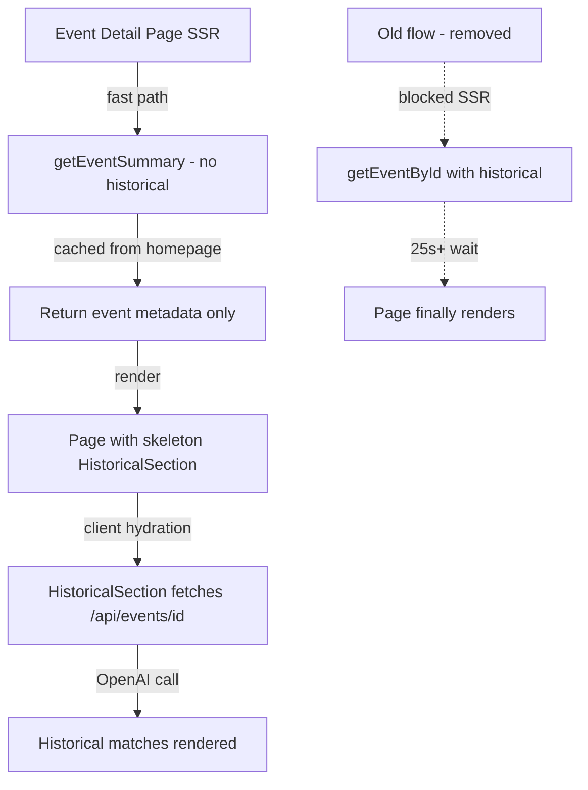

# Fix event detail page SSR hanging when OpenAI API is slow

## Problem Statement

The event detail page (`/event/[id]`) performs server-side rendering that calls `getEventById()`, which chains `getEvents()` (RSS feeds, 8s timeout each) and `getHistoricalMatches()` (OpenAI API, 25s timeout). When these external APIs are slow or unresponsive, the entire page SSR hangs indefinitely, blocking the dev server and causing production request timeouts.

Observed behavior: navigating to `/event/live-global-1-2026-04-28` caused the server to become completely unresponsive — even the health endpoint and root page stopped responding for over 2 minutes.

The `HistoricalSection` component is already a client component that can fetch historical matches independently, but the SSR call to `getEventById` still blocks because it fetches historical matches and passes them as `initialMatches`.

## User Story

As a trader, I want the event detail page to load quickly (under 3 seconds), showing a loading skeleton for historical data while it fetches, so that I don't think the app is broken when external APIs are slow.

## How It Was Found

During surface-sweep review: clicked an event card from the landing page, the browser showed "Rendering..." and the page never loaded. The dev server became completely unresponsive (health endpoint, root page, and all API routes stopped responding). Verified via curl that the request hung for over 2 minutes despite individual fetch timeouts being set.

## Proposed Fix

1. **Don't await historical matches during SSR** — modify `getEventById` to return the event without historical data (or add a `skipHistorical` parameter). Always pass empty `initialMatches` to `HistoricalSection`, which already handles client-side fetching with loading skeleton and error retry.

2. **Add a page-level overall timeout** — wrap the SSR data fetch in `Promise.race` with a 5-second timeout. If the timeout fires, return what we have (event metadata) without historical matches.

3. **Fix Next.js fetch timeout compatibility** — the `AbortSignal.timeout()` may not work correctly with Next.js's extended `fetch` (which adds `{ next: { revalidate } }` options). Add a manual `AbortController` with `setTimeout` as a fallback.

## Acceptance Criteria

- [ ] Event detail page loads within 5 seconds even when OpenAI API is unresponsive
- [ ] Historical section shows loading skeleton and fetches data client-side
- [ ] Server remains responsive to other requests during event detail loading
- [ ] No regression in event detail page content (historical matches still appear after client-side fetch)
- [ ] Build passes with no type errors
- [ ] All existing tests pass

## Verification

- Run `npm run build` — build succeeds
- Run `npx vitest run` — all tests pass
- Browse to event detail page in browser — page loads quickly with skeleton for historical section
- Health endpoint remains responsive during event detail loading

## Out of Scope

- Changing the OpenAI API timeout value
- Adding streaming/Suspense infrastructure
- Changing the RSS feed timeout behavior

---

## Planning

### Overview
The event detail page SSR blocks on `getEventById()` which sequentially calls `getEvents()` (RSS feeds) then `getHistoricalMatches()` (OpenAI). When these external calls are slow, the entire server hangs. The fix is to decouple the historical matching from SSR and let the client-side `HistoricalSection` component handle it instead.

### Research Notes
- `HistoricalSection` is already a client component that can fetch matches independently via `/api/events/[id]` — it shows a loading skeleton when `initialMatches` is empty
- The `getEventById` function in `event-service.ts` does two things: (1) finds the event in the events list, (2) fetches historical matches. Only step 1 is needed for SSR.
- `getEvents()` has its own 5-min cache (`eventsCache`), so finding the event is fast when cached
- The `fetchAdjacentEvents` function also calls `getEvents()` but benefits from the same cache
- Next.js's `fetch` with `{ next: { revalidate } }` may interfere with `AbortSignal.timeout` behavior — manual AbortController + setTimeout is more reliable

### Assumptions
- The `HistoricalSection` client component's existing client-side fetch path works correctly (tested in previous tasks)
- Users prefer a fast page load with skeleton over a slow page load with pre-rendered historical data
- The existing `/api/events/[id]` endpoint will handle the historical matching for client-side fetches

### Architecture Diagram

### One-Week Decision
**YES** — This is a ~1 hour change. Add a `skipHistorical` parameter to `getEventById`, use it in the page component, and always pass empty `initialMatches`. The client component already handles everything.

### Implementation Plan

1. **Modify `getEventById` in `src/lib/event-service.ts`**
   - Add `options?: { skipHistorical?: boolean }` parameter
   - When `skipHistorical` is true, return the event with empty `historicalMatches` array (skip `getHistoricalMatches` call)
   - Default to `skipHistorical: false` for backward compatibility (API routes still need it)

2. **Update event detail page `src/app/event/[id]/page.tsx`**
   - Call `getEventById(id, { skipHistorical: true })` in both `fetchEvent` and the page component
   - Pass empty array as `initialMatches` to `HistoricalSection`
   - This makes the SSR only depend on `getEvents()` (cached, fast) — no more OpenAI blocking

3. **Verify** — run tests, run build, verify in browser
