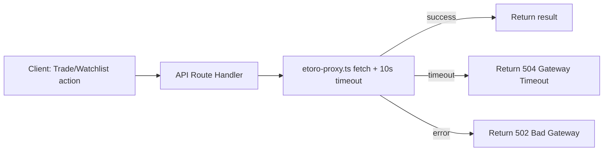

# Add timeout to eToro proxy fetch calls to prevent hanging requests

## Problem Statement

The eToro proxy functions in `src/lib/etoro-proxy.ts` — `searchInstrument()` and `executeTrade()` — call `fetch()` against the eToro Public API without any `AbortSignal.timeout`. If the eToro API is slow or unresponsive, these requests hang indefinitely.

Similarly, the watchlist route in `src/app/api/etoro/watchlist/route.ts` calls `fetch()` to the eToro watchlist API without a timeout.

This means a user clicking "Trade" or the watchlist star could wait indefinitely with a spinner if the eToro API is down, with no error feedback.

## User Story

As a trader, I want trade and watchlist actions to fail gracefully with a clear error message within 10 seconds if the eToro API is unresponsive, so I know to try again later rather than waiting indefinitely.

## How It Was Found

Code review during surface sweep. The `openai-client.ts` (25s) and `rss-client.ts` (8s) both have `AbortSignal.timeout()` on their fetch calls, but `etoro-proxy.ts` does not, creating an inconsistency in timeout handling.

## Proposed Fix

Add `signal: AbortSignal.timeout(10000)` (10 seconds) to all fetch calls in:
1. `searchInstrument()` in `src/lib/etoro-proxy.ts`
2. `executeTrade()` in `src/lib/etoro-proxy.ts`
3. The watchlist fetch in `src/app/api/etoro/watchlist/route.ts`

Wrap the timeout error in a user-friendly message (e.g., "eToro API timed out — please try again").

## Acceptance Criteria

- [ ] `searchInstrument()` fetch has `AbortSignal.timeout(10000)`
- [ ] `executeTrade()` fetch has `AbortSignal.timeout(10000)`
- [ ] Watchlist route's eToro API fetch has `AbortSignal.timeout(10000)`
- [ ] Timeout errors are caught and return appropriate HTTP error responses with user-friendly messages
- [ ] Existing tests pass
- [ ] Build succeeds

## Verification

- Run `npx vitest run` — all tests pass
- Run `npm run build` — build succeeds

## Out of Scope

- Retry logic on timeout
- Client-side timeout handling
- Changing the rate limiter configuration

---

## Planning

### Overview
Three fetch calls to the eToro Public API lack timeout signals. Adding `AbortSignal.timeout(10000)` to each and handling the resulting `AbortError` ensures requests fail gracefully rather than hanging.

### Research Notes
- `AbortSignal.timeout(ms)` is supported in Node 18+ and all modern browsers
- When a timeout fires, `fetch` rejects with a `DOMException` with `name === "TimeoutError"` (or `AbortError` in some runtimes)
- The existing code already has try/catch around all fetch calls, so adding timeout just changes the error type from network error to timeout error
- The API route handlers already return sanitized error messages — just need to ensure timeout errors produce appropriate responses

### Assumptions
- 10 seconds is a reasonable timeout for eToro API calls (search + trade execution)
- No special fetch wrapper is needed — standard `AbortSignal.timeout` works fine for these calls (they don't use Next.js's `{ next: {} }` extensions)

### Architecture Diagram

### One-Week Decision
**YES** — This is a 15-minute change: add `signal: AbortSignal.timeout(10000)` to 3 fetch calls and add timeout-specific error handling.

### Implementation Plan

1. **Update `searchInstrument()` in `src/lib/etoro-proxy.ts`**
   - Add `signal: AbortSignal.timeout(10000)` to the fetch options

2. **Update `executeTrade()` in `src/lib/etoro-proxy.ts`**
   - Add `signal: AbortSignal.timeout(10000)` to the fetch options
   - Catch timeout errors and return `{ success: false, error: "eToro API timed out" }`

3. **Update watchlist fetch in `src/app/api/etoro/watchlist/route.ts`**
   - Add `signal: AbortSignal.timeout(10000)` to the fetch options

4. **Add timeout-aware error handling in API routes**
   - Detect timeout errors (check `error.name === "TimeoutError"` or `"AbortError"`)
   - Return 504 status with "eToro API timed out — please try again" message

5. **Verify** — run tests and build
