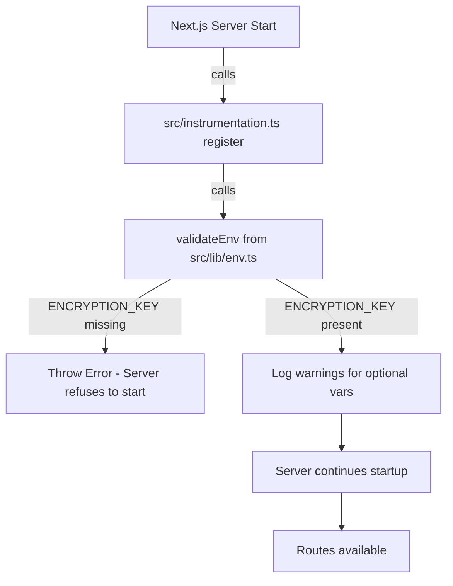

# Wire env validation to run at startup so missing ENCRYPTION_KEY fails fast

## Problem Statement

The `validateEnv()` function in `src/lib/env.ts` validates that `ENCRYPTION_KEY` is present and at least 64 characters, and warns about missing optional vars (`NEWSAPI_KEY`, `OPENAI_API_KEY`). However, this function is **never imported or called anywhere in the application**. It is dead code.

As a result:
- If `ENCRYPTION_KEY` is missing or invalid, the app starts without error and only crashes when a user tries to connect their eToro keys (when `src/lib/encryption.ts` tries to read the key).
- The helpful warnings about `NEWSAPI_KEY` and `OPENAI_API_KEY` never appear in the logs.
- The acceptance criterion "All required environment variables validated on startup" from the rate-limiting-hardening task is not actually met.

## User Story

As an operator deploying the app, I want the application to fail immediately on startup with a clear error message if `ENCRYPTION_KEY` is missing or malformed, so that I can fix configuration issues before users encounter cryptic runtime errors.

## How It Was Found

During surface-sweep review, searched for all imports of `@/lib/env` across the codebase — found zero results outside of `env.test.ts`. The `validateEnv()` function exists but is never invoked. Confirmed by checking that no `instrumentation.ts` file exists and no layout/route file imports `env.ts`.

## Proposed Fix

Use Next.js `instrumentation.ts` to call `validateEnv()` at server startup:

1. Create `src/instrumentation.ts` with a `register()` function that calls `validateEnv()`.
2. Next.js automatically calls `register()` once when the server starts, before any routes are served.
3. If `ENCRYPTION_KEY` is missing, the server will throw and refuse to start — giving the operator a clear error message.

## Acceptance Criteria

- [ ] `src/instrumentation.ts` exists and calls `validateEnv()` in its `register()` function
- [ ] Starting the app without `ENCRYPTION_KEY` fails immediately with a clear error
- [ ] Starting the app with all env vars set succeeds with no warnings
- [ ] Starting the app with optional vars missing logs appropriate warnings
- [ ] Existing tests pass (`npx vitest run`)
- [ ] Build succeeds (`npm run build`)

## Verification

- Run `npx vitest run` — all tests pass
- Run `npm run build` — build succeeds
- Temporarily remove `ENCRYPTION_KEY` from `.env` and start the dev server — confirm it throws immediately

## Out of Scope

- Changing the env var validation logic itself
- Adding new env vars to validate
- Changing the encryption module's own key validation

---

## Planning

### Overview
The `validateEnv()` function in `src/lib/env.ts` correctly validates `ENCRYPTION_KEY` and warns about optional vars, but is never called. Next.js provides the `instrumentation.ts` hook — its `register()` function runs once at server startup before any route is served. Wiring `validateEnv()` into `register()` solves the fail-fast requirement with a 1-file change.

### Research Notes
- Next.js `instrumentation.ts` (or `src/instrumentation.ts` with `src/` app dir) exports an async `register()` function called once on server startup
- In Next.js 16, instrumentation is stable and documented: `export async function register() { ... }`
- The function runs in the Node.js runtime only (not edge), which is correct since `validateEnv()` uses `process.env`
- Throwing inside `register()` prevents the server from starting — exactly the fail-fast behavior we want
- No additional dependencies needed

### Assumptions
- The existing `validateEnv()` logic is correct and complete — no changes needed to it
- The project uses `src/` directory structure, so the file should be at `src/instrumentation.ts`

### Architecture Diagram

### One-Week Decision
**YES** — This is a 15-minute change: create one file (`src/instrumentation.ts`) with 4 lines of code that calls the existing `validateEnv()`.

### Implementation Plan

1. **Create `src/instrumentation.ts`**
   - Export an async `register()` function
   - Import and call `validateEnv()` from `@/lib/env`
   - Any throw from `validateEnv()` will prevent server startup

2. **Verify**
   - Run `npx vitest run` — all tests pass
   - Run `npm run build` — build succeeds
   - Start dev server with valid `.env` — starts normally with optional var warnings in console
