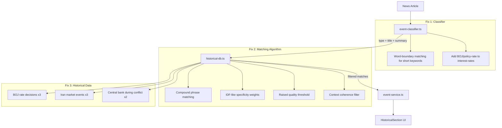

## Problem Statement

Historical matches are irrelevant to actual news events. The core value proposition is broken.

**Example**: "Bank of Japan keeps policy rate steady while raising inflation forecast on Iran war worries" matches:
1. EU AI Act (2024) — COMPLETELY UNRELATED
2. Fed holds rates near-zero (2021) — wrong context
3. Israel-Hamas war (2023) — different geography and impact

**Root causes identified**:

1. **Classifier bug**: The word "ban" (a regulation keyword) matches as a substring of "Bank" in "Bank of Japan". Combined with "policy" (also a regulation keyword), BOJ rate decisions are classified as "regulation" instead of "interest-rates". This gives a +5 type bonus to regulation entries, surfacing irrelevant matches like EU AI Act.

2. **Keyword matching is too broad**: The matching algorithm in `historical-db.ts` matches individual words (e.g., "war" or "rates") rather than EVENT TYPE + CONTEXT together. A single word match like "war" in "Iran war worries" pulls in the Israel-Hamas war entry, which is a completely different conflict.

3. **No keyword specificity weighting**: "BOJ" is extremely specific, "rates" is extremely generic. Both get the same weight.

4. **Low quality threshold**: `minScore = 5` allows low-quality matches through. A single tag match (+3) with some word overlap easily passes.

5. **Missing historical entries**: No BOJ-specific events, no Iran-specific market events, no "central bank holds during geopolitical crisis" pattern.

## How It Was Found

Direct product owner feedback (CRITICAL priority). Confirmed by:
- Code review of `event-classifier.ts`: "ban" substring match in "Bank" and "policy" keyword cause BOJ → regulation misclassification
- Code review of `historical-db.ts`: single-word matching with flat weights
- Testing the classification logic: regulation scores 0.2182 vs interest-rates 0.1182 for BOJ events

## User Story

As a trader viewing a BOJ rate decision event, I want to see historical parallels of actual central bank rate holds during geopolitical uncertainty (e.g., Fed hold during Gulf War, BOJ negative rates during trade tensions) so that I can understand how markets typically react and make informed trading decisions.

## Proposed Fix

### 1. Fix event classifier (event-classifier.ts)
- Change "ban" keyword to require word boundaries (e.g., only match standalone "ban", not "Bank")
- Add missing interest-rates keywords: "bank of japan", "boj", "policy rate", "rate decision", "rate hold", "holds rate", "keeps rate", "rate steady", "rate unchanged"
- Add "war" to geopolitical keywords

### 2. Rewrite matching algorithm (historical-db.ts)
- **Compound phrase matching**: Match multi-word phrases like "rate hold" or "central bank" as a unit, not individual words. Score compound matches higher than individual word matches.
- **Keyword specificity weighting**: Weight matches by specificity. "BOJ" (appears in <1% of entries) scores much higher than "rates" (appears in >50% of entries). Use IDF-like weighting.
- **Context clustering**: Group keywords by context (e.g., {entity: "BOJ", action: "rate hold", backdrop: "geopolitical tension"}). Require at least 2 context dimensions to match.
- **Raise minimum score threshold**: Increase `minScore` to require at least one strong tag match AND word overlap, not just any combination that exceeds 5.

### 3. Add specific historical entries
- BOJ rate decisions: 2016 negative rates, 2023 YCC adjustment, 2024 first hike in 17 years
- Central bank holds during wars/conflicts: Fed holds during Gulf War, ECB during Ukraine invasion
- Iran-specific market events: 2020 Soleimani strike, 2019 tanker attacks, 1979 oil shock
- "Central bank + geopolitical crisis" compound pattern entries

### 4. Quality gate
- Don't show matches below a meaningful threshold — better to show 1 high-quality match than 3 irrelevant ones
- If all matches are below threshold, return empty array (let the UI handle "no historical parallels found")

### 5. Unified insight coherence
- In event-service.ts, check if returned matches are from the same category/context before combining
- If matches span unrelated categories, present only the strongest match or present them separately

## Acceptance Criteria

- [ ] BOJ rate decision events are classified as "interest-rates", not "regulation"
- [ ] "Bank of Japan keeps policy rate steady" matches BOJ-specific or central-bank-holds historical entries, NOT EU AI Act or unrelated wars
- [ ] The word "ban" does not false-positive match "Bank" in the classifier
- [ ] Historical entries include at least 3 BOJ-specific events and 2 Iran-specific market events
- [ ] Matching algorithm requires at least 2 meaningful keyword matches (not just 1 generic word)
- [ ] Matches with scores below the quality threshold are filtered out
- [ ] All existing tests pass
- [ ] New tests verify matching quality for: BOJ rate hold, Fed rate cut, Iran conflict, tariff event

## Verification

- Run all tests: `npm test`
- Write specific tests for the BOJ event matching scenario
- Build the project: `npm run build`

## Out of Scope

- OpenAI-powered matching (separate path, already works when API key available)
- Changes to the unified insight UI component (only the data quality feeding into it)
- Adding entries for event types that aren't relevant to current news

---

## Planning

### Overview

Fix the two-layer matching quality problem: (1) event classifier misclassifies central bank events as "regulation" due to substring matching bugs, and (2) the historical-db matching algorithm matches on individual generic words instead of compound event context. Both issues compound to produce irrelevant historical parallels, breaking the app's core value proposition.

### Research Notes

1. **Classifier bug confirmed**: `text.includes("ban")` matches "Bank" in "Bank of Japan". Also "policy" is a regulation keyword but should not match "policy rate" contexts. The fix is word-boundary matching for short keywords and adding missing interest-rates keywords.

2. **Matching algorithm issues confirmed**: `computeRelevance()` in historical-db.ts uses flat scoring: +3 per tag match (via substring), +2 per word-tag match, +1 per word overlap. No specificity weighting. `minScore = 5` is too low. No compound phrase matching.

3. **Missing data**: DB has zero BOJ entries, zero Iran-specific market entries, zero "central bank during conflict" entries. Only 6 interest-rate entries total, all Fed/ECB/BOE.

4. **No existing tests**: No test file for historical-db.ts. Need to create one.

### Assumptions

- The built-in DB is the primary matching source (OpenAI is optional/fallback)
- Backward-compatible: no changes to the `HistoricalMatch` type interface
- The unified insight combines whatever matches are returned — fixing data quality fixes insight quality

### Architecture Diagram

### One-Week Decision

**YES** — This is focused on 2 source files (event-classifier.ts, historical-db.ts), their tests, and data entries. No new dependencies, no API changes, no UI changes. Estimated: 2-3 days.

### Implementation Plan

**Phase 1: Fix classifier (event-classifier.ts)**
- Add word-boundary matching for short keywords (≤4 chars): "ban" should not match inside "Bank"
- Add missing interest-rates keywords: "bank of japan", "boj", "policy rate", "rate decision", "rate hold", "rate steady", "keeps rate", "holds rate"
- Add "war" to geopolitical keywords
- Update existing classifier tests + add BOJ classification test

**Phase 2: Rewrite matching algorithm (historical-db.ts)**
- Add compound phrase detection: multi-word tags get higher scores
- Add IDF-like specificity weighting: rare tags (e.g., "boj") score much higher than common ones (e.g., "rates")
- Require minimum 2 meaningful matches (not just 1 generic word)
- Raise minScore threshold significantly (from 5 to ~12)
- Add context coherence: if the event type doesn't match AND there's no strong cross-type signal, skip the entry

**Phase 3: Add historical entries**
- BOJ: 2016 negative rates, 2023 YCC adjustment, 2024 first hike
- Iran: 2020 Soleimani strike, 2019 tanker attacks, 1979 oil crisis
- Central bank + conflict: Fed hold during Gulf War, ECB during Ukraine
- Tag each entry with specific compound tags

**Phase 4: Tests**
- Create historical-db.test.ts with scenarios:
  - BOJ rate hold → matches BOJ/central-bank-hold entries
  - Iran conflict → matches Iran/Middle-East-oil entries
  - Fed rate cut → matches Fed rate entries
  - Generic "war" → does NOT match unrelated conflicts
  - Low-quality matches filtered out
- Update event-classifier tests for BOJ classification
