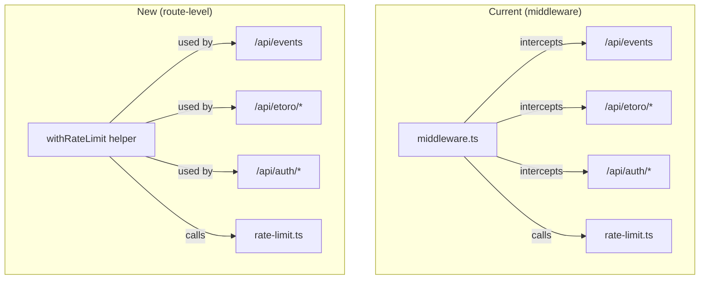

## Problem Statement

The Next.js build emits a deprecation warning: `The "middleware" file convention is deprecated. Please use "proxy" instead.` The rate limiting logic currently lives in `src/middleware.ts`, which intercepts all `/api/*` requests. Since middleware is deprecated in Next.js 16, this infrastructure will break in a future major version — meaning rate limiting would silently stop working in production.

## User Story

As a product owner deploying to production, I want rate limiting to use supported Next.js conventions so that the rate limiting protection continues to work after framework upgrades.

## How it was found

Running `npm run build` shows the deprecation warning. The entire rate limiting system — IP extraction, per-route limits (100/min general, 30/min eToro), and rate limit headers — depends on the deprecated middleware file convention.

## Research Notes

- Next.js 16.2.3 marks `middleware.ts` as deprecated in favor of `proxy.ts`
- The proxy convention handles URL rewriting and routing, NOT arbitrary request/response modification
- Rate limiting is better implemented at the route handler level — each handler calls a shared utility
- The existing `src/lib/rate-limit.ts` module (in-memory Map store) can be reused as-is
- 8 API routes need the rate limit wrapper (all except `/api/health`)
- IP extraction logic (`x-forwarded-for` / `x-real-ip`) can be adapted to standard `Request` headers
- The middleware currently runs in Edge Runtime; moving to route handlers keeps everything in Node.js runtime consistently

## Architecture Diagram



## One-Week Decision

**YES** — This is a straightforward refactoring. Create 1 helper function, update 8 route files to call it, delete middleware.ts. The rate-limit.ts module doesn't change. ~1 day.

## Implementation Plan

### Phase 1: Create rate limit helper

Create `src/lib/with-rate-limit.ts`:
- Extract `getClientIP(request: Request)` — same logic as middleware (x-forwarded-for, x-real-ip)
- Export `applyRateLimit(request: Request, tier: "api" | "etoro")` that returns `{ allowed: true, headers }` or `{ allowed: false, response: NextResponse }`
- The helper attaches `X-RateLimit-*` headers on success and returns a 429 `NextResponse` on failure

### Phase 2: Update all API route handlers

For each of the 8 routes, add at the top of each handler function:
```typescript
const rateCheck = applyRateLimit(request, "api"); // or "etoro"
if (!rateCheck.allowed) return rateCheck.response;
// ... existing handler logic
// append rateCheck.headers to response
```

Routes to update (tier):
- `src/app/api/events/route.ts` (api)
- `src/app/api/events/[id]/route.ts` (api)
- `src/app/api/auth/etoro/route.ts` (api)
- `src/app/api/auth/logout/route.ts` (api)
- `src/app/api/auth/session/route.ts` (api)
- `src/app/api/etoro/search/route.ts` (etoro)
- `src/app/api/etoro/trade/route.ts` (etoro)
- `src/app/api/etoro/watchlist/route.ts` (etoro)

### Phase 3: Delete middleware

- Delete `src/middleware.ts`
- Verify build has no middleware deprecation warning

### Phase 4: Tests

- Add test for `applyRateLimit` helper
- Verify existing rate-limit.test.ts still passes
- Run full test suite

## Acceptance Criteria

- [ ] `src/middleware.ts` is deleted
- [ ] Build completes with NO middleware deprecation warning
- [ ] All API routes (except `/api/health`) apply rate limiting via the shared utility
- [ ] General API routes: 100 requests/minute per IP
- [ ] eToro API routes: 30 requests/minute per IP
- [ ] 429 responses include `Retry-After` and `X-RateLimit-*` headers
- [ ] All existing rate-limit tests still pass
- [ ] Full test suite passes

## Verification

- Run `npm run build` and confirm no middleware deprecation warning
- Run `npm test` and confirm all tests pass

## Out of Scope

- Changing rate limit thresholds
- Adding per-user (session-based) rate limiting
- External rate limiting services (Redis, Upstash)
