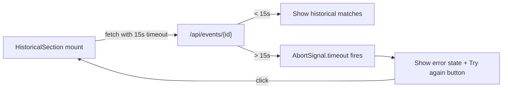

## Problem Statement

The `HistoricalSection` client component fetches historical matches from `/api/events/${eventId}` without any timeout. The server-side handler chains `getEvents()` (up to 8s on RSS cache miss) and `getHistoricalMatches()` (up to 25s OpenAI timeout), meaning a user can wait 30+ seconds staring at a loading skeleton with no indication that something is wrong and no way to retry.

The component already has a proper error state with a "Try again" button, but it only appears if the fetch outright fails — not if it takes too long.

## User Story

As a trader viewing an event detail page, I want the historical data section to show a retry button within 15 seconds if loading is slow, so I can try again rather than waiting indefinitely with no feedback.

## How It Was Found

During surface-sweep review: navigated to event detail pages and observed that the `HistoricalSection` fetch (`fetch(\`/api/events/${eventId}\`)`) has no `AbortSignal.timeout`. The OpenAI client has a 25s timeout, RSS feeds have 8s timeouts, but the client-side caller has no limit. In worst case (cold cache + slow OpenAI), the user waits 30+ seconds with just a pulsing skeleton.

## Proposed Fix

Add `signal: AbortSignal.timeout(15000)` to the `fetch()` call in `HistoricalSection.tsx`. This way, if the API takes longer than 15 seconds, the fetch aborts and the error state with "Try again" button appears. The server-side request continues processing but the user gets actionable feedback.

## Acceptance Criteria

- [ ] `HistoricalSection` fetch includes `signal: AbortSignal.timeout(15000)`
- [ ] When the API takes >15s, the error state with "Try again" button appears (not an infinite skeleton)
- [ ] When the API responds within 15s, historical matches display normally (no regression)
- [ ] The "Try again" button works correctly after a timeout
- [ ] All existing tests pass
- [ ] Build succeeds

## Verification

- Run `npx vitest run` — all tests pass
- Run `npm run build` — build succeeds
- Test in browser: event detail pages with historical matches still load correctly

## Out of Scope

- Changing server-side OpenAI or RSS timeout values
- Adding a progress indicator or countdown timer
- Retry logic (auto-retry on timeout)

---

## Planning

### Overview
Add a 15-second client-side timeout to the `fetch()` call in `HistoricalSection` so users get the existing error/retry UI instead of an indefinite loading skeleton when the server-side API is slow.

### Research Notes
- `AbortSignal.timeout(ms)` is supported in all modern browsers (Chrome 103+, Firefox 100+, Safari 16+)
- When the timeout fires, `fetch` rejects with a `DOMException` with `name === "TimeoutError"`
- The existing `.catch()` handler already sets `fetchError: true`, which shows the error state with "Try again" button — no additional error handling code needed
- The component already has a `cancelRef` pattern for cancellation, but `AbortSignal.timeout` handles this orthogonally

### Assumptions
- 15 seconds is a reasonable timeout: allows the server-side OpenAI call (25s timeout) to fail fast, while still giving the built-in DB fallback time to respond
- Users prefer seeing a "Try again" button after 15s vs waiting 30+s for a potential success

### Architecture Diagram

### One-Week Decision
**YES** — This is a single-line change: add `{ signal: AbortSignal.timeout(15000) }` to the fetch call. Update the test to verify. ~15 minutes.

### Implementation Plan

1. **Update `src/components/HistoricalSection.tsx`**
   - Add `signal: AbortSignal.timeout(15000)` to the `fetch()` call on line 30
   - No other changes needed — the existing `.catch()` handler already triggers the error state

2. **Update or add test in `src/components/__tests__/HistoricalSection.test.tsx`**
   - Add a test that verifies the fetch is called with an AbortSignal
   - Verify that when fetch rejects (simulating timeout), the error state with retry button appears

3. **Verify** — run tests, run build
