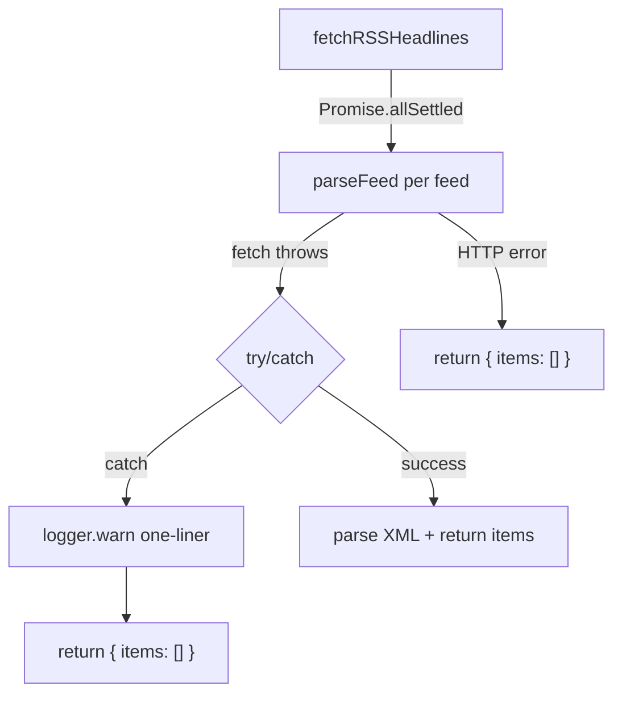

## Problem Statement

When an RSS feed fetch fails due to a network-level error (TLS certificate mismatch, DNS failure, connection refused, etc.), `parseFeed()` in `rss-client.ts` lets the error propagate as an unhandled rejection. While `Promise.allSettled` in `fetchRSSHeadlines` prevents the app from crashing, Next.js still logs the full error object to the server console — including raw certificate buffers, fingerprints, and multi-line stack traces.

This produces 40+ lines of log output per failed feed, polluting server logs and making it hard to identify real errors in production log aggregation tools.

## User Story

As an operator monitoring production logs, I want RSS feed failures to be logged as clean one-liners instead of verbose error dumps, so that I can quickly identify real issues without wading through certificate data noise.

## How It Was Found

During surface-sweep review of the running dev server logs. The server terminal showed `TypeError: fetch failed` followed by the full `[cause]` error object including raw certificate buffers (200+ bytes), fingerprints, serial numbers, and issuer chains for `www.aljazeera.com`. This output repeated for every feed that failed.

## Proposed Fix

Add a try/catch inside `parseFeed()` that catches any fetch error, logs a clean one-liner via the existing logger (`logger.warn("RSS feed unavailable: <url> — <error.message>")`), and returns `{ items: [] }`. This matches the existing behavior for HTTP errors (non-200 status) which already return an empty feed.

## Acceptance Criteria

- [ ] `parseFeed()` wraps its fetch call in a try/catch
- [ ] On catch: returns `{ items: [] }` (same as HTTP error path)
- [ ] On catch: logs a single-line warning with the feed URL and error message (no stack trace, no raw cert data)
- [ ] Existing behavior is preserved: feeds that return HTTP errors still handled gracefully
- [ ] Feeds that succeed continue to work normally
- [ ] All existing tests pass
- [ ] Build succeeds

## Verification

- Run `npx vitest run` — all tests pass
- Run `npm run build` — build succeeds
- Start dev server, check logs for clean one-liner warnings instead of verbose error dumps

## Out of Scope

- Changing which RSS feeds are fetched
- Adding retry logic for failed feeds
- Fixing the underlying TLS/network errors (environment-specific)

---

## Planning

### Overview
Add a try/catch wrapper inside `parseFeed()` in `src/lib/rss-client.ts` so that network-level errors (TLS, DNS, timeout) are caught locally, logged as a clean one-liner, and converted to an empty feed result — matching the existing HTTP error handling behavior.

### Research Notes
- `parseFeed()` already handles HTTP errors gracefully: `if (!res.ok) return { items: [] }`
- The gap is that `fetch()` can throw before returning a Response (TLS, DNS, ECONNREFUSED, AbortSignal.timeout)
- When it throws, `Promise.allSettled` captures the rejection but Node.js/Next.js still prints the full error
- The project has a `logger` module at `src/lib/logger.ts` for structured logging
- The fix is purely additive: wrap the existing fetch+parse in try/catch, return `{ items: [] }` on error

### Assumptions
- The logger module exports a `warn` method (standard log levels)
- No behavioral change expected: failed feeds already result in empty arrays via `Promise.allSettled`

### Architecture Diagram

### One-Week Decision
**YES** — This is a 5-line change: add try/catch to `parseFeed`, log a warning, return empty feed. Plus one test to verify the catch path. ~15 minutes.

### Implementation Plan

1. **Update `src/lib/rss-client.ts`**
   - Import `logger` from `./logger`
   - Wrap the body of `parseFeed()` in a try/catch
   - In the catch block: `logger.warn(\`RSS feed unavailable: ${url} — ${(error as Error).message}\`)`
   - Return `{ items: [] }` from the catch block

2. **Add test in `src/lib/__tests__/rss-client.test.ts`** (or update existing)
   - Mock `fetch` to throw a `TypeError("fetch failed")`
   - Verify `parseFeed` returns `{ items: [] }` without throwing
   - Verify the error does not propagate to the caller

3. **Verify** — run all tests, run build
