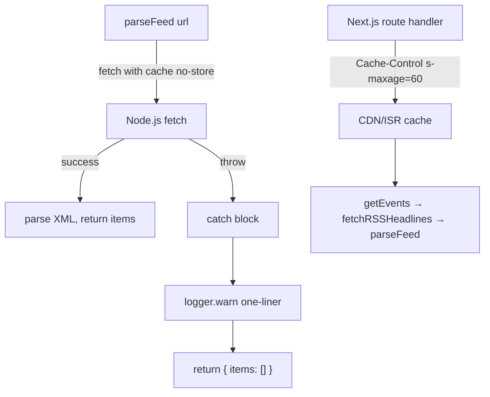

## Problem Statement

Despite task 0014 adding a try/catch to `parseFeed()` in `src/lib/rss-client.ts`, the server console still dumps 40+ lines of raw TLS certificate data every time an RSS feed fetch fails. The root cause: `parseFeed` uses `fetch(url, { next: { revalidate: 1800 } })`, which routes the request through Next.js's data cache layer. Next.js's internal fetch wrapper logs the error to stderr **before** re-throwing it for our catch handler. Our catch block works (pages return 200, no crash), but the verbose logging cannot be suppressed from user code.

This produces:
```
TypeError: fetch failed
    at ignore-listed frames {
  [cause]: Error: Hostname/IP does not match certificate's altnames...
    cert: { modulus: '9CD4E8B1AF...', pubkey: <Buffer ...>, ... }
```

...repeated for every failed RSS feed, on every page render.

## User Story

As an operator monitoring production logs, I want RSS feed fetch errors to produce only a clean one-liner warning so I can quickly identify real problems without wading through certificate data noise.

## How It Was Found

During surface-sweep review of the dev server terminal (iteration #9). The server logs at http://localhost:3050 still show the full `TypeError: fetch failed` with 40+ lines of `[cause]` data including raw certificate buffers, fingerprints, and modulus values — the exact same issue task 0014 was supposed to fix. Verified that the `parseFeed` try/catch IS in place and catches the error (pages render fine), but Next.js's extended fetch logs the error independently.

## Proposed Fix

Remove `next: { revalidate: 1800 }` from the `fetch()` call in `parseFeed()` and add `cache: 'no-store'` instead. This tells Next.js not to run the request through its data cache layer, which eliminates the internal error logging. The RSS feed results are already cached at the route level via the `Cache-Control` response header (`s-maxage=60, stale-while-revalidate=120`), so the per-fetch revalidation is redundant.

```ts
const res = await fetch(url, {
  cache: 'no-store',
  headers: { ... },
  signal: AbortSignal.timeout(8000),
});
```

## Acceptance Criteria

- [ ] `parseFeed()` uses `cache: 'no-store'` instead of `next: { revalidate: 1800 }`
- [ ] When an RSS feed fetch fails, only our `logger.warn` one-liner appears in server logs — no verbose `TypeError: fetch failed` with `[cause]` cert data
- [ ] All existing tests pass
- [ ] Build succeeds
- [ ] Pages still render correctly when RSS feeds fail

## Verification

- Run `npm test` — all tests pass
- Run `npm run build` — build succeeds
- Start dev server (`PORT=3050 npm run dev`), check server terminal for clean log output (no raw cert data dump)

## Out of Scope

- Changing which RSS feeds are configured
- Adding retry logic for failed feeds
- Fixing the underlying TLS/DNS interception (environment-specific)
- Adding per-feed caching (route-level cache is sufficient)

---

## Planning

### Overview
Remove `next: { revalidate: 1800 }` from the `fetch()` call in `parseFeed()` (src/lib/rss-client.ts line 91) and replace it with `cache: 'no-store'`. This stops Next.js from routing the fetch through its data cache layer, which is what logs the verbose error to stderr independently of our try/catch handler.

### Research Notes
- Next.js App Router patches `globalThis.fetch` to add data caching. When `next: { revalidate }` is set, failed fetches are logged by the cache layer before the error propagates to user code.
- The `cache: 'no-store'` option tells Next.js to skip the data cache entirely, treating it as a plain Node.js fetch.
- The RSS feeds are fetched during SSR (page render), and the route response already has `Cache-Control: public, s-maxage=60, stale-while-revalidate=120` — this handles response-level caching. The per-fetch `revalidate: 1800` is redundant.
- The existing try/catch in `parseFeed` already returns `{ items: [] }` on error and logs a clean one-liner via `logger.warn`.

### Assumptions
- Removing per-fetch caching won't cause performance regression because the route-level `Cache-Control` headers handle caching.
- In production on Vercel, the `s-maxage=60` on the route response is the effective cache layer.

### Architecture Diagram



### One-Week Decision
**YES** — This is a 1-line change: replace `next: { revalidate: 1800 }` with `cache: 'no-store'` in the fetch options. Plus updating the existing test to verify the change. ~10 minutes.

### Implementation Plan

1. **Update `src/lib/rss-client.ts`**
   - In `parseFeed()`, change the fetch options from `{ next: { revalidate: 1800 }, ... }` to `{ cache: 'no-store', ... }`
   - Keep all other options (headers, signal) unchanged

2. **Update tests if needed**
   - Check `src/lib/__tests__/rss-client.test.ts` for any assertions on the `next: { revalidate }` option
   - Ensure existing tests still pass

3. **Verify** — run all tests, run build, start dev server and check logs
