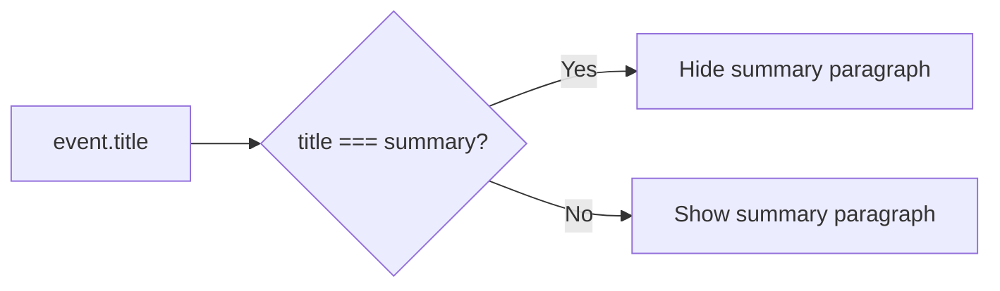

## Problem statement

On both the weekly event cards and the event detail page, the event summary displays text identical to the event title. This happens because `cleanDescription()` returns the title when the source is Google News (which is the dominant source). The result is that every event card shows the headline twice — once as the title and immediately below as the "description" — making the app look broken and unprofessional.

**Observed on:**
- Weekly view cards: title in `<h3>` and identical text in `
` below it (line 337-342 of WeeklyViewClient.tsx)
- Event detail page: title in `<h1>` and identical text in `
` below the source (line 119-127 of event/[id]/page.tsx)

## User story

As a trader viewing the weekly events, I want each card to show only unique information so the interface looks clean and professional rather than having repeated text.

## How it was found

Browser testing: opened http://localhost:3050, inspected event cards. Confirmed via API that `title === summary` for all events from Google News sources. Screenshots 36-38 in the review directory show the duplicate text.

## Proposed UX

- On weekly cards: if `event.summary === event.title` (or summary is a substring of title), hide the `
` summary element entirely
- On event detail page: if `event.summary === event.title`, hide the summary `
` below the source line
- When the summary IS different from the title, continue showing it as-is

## Acceptance criteria

- [ ] Weekly event cards do NOT show duplicate summary text when summary matches title
- [ ] Event detail page does NOT show duplicate summary text when summary matches title
- [ ] When summary differs from title, both are still displayed
- [ ] All existing tests pass
- [ ] Visual verification in browser confirms no duplicate text

## Verification

- Run `npm test` — all tests pass
- Open http://localhost:3050 in browser, verify cards show title only (no duplicate description)
- Navigate to event detail, verify no duplicate paragraph
- Take screenshot as evidence

## Out of scope

- Changing the `cleanDescription()` function itself
- Fetching better descriptions from alternative sources
- Adding new description content

---

## Planning

### Overview

Simple conditional rendering change in two components. When `event.summary` equals `event.title` (or is a substring), hide the summary paragraph element. No new components, no API changes, no state changes.

### Research notes

- `cleanDescription()` in `src/lib/event-classifier.ts:255` returns the title when source starts with "Google News"
- All current live events come from Google News RSS feeds, so all summaries === title
- The fix should use a normalized comparison (trim + case-insensitive) for robustness
- Two files to modify: `WeeklyViewClient.tsx` (line 340-342) and `event/[id]/page.tsx` (line 125-127)

### Assumptions

- String equality check is sufficient (no fuzzy matching needed)
- When summary is hidden, the card layout remains visually balanced

### Architecture diagram

### One-week decision

**YES** — This is a two-line conditional change in two files. Estimated: 15 minutes.

### Implementation plan

1. Create a helper function `isDuplicateSummary(title, summary)` that returns true when summary matches title (trimmed, case-insensitive)
2. In `WeeklyViewClient.tsx`: wrap the summary `
` (line 340-342) in a conditional that checks `!isDuplicateSummary(event.title, event.summary)`
3. In `event/[id]/page.tsx`: wrap the summary `
` (line 125-127) in the same conditional
4. Add tests for the helper function
5. Verify visually in browser
