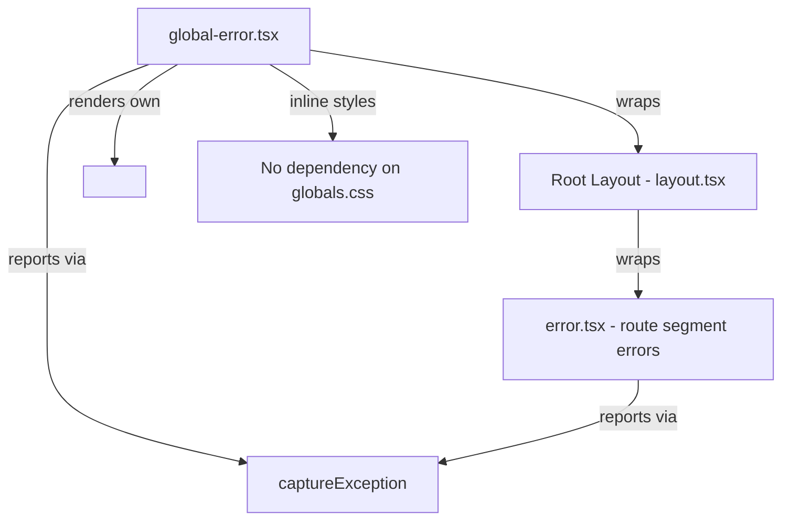

## Problem statement

The app has `error.tsx` boundaries at the root route segment and the event detail route, but is missing a `global-error.tsx` file. In Next.js App Router, `global-error.tsx` is the only boundary that catches errors thrown in the root `layout.tsx` itself. Without it, a crash in the root layout (e.g. AuthProvider or ToastProvider throwing during render) would show an unstyled browser error page instead of a branded recovery screen.

The initiative spec explicitly requires: "Add proper error boundaries in React" under Production Hardening.

## User story

As a user, when a catastrophic error occurs in the root layout, I want to see a branded error page with a retry button so I can recover without hitting a blank white screen.

## How it was found

Surface-sweep review: checked for `global-error.tsx` in the app directory — the file does not exist. The existing `error.tsx` boundaries only cover route segment errors, not layout-level crashes. Verified by inspecting the `src/app/` directory structure.

## Proposed UX

A full-page error screen matching the existing `error.tsx` styling:
- eToro-branded styling with CSS custom properties
- "Something went wrong" heading
- "Try again" button that calls `reset()`
- Must include its own `<html>` and `<body>` tags (Next.js requirement for global-error)
- Must be a client component
- Reports the error via `captureException`

## Acceptance criteria

- [ ] `src/app/global-error.tsx` exists as a `"use client"` component
- [ ] It renders its own `<html>` and `<body>` tags (required by Next.js)
- [ ] It includes a "Try again" button that calls `reset()`
- [ ] It calls `captureException` to report the error
- [ ] It uses inline styles (since global CSS may not be available during a layout crash)
- [ ] Build passes (`npm run build`)
- [ ] All existing tests pass (`vitest run`)

## Verification

- Run `npm run build` — should succeed
- Run `vitest run` — all tests should pass
- Verify the file exists and exports a default component

## Out of scope

- Testing actual layout crashes (hard to trigger reliably)
- Adding Sentry SDK integration
- Modifying existing error.tsx files

---

## Planning

### Overview

Add a single `global-error.tsx` file to `src/app/` that serves as the outermost error boundary for the entire Next.js application. This catches errors that happen in the root layout (which the existing `error.tsx` cannot catch).

### Research notes

- Next.js App Router requires `global-error.tsx` to wrap the root layout. It MUST render its own `<html>` and `<body>` tags since the root layout is unmounted when this boundary triggers.
- The component must be a client component (`"use client"`).
- Since the root layout's CSS imports may not be available during a global error, the component should use inline styles rather than CSS classes that depend on `globals.css`.
- The existing `error.tsx` at `src/app/error.tsx` and `src/app/event/[id]/error.tsx` provide a good reference for styling and structure, but use Tailwind classes that may not work in global-error context.
- The `captureException` function from `@/lib/error-reporter` should work fine in the client component.

### Assumptions

- The eToro design system colors (green: #0EB12E, etc.) can be hardcoded as inline styles since CSS custom properties from the layout may not be available.
- The Inter font from Google Fonts can be referenced via a link tag within the component's `<head>`, or we can fall back to system fonts.

### Architecture diagram

### One-week decision

**YES** — This is a single-file addition with a well-defined structure. It mirrors the existing `error.tsx` but with inline styles and its own HTML/body tags. Implementation time: ~30 minutes.

### Implementation plan

1. Create `src/app/global-error.tsx` as a `"use client"` component
2. Render `<html>` and `<body>` tags with inline styles matching the eToro design system
3. Show "Something went wrong" heading, explanatory text, and "Try again" button
4. Call `captureException` in a `useEffect` on mount
5. Use system font stack as fallback (no Google Fonts dependency)
6. Verify build passes and all tests pass
