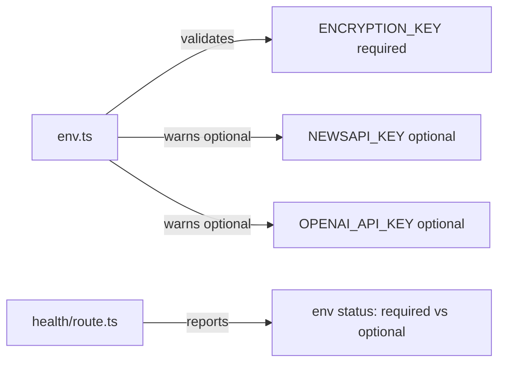

## Problem statement

The env validation in `src/lib/env.ts` logs `[env] NEWSAPI_KEY not set — news fetching will not work` at startup when `NEWSAPI_KEY` is not configured. This message is factually incorrect — the app's primary news source is Google News RSS (`src/lib/rss-client.ts`), and news fetching works perfectly without NEWSAPI_KEY. NewsAPI is only a fallback.

Additionally, the health endpoint (`/api/health`) reports `NEWSAPI_KEY: false`, which could trigger unnecessary monitoring alerts.

## How it was found

- Server logs show `[env] NEWSAPI_KEY not set — news fetching will not work` on every cold start
- Health endpoint at `/api/health` returns `"NEWSAPI_KEY": false`, suggesting a problem when there is none
- Meanwhile, the app loads 10+ live news events correctly via RSS
- A production ops team would see this warning and think news is broken when it's not

## User story

As an ops engineer monitoring the production deployment, I want env warnings to accurately describe the impact of missing keys, so that I don't waste time investigating false alarms.

## Proposed UX

- Change the warning to: `[env] NEWSAPI_KEY not set — NewsAPI fallback disabled (RSS primary source active)`
- In the health endpoint, group env vars by criticality: required (ENCRYPTION_KEY) vs optional (NEWSAPI_KEY, OPENAI_API_KEY) so it's clear which are actually needed

## Acceptance criteria

- [ ] Startup warning for missing NEWSAPI_KEY accurately describes it as an optional fallback
- [ ] Health endpoint distinguishes required vs optional env vars
- [ ] Existing tests for env validation still pass
- [ ] No new regressions in the test suite

## Verification

- Run `npm test` — all tests pass
- Restart dev server and check that the warning message is accurate
- Hit `/api/health` and verify the response structure clearly shows NEWSAPI_KEY as optional

## Out of scope

- Removing NEWSAPI_KEY support entirely
- Changing the actual news fetching logic
- Adding new env vars

---

## Planning

### Overview

Two files need updating: the env validation module (`src/lib/env.ts`) and the health endpoint (`src/app/api/health/route.ts`). Both currently treat NEWSAPI_KEY as if it's essential for news to work, but the primary news source is Google News RSS which needs no API key.

### Research notes

- `src/lib/event-service.ts` fetches articles via `fetchArticles()` which tries RSS first, then falls back to NewsAPI only if NEWSAPI_KEY is set
- RSS is the primary, always-available news source; NewsAPI is a fallback
- `src/lib/env.ts` warns at startup with misleading "news fetching will not work"
- `src/app/api/health/route.ts` shows a flat list of env vars without distinguishing required vs optional
- Tests: `src/lib/__tests__/env.test.ts` has tests for env validation that check warning messages

### Architecture diagram

### One-week decision

**YES** — This is a 30-minute change: update two warning messages in env.ts and restructure the health endpoint response to group env vars by criticality. Update corresponding tests.

### Implementation plan

1. Update `src/lib/env.ts`:
   - Change NEWSAPI_KEY warning to: `[env] NEWSAPI_KEY not set — NewsAPI fallback disabled (RSS primary source active)`
   - Keep OPENAI_API_KEY warning as-is (it's accurate)

2. Update `src/app/api/health/route.ts`:
   - Split env into `required` and `optional` groups so ops teams know which vars matter
   - Keep backward compatibility by including a flat `env` object as well

3. Update `src/lib/__tests__/env.test.ts`:
   - Update any test expectations that match the old warning message

4. Run full test suite to verify no regressions
