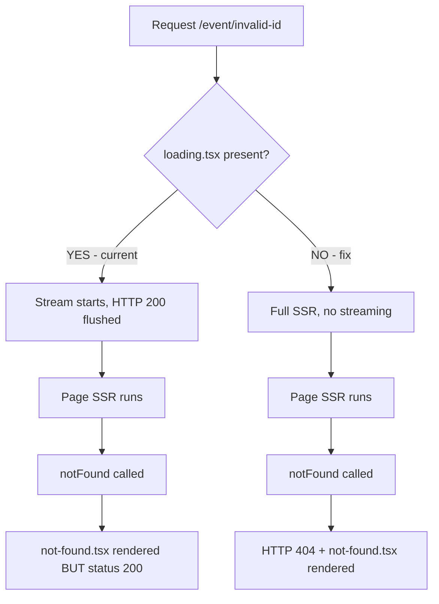

## Problem statement

The event detail page (`/event/[id]`) returns HTTP 200 status code when the event ID does not exist, even though the page visually shows a "404 Page not found" message. The `notFound()` function from `next/navigation` is called correctly in the server component, but the HTTP response status is 200 instead of 404.

This was confirmed in both dev mode (`next dev`) and production mode (`next start`):
- `curl -s -o /dev/null -w '%{http_code}' http://localhost:3050/event/nonexistent-event-id` returns `200`
- Server logs show `GET /event/nonexistent-event-id 200`

## How it was found

- During surface-sweep review, navigated to `/event/nonexistent-event-id` in the browser
- Page displayed the 404 UI correctly (from `src/app/not-found.tsx`)
- Checked HTTP status code via curl — confirmed 200 instead of 404
- Verified in production build — same behavior

## User story

As a production ops engineer monitoring the app, I want non-existent event pages to return HTTP 404 status codes, so that monitoring tools can detect broken links and search engines do not index error pages as valid content.

## Proposed UX

- `/event/<invalid-id>` should return HTTP 404 status code
- The visual 404 page should remain unchanged (already looks good)
- Search engines should not index these pages (correct status code will handle this)

## Acceptance criteria

- [ ] Requesting a non-existent event ID returns HTTP 404 status code
- [ ] The 404 page visual UI remains unchanged
- [ ] Valid event detail pages still return HTTP 200
- [ ] All existing tests pass
- [ ] Build succeeds without errors

## Verification

- Run `npm test` — all tests pass
- Run `npm run build` — no errors
- Start production server and verify: `curl -s -o /dev/null -w '%{http_code}' http://localhost:3050/event/nonexistent` returns `404`
- Verify valid event pages still return 200

## Out of scope

- Changing the 404 page visual design
- Adding custom error pages for other status codes
- SEO metadata changes beyond status code

---

## Planning

### Overview

The event detail page at `/event/[id]` correctly calls `notFound()` from `next/navigation` when an event ID doesn't exist, and the correct `not-found.tsx` UI is rendered. However, the HTTP response status code is 200 instead of 404. This is caused by a confirmed Next.js bug ([vercel/next.js#93253](https://github.com/vercel/next.js/issues/93253)) where the presence of `loading.tsx` in the route segment enables streaming, which flushes response headers (with 200 status) before the `notFound()` error handler can set the 404 status.

### Research notes

- **Root cause**: `src/app/event/[id]/loading.tsx` enables streaming for the event route. When streaming is active, Next.js sends the initial response (with 200 status) immediately, then streams the page content. By the time `notFound()` is called in the page component, the 200 status has already been sent.
- **Confirmed bug**: This is tracked in vercel/next.js#93253 (filed against 16.2.3) and vercel/next.js#76474 (older report). No fix has been merged upstream as of April 2026.
- **Framework workaround**: Remove `loading.tsx` from the affected route segment. This disables streaming for that route, allowing `notFound()` to correctly set the 404 status before any response is sent.
- **Impact of removing loading.tsx**: The event detail page loads in ~50ms (cached) to ~400ms (cold). The `HistoricalSection` client component already has its own loading state. The skeleton provided by `loading.tsx` is a nice-to-have but not essential.
- **SEO note**: Next.js does inject a `robots` meta tag for streamed 404s, but monitoring tools and CDN caches rely on the HTTP status code, not meta tags.

### Architecture diagram

### One-week decision

**YES** — This is a single file deletion. The fix is to remove `src/app/event/[id]/loading.tsx`. The page already loads fast enough without the streaming skeleton, and the HistoricalSection has its own client-side loading state.

### Implementation plan

1. Delete `src/app/event/[id]/loading.tsx`
2. Verify: `curl -s -o /dev/null -w '%{http_code}' http://localhost:3050/event/nonexistent` returns `404`
3. Verify: valid event pages still return `200`
4. Run full test suite to confirm no regressions
5. Build the project to confirm no errors
