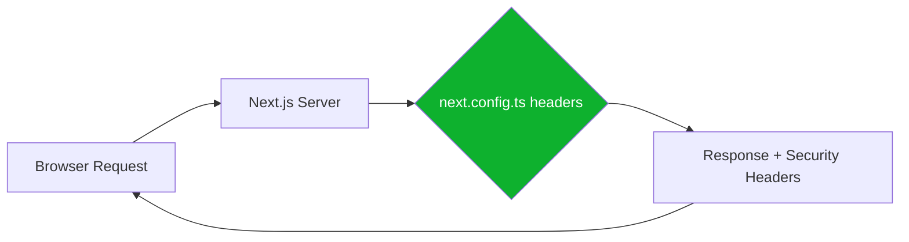

## Problem statement

The app returns no security headers on any response. A curl -I to the main page reveals:
- No `X-Frame-Options` (clickjacking risk)
- No `X-Content-Type-Options` (MIME-sniffing risk)
- No `Referrer-Policy`
- No `Strict-Transport-Security` (HSTS)
- `X-Powered-By: Next.js` is present, revealing the technology stack

These are standard production hardening headers that should be set on all responses.

## User story

As a production deployer, I want the app to include standard security headers on all HTTP responses, so that common web vulnerabilities (clickjacking, MIME sniffing, missing HSTS) are mitigated.

## How it was found

Ran `curl -sI http://localhost:3050` during surface-sweep review and observed no security headers in the response. The `X-Powered-By: Next.js` header was also visible.

## Proposed UX

No visible UX change — these are HTTP response headers only.

## Acceptance criteria

- [ ] `next.config.ts` sets `poweredByHeader: false`
- [ ] `next.config.ts` adds a `headers()` function returning security headers for all routes (`/*`)
- [ ] Headers include: `X-Frame-Options: DENY`, `X-Content-Type-Options: nosniff`, `Referrer-Policy: origin-when-cross-origin`, `Strict-Transport-Security: max-age=63072000; includeSubDomains; preload`
- [ ] `X-Powered-By` header is no longer present in responses
- [ ] All existing tests still pass
- [ ] Verified via curl that headers appear on both HTML pages and API routes

## Verification

- Run `curl -sI http://localhost:3050` and confirm all security headers are present
- Run `curl -sI http://localhost:3050/api/health` and confirm headers are present
- Confirm `X-Powered-By` is absent
- Run full test suite

## Out of scope

- Content-Security-Policy (complex, requires analysis of all inline scripts/styles)
- Permissions-Policy
- CORS configuration

## Overview

Add standard production security headers to all HTTP responses via Next.js config. This is a single-file change to `next.config.ts` that adds `poweredByHeader: false` and a `headers()` async function.

## Research notes

- Next.js supports custom headers via the `headers()` config function in `next.config.ts` ([Next.js docs](https://nextjs.org/docs/app/api-reference/config/next-config-js/headers))
- `poweredByHeader: false` disables the `X-Powered-By: Next.js` header
- Headers apply to all routes when source is `/:path*`
- These headers are standard OWASP recommendations for web application security

## Assumptions

- The app does not use iframes for its own content (safe to set `X-Frame-Options: DENY`)
- HSTS is desired for production (Vercel enforces HTTPS anyway, but belt-and-suspenders)

## Architecture diagram

## One-week decision

**YES** — This is a single-file config change. Takes ~15 minutes.

## Implementation plan

1. Edit `next.config.ts`:
   - Add `poweredByHeader: false`
   - Add `async headers()` returning security headers for `/:path*`
2. Restart dev server
3. Verify headers via curl on both HTML pages and API routes
4. Run full test suite to confirm no regressions
