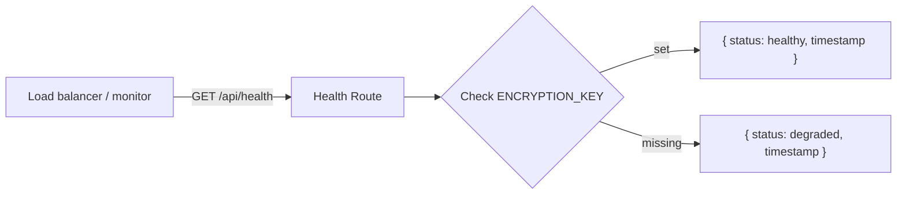

## Problem statement

The `/api/health` endpoint exposes the names and set/unset status of all environment variables used by the application:

```json
{
  "status": "healthy",
  "uptime": "87s",
  "env": {
    "ENCRYPTION_KEY": true,
    "NEWSAPI_KEY": false,
    "OPENAI_API_KEY": true,
    "required": { "ENCRYPTION_KEY": true },
    "optional": { "NEWSAPI_KEY": false, "OPENAI_API_KEY": true }
  },
  "version": "0.1.0"
}
```

This reveals the application's internal architecture — an attacker learns:
- The app uses encryption (ENCRYPTION_KEY)
- The app integrates with OpenAI (OPENAI_API_KEY)
- The app integrates with NewsAPI (NEWSAPI_KEY) — and that it's currently disabled
- The app version

In production, this information helps narrow attack surface. The initiative spec requires "Ensure no secrets leak in error messages or client-side code." While values aren't leaked, internal infrastructure metadata is.

## User story

As an operator deploying this app to production, I want the health endpoint to return minimal information publicly, so that internal infrastructure details aren't exposed to unauthenticated requests.

## How it was found

Observed during broad surface sweep: `curl http://localhost:3050/api/health` returns env var names and status in the response body. No authentication is required.

## Proposed UX

The public health endpoint should return only:
```json
{
  "status": "healthy",
  "timestamp": "2026-04-28T23:20:25.199Z"
}
```

The server-side env validation at startup (already in place) handles the developer-facing diagnostics. The health check endpoint should only serve load-balancer/uptime-monitor purposes.

## Acceptance criteria

- [ ] `/api/health` returns only `{ status, timestamp }` — no env, no uptime, no version
- [ ] Existing test assertions updated to match new response shape
- [ ] Server startup env validation still logs missing vars as before
- [ ] All tests pass

## Verification

- Run `curl http://localhost:3050/api/health` and verify the response contains only `status` and `timestamp`
- Run `npm test` and verify all tests pass

## Out of scope

- Adding authentication to the health endpoint
- Changing startup env validation behavior

---

## Planning

### Overview

The `/api/health` endpoint currently returns internal environment variable names and their set/unset status. The fix is straightforward: strip the `env`, `uptime`, and `version` fields from the response and return only `status` and `timestamp`.

### Research notes

- **Current response**: `{ status, uptime, timestamp, env: { ENCRYPTION_KEY, NEWSAPI_KEY, OPENAI_API_KEY, required, optional }, version }`
- **Files to modify**: `src/app/api/health/route.ts` (endpoint) and `src/app/__tests__/health.test.ts` (3 test cases)
- **Server-side health**: The `status: healthy | degraded` distinction still uses env checks internally — it just stops exposing the details
- The startup env validation in `instrumentation.ts` already logs missing vars for developer diagnostics

### Architecture diagram



### One-week decision

**YES** — This is a ~15-minute change: simplify the route handler return object and update 3 test assertions.

### Implementation plan

1. Update `src/app/api/health/route.ts`: remove `env`, `uptime`, and `version` from the response; keep internal `checkEnvVar` for the `status` determination
2. Update `src/app/__tests__/health.test.ts`: remove assertions on `env`, `uptime`, and `version`; keep `status` and `timestamp` assertions; update degraded test
3. Verify all tests pass
