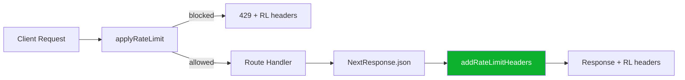

## Problem statement

The three eToro proxy routes (`/api/etoro/trade`, `/api/etoro/watchlist`, `/api/etoro/search`) call `applyRateLimit()` to enforce request limits, but none of them call `addRateLimitHeaders()` on their successful responses. The events API routes (`/api/events`, `/api/events/[id]`) and the auth route (`/api/auth/etoro`) all properly return `X-RateLimit-Limit`, `X-RateLimit-Remaining`, and `X-RateLimit-Reset` headers. The eToro proxy routes only return these headers on 429 (blocked) responses, not on normal responses.

Additionally, `/api/auth/session` imports `addRateLimitHeaders` but never uses it.

## User story

As a client consuming the eToro proxy APIs, I want to see rate limit headers on every response, so that I can monitor my remaining quota and avoid hitting 429 errors.

## How it was found

During surface sweep: ran `curl -D -` against `/api/etoro/trade` and observed no `X-RateLimit-*` headers in the response, while `/api/events/live-global-1-2026-04-28` correctly includes `x-ratelimit-limit: 100`, `x-ratelimit-remaining: 99`, and `x-ratelimit-reset`.

## Proposed UX

No visible UX change — these are HTTP response headers. All API responses from eToro proxy routes should include rate limit metadata consistently.

## Acceptance criteria

- [ ] `/api/etoro/trade` responses include `X-RateLimit-Limit`, `X-RateLimit-Remaining`, `X-RateLimit-Reset` headers
- [ ] `/api/etoro/watchlist` responses include rate limit headers
- [ ] `/api/etoro/search` responses include rate limit headers
- [ ] `/api/auth/session` responses include rate limit headers
- [ ] Blocked (429) responses still include rate limit headers (already working)
- [ ] All existing tests pass

## Verification

- Run `curl -sD - -X POST -H "Content-Type: application/json" -d '{"symbol":"Oil","isBuy":true,"amount":100}' http://localhost:3050/api/etoro/trade` and confirm `X-RateLimit-*` headers are present
- Run full test suite

## Out of scope

- Changing rate limit thresholds
- Adding new rate limit tiers

## Overview

Four API routes call `applyRateLimit()` but don't forward the returned rate limit headers to their responses. The `addRateLimitHeaders()` utility already exists and is used by `/api/events` and `/api/auth/etoro`. The fix is to import `addRateLimitHeaders` in each affected route and wrap the final `NextResponse.json()` calls through it.

## Research notes

- `applyRateLimit()` returns `{ blocked: false, headers: Record<string, string> }` when not blocked
- `addRateLimitHeaders(response, check)` copies those headers onto the response
- The pattern is already established in `src/app/api/events/route.ts` and `src/app/api/events/[id]/route.ts`
- Affected files: `src/app/api/etoro/trade/route.ts`, `src/app/api/etoro/watchlist/route.ts`, `src/app/api/etoro/search/route.ts`, `src/app/api/auth/session/route.ts`

## Assumptions

- Early-return error responses (401 for not connected, 400 for bad input) should also include rate limit headers since the request still consumed a rate limit token
- The existing `addRateLimitHeaders` utility handles the type narrowing correctly

## Architecture diagram

## One-week decision

**YES** — This is a mechanical fix across 4 files, following an established pattern. Takes ~30 minutes.

## Implementation plan

1. In each of the 4 route files:
   - Import `addRateLimitHeaders` from `@/lib/with-rate-limit`
   - For every `return NextResponse.json(...)` call, wrap via `addRateLimitHeaders(response, rateLimit)`
   - Since `rateLimit` may be the blocked variant at the type level, only apply headers when `!rateLimit.blocked` (the code already returns early for blocked)
2. Run the full test suite
3. Verify via curl that headers appear on eToro route responses
